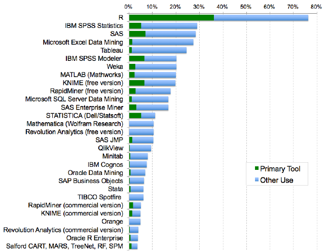
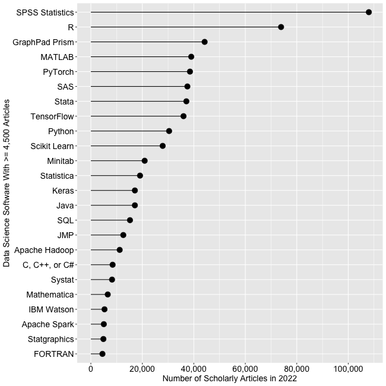
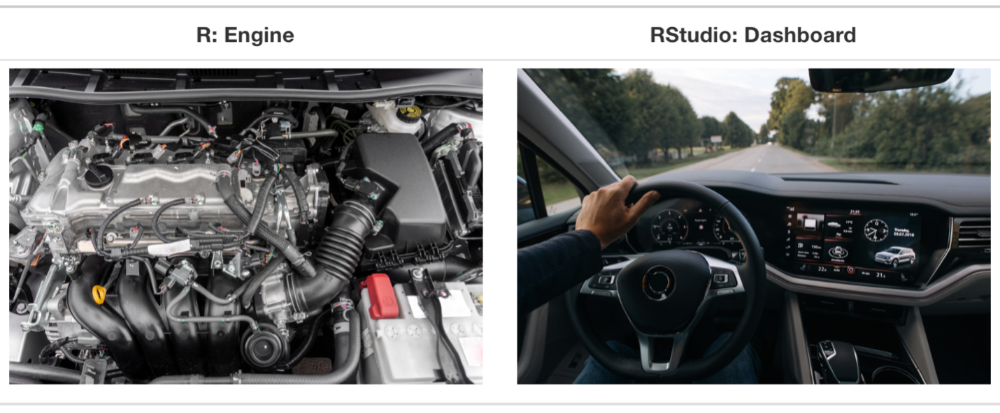
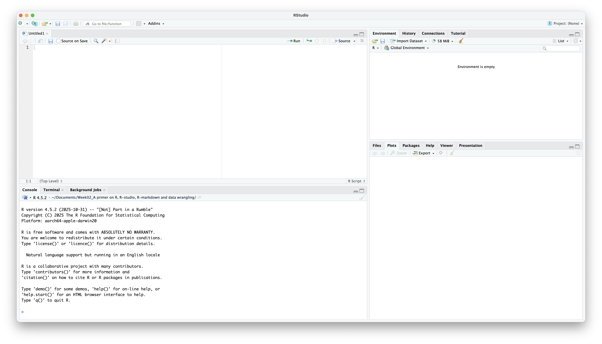

# Introduction {.section-time data-time="10 min"}

## Why Learn R for Healthcare Analytics?

This week we're building the foundation for all future analytics work in this course. 
In this course, we'll use R for data analysis, so we will cover some basics of R and R-accompanied tools. 
You might be wondering, why R? Why can't I just use Excel?

Let's look at a scenario:

> You're analyzing readmission rates across 50 hospitals with monthly data for 3 years.

### With Excel

- Manually copy-paste data from different sources → *error-prone*
- Create pivot tables and charts by clicking through menus → *time-consuming with large data*
- When data updates next month, repeat everything manually → *not scalable*
- Hard to document what you did → *difficult to reproduce or share methodology*

### With R

- Write a script once that loads, cleans, and analyzes all data → *reproducible*
- Generate charts and tables with a few lines of code → *efficient*
- Works the same whether you have 10 rows or 10 million → *scalable*
- Document exactly what you did → *shareable and verifiable*

```{r}
#| label: intro-example
#| echo: true
#| eval: false

# Load data from multiple sources
hospital_data <- read_csv("hospital_readmissions.csv")

# Analyze and visualize
hospital_data |>
    group_by(hospital_name, year) |>
    summarize(readmission_rate = mean(readmitted)) |>
    ggplot(aes(x = year, y = readmission_rate, color = hospital_name)) +
    geom_line() +
    labs(title = "30-Day Readmission Trends by Hospital")

# When data updates: just re-run this code!
```


## What You'll Learn Today

By the end of today's session, you will be able to:

1. **Understand** what R, RStudio, and Quarto are and how they work together
2. **Understand** fundamental R concepts: variables, data types, and data structures
3. **Apply** basic data wrangling techniques using the tidyverse
4. **Create** a reproducible analysis document using Quarto

## Session Overview

**Part 1**: Understanding the tools (R, RStudio, and Quarto)

**Part 2**: Understanding R Basics (Variables, Types, etc.)

**Part 3**: Data Wrangling with dplyr

**Part 4**: Putting It All Together

**Part 5**: Practice

::: {.callout-note}
## How You'll Work Today

You'll use **TWO documents** during this session:

1. **Week02_mynotes.qmd** - Your personal learning notebook
   - Create this document in Part 1
   - Use it to follow along during lecture
   - Type code examples as we go through them
   - Keep it as your reference for the future

2. **Week02_practice.qmd** - Structured practice activities
   - Open this when you see "Try It Yourself!" boxes
   - Complete specific tasks with guided exercises
   - Check solutions at the end

**Workflow**: Learn in mynotes → Practice in practice document → Return to mynotes for next topic
:::

---

# Part 1: Understanding the Tools {.section-time data-time="40 min"}

## What is R?

{width=150px fig-align="center"}

**R is a programming language** designed specifically for statistical computing and data analysis.

**Think of it like this**:

- **Excel** is a tool (spreadsheet)
- **R** is a language (like English or Spanish)

### Why R?

R offers unique advantages for data analytics:

1. **Free and Open Source**: No licensing costs, ever
2. **Rich Ecosystem of Packages**: Thousands of packages for specialized analysis
   - General analytics: `dplyr`, `ggplot2`, `tidyr` for data manipulation and visualization
   - Healthcare-specific: `survival`, `tableone`, `medicaldata` for clinical analysis
   - Business analytics: `forecast`, `caret`, `mlr3` for predictive modeling
3. **Reproducibility**: Essential for research, compliance, and collaborative work
4. **Industry Adoption**: Used across healthcare, finance, tech, consulting, and research organizations

### R's Growing Popularity

R has become one of the leading tools for data analytics. Here are some key indicators:

{width=80% fig-align="center"}

{width=80% fig-align="center"}

**Job Market (October 2022)**:

- Approximately **24,000 job listings** for R in data science roles
- R surpassed SAS in data science job postings for the first time in 2017
- R job postings roughly doubled from ~13,000 (2019) to ~24,000 (2022), about **85% growth**

**Scholarly Research (Google Scholar, 2023)**:

- R is the **2nd most-cited** analytics software in scholarly articles (behind SPSS)
- R was estimated to be the most widely used analytics software for new scholarly articles in 2014

**Package Ecosystem**:

- Over **10,000 add-on packages** available for specialized analyses
- In 2015, R added more functions and procedures than SAS had developed in its entire history
- R has approximately **190 times more commands** than SAS

**Why This Matters for You**:

- Over 10,000 packages give you access to cutting-edge analytical methods
- Steady job market demand with 85% growth in recent years
- Free and open-source—use it anywhere, anytime

::: {.callout-note}
## Source
Statistics and graphs from [r4stats.com](https://r4stats.com/articles/popularity/), a comprehensive analysis of data science software popularity trends.
:::

## What is RStudio?

{width=200px fig-align="center"}

- **RStudio is an Integrated Development Environment (IDE)**—a software application that combines multiple programming tools into a single interface. Instead of using separate programs for writing code, running it, viewing outputs, and managing files, an IDE brings everything together in one place.

- RStudio includes a code editor, variable viewer, file browser, plot viewer, and more.

- **Think of R as the engine and RStudio as the car.** R does all the computational work under the hood, but RStudio provides the dashboard, steering wheel, and comfortable seats that make it easier to drive. You *could* use R on its own (like running an engine on a workbench), but RStudio makes the experience much more practical and enjoyable.

[{fig-align="center" width=80%}](https://moderndive.com/v2/getting-started.html){target="_blank"}


### The RStudio Interface

When you open RStudio, you'll see four panes:

{width=600px fig-align="center"}

::: {.callout-note}
## The Four Panes of RStudio

1. **Source Pane (Top-Left)**: Write and edit your scripts
   - This is where you'll write and save your R code
   - Create new files here (R scripts, Quarto documents)

2. **Console Pane (Bottom-Left)**: See code execution and results
   - Code runs here and displays output
   - You can type commands directly here for quick tests

3. **Environment Pane (Top-Right)**: View your data and variables
   - See all objects you've created (data frames, variables, functions)
   - Check what's currently loaded in R's memory

4. **Files/Plots Pane (Bottom-Right)**: Navigate files, view plots, access help
   - Browse files in your project folder
   - View graphs and visualizations
   - Access help documentation
   - Manage R packages
:::


## What is Quarto?

**Quarto** is a scientific publishing system that combines:

- **Code** (R, Python, etc.)
- **Text** (formatted with Markdown)
- **Output** (tables, figures, results)

All three live in a single document that can be rendered to HTML, PDF, Word, or presentations.

### Why Use Quarto?

Imagine you analyze hospital readmission data and create a report in Word with charts from Excel. Two weeks later, you get updated data. What happens?

**Traditional Approach**:

1. Re-analyze data in Excel and recreate all charts → *time-consuming and tedious*
2. Copy-paste new charts into Word and update text to match new numbers → *error-prone and easy to miss something*

**With Quarto**:

1. Update your data file
2. Click "Render"
3. Done—everything updates automatically → *reproducible and reliable*

### Quarto Document Structure

A Quarto document has three parts:

#### 1. YAML Header (Metadata)

- This controls document settings and appearance.

```yaml
---
title: "My Analysis"
author: "Your Name"
date: today
format: html
---
```


#### 2. Markdown Text (Narrative)

- This creates formatted text (headings, bold, lists, etc.).

```markdown
## Introduction

This analysis examines **patient satisfaction** across three hospitals.

We found that:
- Wait times vary significantly
- Satisfaction decreases with longer waits
```

#### 3. Code Chunks (Analysis)

- This executes R code and shows results in your document.

````markdown
```{{r}}
# Calculate average satisfaction
mean(patient_data$satisfaction_score)
```
````

### Code Chunk Options

- You can control how code chunks behave using options. Add options at the top of a code chunk with `#|`:

````markdown
```{{r}}
#| echo: false     # Don't show the code, only the output
#| eval: true      # Run this code (true is default)
#| warning: false  # Hide warnings
#| message: false  # Hide messages

# Your code here
```
````

**Common options**:

- `echo: false`: Hide the code, show only results (good for reports to non-technical audience)
- `eval: false`: Show the code but don't run it (good for examples)
- `include: false`: Run the code but hide both code and output (good for setup)
- `warning: false`: Suppress warning messages
- `message: false`: Suppress package loading messages
- `fig-width: 8` and `fig-height: 6`: Control plot dimensions (sizes)

**Example use case**:

````markdown
```{{r}}
#| echo: false
#| message: false

# This chunk loads packages silently
library(tidyverse)
```
````

### Inline R Code

- You can insert R results directly into your text. 
- The syntax is: **`` ` r <code> ` ``** (backtick + r + space + code + backtick; see example below).
- Don't put a space between **backtick and r** and **code and backtick**

**Example syntax** (what you type):

> - Today's date is `` ` r Sys.Date() ` ``.
> - The result of 2 + 2 is `` ` r 2 + 2 ` ``.


**When rendered, these become:**

> - "Today's date is `r Sys.Date()`"
> - "The result of 2 + 2 is `r 2 + 2`"

**Example with data**:

- Let's create a simple dataset about patient age:

```{r}
patient_age <- c(44, 32, 56, 43, 67, 78, 13, 25, 47)
```

- If we write in our Quarto document:

> - The average patient age is `` ` r mean(patient_age) ` `` years.

- It renders as:

> - The average patient age is `r mean(patient_age)` years.

**Why this is powerful?**: 

- When data updates, all numbers in your report update *automatically*!

### Creating Your First Quarto Document

Let's create a Quarto document that you'll use throughout today's lesson. 
This will become your personal reference document!

**In R-Studio:**

1. File → New File → Quarto Document
2. Title: "Week 2 - My R Learning Notes"
3. Author: Your name
4. Format: HTML
5. Click "Create"
6. Save it as `Week02_mynotes.qmd` (File → Save)

::: {.callout-important}
## Try It Yourself! (5 minutes)

**Pause here and create your learning document:**

1. Follow the steps above to create `Week02_mynotes.qmd`
2. Click "Render" to verify your setup works
3. **Keep this document open** - you'll add code to it as we go through later parts

**Important workflow tips:**

- You can run individual code line with **Cmd/Ctrl + Enter** (no need to render every time!)
- You can run individual code chunk line with **Cmd/Ctrl + Shift + Enter** (no need to render every time!)
- Add new code chunks with **Cmd/Ctrl + Option/Alt + I**
- Only click "Render" when you want to see the final formatted document

This document will become your complete Week 2 reference with all the code you practice today.

**After 5 minutes**, we'll continue with Part 2: R Basics.
:::

---


# Part 2: R Basics {.section-time data-time="40 min"}

## Your First R Commands

Let's start with simple operations. You can type these in the Console or in a code chunk.

### R as a Calculator

```{r}
#| label: r-calculator
# Addition
5 + 3

# Subtraction
10 - 4

# Multiplication
6 * 7

# Division
20 / 4

# Exponentiation (power)
2^3
```

::: {.callout-tip}
## Comments: Your Code's Documentation

The `#` symbol creates a **comment** - text that R ignores but humans read. Use comments liberally!

**Bad** (no context):
```r
x <- 150
y <- 4.5
z <- x * y
```

**Good** (explains the "why"):
```r
patient_count <- 150  # Current cohort size
average_los <- 4.5    # Mean length of stay in days
total_patient_days <- patient_count * average_los
```

**Tip**: Comment the "why" and "what," not the "how." Your code shows how it works; comments explain why you're doing it.
:::

### Creating Variables

Variables store values for later use. Use the assignment operator `<-`.

```{r}
#| label: create-variables
# Store values
patient_count <- 150
average_los <- 4.5 # LOS = Length of Stay

# View values
patient_count
average_los

# Use in calculations
total_patient_days <- patient_count * average_los
total_patient_days
```

::: {.callout-tip}
## Variable Naming Rules

- ✅ **Good names**: `patient_count`, `average_los`, `readmission_rate`
- ❌ **Avoid**: spaces (`patient count`), special characters (`patient#`), starting with numbers (`2patients`)

**Best practice**: Use descriptive names with underscores
:::

## Data Types

R treats different types of data differently. Understanding data types is crucial for analysis.

### 1. Numeric

Numbers with or without decimals:

```{r}
# Integer-like
num_beds <- 200
class(num_beds) # Check the type

# Decimal
occupancy_rate <- 0.85
class(occupancy_rate)

# Scientific notation for very large/small numbers
population <- 3.3e8 # 330,000,000
population

# More scientific notation examples
large_number <- 1.5e6 # 1.5 × 10^6 = 1,500,000
small_number <- 2.5e-4 # 2.5 × 10^-4 = 0.00025
large_number
small_number
```

::: {.callout-note}
## Understanding Scientific Notation

Scientific notation uses `e` to represent "times 10 to the power of":

- `3.3e8` means 3.3 × 10^8^ = 3.3 × 100,000,000 = 330,000,000
- `1.5e6` means 1.5 × 10^6^ = 1.5 × 1,000,000 = 1,500,000
- `2.5e-4` means 2.5 × 10^-4^ = 2.5 × 0.0001 = 0.00025

**The number after `e`**:

- Positive (`e8`): Move decimal point **8 places to the right** (larger number)
- Negative (`e-4`): Move decimal point **4 places to the left** (smaller number)

**When R shows scientific notation**: R automatically displays very large or very small numbers in scientific notation for readability.
:::

**Numeric is Used for**: Age, costs, lab values, any quantitative measure

### 2. Character (Text)

Text data, always in **quotes**:

```{r}
# Single or double quotes work
hospital_name <- "City General Hospital"
patient_id <- "P-2024-00123"

# Check the type
class(hospital_name)

# Numbers can be characters!
age_text <- "45"
class(age_text) # "character" not "numeric"!
```

**Important**: You CAN'T do math with character data, even if it contains numbers!

```{r}
# This won't work:
# age_text + 5  # ERROR!

# Must convert first:
age_numeric <- as.numeric(age_text) # Convert Character as Numeric
age_numeric + 5 # Now it works!
```

**Use for**: Names, IDs, addresses, diagnosis codes, any text

### 3. Logical (TRUE/FALSE)

Only two values: `TRUE` or `FALSE` (must be ALL CAPS, no quotes):

```{r}
# Create logical values directly
is_emergency <- TRUE
has_insurance <- FALSE
```

**Use for**: Yes/No questions, filtering data, conditions

#### Comparison Operators

Comparison operators evaluate conditions and return `TRUE` or `FALSE`:

```{r}
age <- 65
glucose <- 140

# Greater than
glucose > 126 # TRUE

# Less than
age < 18 # FALSE

# Greater than or equal to
age >= 65 # TRUE

# Less than or equal to
age <= 70 # TRUE

# Equal to (use ==, not =)
age == 65 # TRUE

# Not equal to
age != 50 # TRUE
```

::: {.callout-warning}
## Common Mistake: `=` vs `==`

- Use `<-` or `=` for **assignment**: `age <- 65` (store value)
- Use `==` for **comparison**: `age == 65` (test equality)

```r
age = 65    # Assignment: set age to 65
age == 65   # Comparison: is age equal to 65?
```
:::

#### Logical Operators

Combine multiple conditions using logical operators:

```{r}
patient_age <- 72
systolic_bp <- 145
has_diabetes <- TRUE

# AND operator (&): Both conditions must be TRUE
patient_age > 65 & systolic_bp > 140 # TRUE (both are true)
patient_age > 65 & systolic_bp < 120 # FALSE (one is false)

# OR operator (|): At least one condition must be TRUE
patient_age < 18 | patient_age >= 65 # TRUE (second is true)
patient_age < 18 | systolic_bp < 120 # FALSE (both are false)

# NOT operator (!): Reverses TRUE/FALSE
!has_diabetes # FALSE (opposite of TRUE)
!(patient_age > 65) # FALSE (opposite of TRUE)
```

#### Combining Conditions

Use parentheses `()` to make complex conditions clearer:

```{r}
# High risk = (age > 65 OR diabetes) AND high blood pressure
high_risk <- (patient_age > 65 | has_diabetes) & (systolic_bp > 140)
high_risk # TRUE

# Pediatric or geriatric
special_population <- (patient_age < 18) | (patient_age >= 65)
special_population # TRUE
```

**Why this matters**: You'll use these operators constantly when filtering data with `filter()` in Part 3!

### 4. Factor (Categories)

Factors represent **categorical** data with predefined levels:

```{r}
# Character version (just text)
departments_char <- c("ER", "ICU", "Surgery", "ER", "ICU")
departments_char

# Factor version (categories with levels)
departments_factor <- factor(c("ER", "ICU", "Surgery", "ER", "ICU"))
departments_factor # Shows levels at bottom

# See the unique categories
levels(departments_factor)
```

**Why use factors?**

- Required for many statistical analyses
- Control the order of categories (important for graphs!)
- More memory-efficient than character

**Ordered factors** for data with natural order:

```{r}
# Severity has a natural order
severity <- factor(
    c("Mild", "Moderate", "Severe", "Mild", "Severe"),
    levels = c("Mild", "Moderate", "Severe"), # Specify order
    ordered = TRUE # Mark as ordered
)
severity # Notice: Mild < Moderate < Severe
```

**Use for**: Department, insurance type, severity levels, any categorical data

::: {.callout-tip}
## Quick Checkpoint: Understanding Data Types

Before moving on, make sure you can answer these:

1. What type is `42`? → numeric
2. What type is `"42"`? → character
3. What type is `TRUE`? → logical
4. What symbols do you use to test if age equals 65? → `==`
5. How do you combine multiple values into a vector? → `c()`

If any of these are unclear, review the sections above or ask now!
:::

::: {.callout-important}
## Try It Yourself! (5 minutes)

**Pause here!** Open `Week02_practice.qmd` and complete:

- **Task 1.1**: Creating variables with different data types

This will help you practice creating variables and understanding data types.

**After 5 minutes**, we'll continue with data structures.
:::

## Data Structures

### Vectors: One-Dimensional Data

A **vector** is a sequence of elements of the **same type**:

```{r}
# Create vectors with c() - "combine" function
ages <- c(45, 67, 32, 58, 71)
ages

departments <- c("ER", "ICU", "Surgery", "ER", "Pediatrics")
departments

# Check length
length(ages)

# Access elements by position (starts at 1!)
ages[1] # First element
ages[3] # Third element
ages[1:3] # Elements 1 through 3

# Vector operations
ages + 1 # Adds 1 to each element
mean(ages) # Calculate average
sum(ages) # Calculate sum
```

**Key point**: Vectors can only contain one data type!

```{r}
# Mixing types - R converts to common type
mixed <- c(25, "years", 100)
mixed # Everything becomes character: "25" "years" "100"
```

### Data Frames: Two-Dimensional Data

A **data frame** is a table where:

- Each column is a vector (variable)
- Each row is an observation
- Columns can have different data types (but within the column, elements are the same type)

**This is how most healthcare data is organized!**

```{r}
#| label: create-dataframe
# Create a data frame
patients <- data.frame(
    patient_id = c(101, 102, 103, 104, 105), # patient's unique ID
    age = c(45, 67, 32, 58, 71), # patient's age
    gender = c("F", "M", "F", "M", "F"), # patient's gender
    department = c("ER", "ICU", "Surgery", "ER", "Pediatrics"), # hospoital deparment the patient assigned
    los = c(2, 7, 3, 1, 4), # Length of stay
    readmitted = c(FALSE, TRUE, FALSE, FALSE, TRUE)
)

# View the data frame
patients

# Check structure
str(patients)

# Access columns
patients$age # Dollar sign notation
patients[, "department"] # Bracket notation

# Access rows
patients[1, ] # First row
patients[1:3, ] # First three rows

# Access specific cell
patients[2, "gender"] # Row 2, column "gender"
```

::: {.callout-note}
## How to Practice: Working in Your Quarto Document

**You should be working in** `Week02_mynotes.qmd` (the document you created earlier).

**How to run code**:

- Type code in a code chunk (use **Cmd/Ctrl + Option/Alt + I** to create new chunks)
- Run the current line or selection with **Cmd/Ctrl + Enter**
- You don't need to click "Render" after every change!

**Think of it this way**:

- **While learning**: Run code chunks interactively (Cmd/Ctrl + Shift + Enter)
- **To see final result**: Click "Render" to create a beautiful formatted document
- **At end of session**: You'll have a complete reference document with all your learning

**Tip**: You can also experiment in the Console for quick tests, but adding code to your Quarto document ensures you keep a record of what you learned.
:::

## Loading Data

In real work, you'll load data from files rather than creating it manually.

### Understanding R Packages

Before we load data, you need to understand **packages** - one of R's most powerful features.

#### What Are Packages?

**Packages** are collections of functions, data, and documentation created by the R community. Think of them as apps for your phone:

- **Base R** = Your phone's built-in apps (calculator, clock)
- **Packages** = Apps you download (Instagram, Spotify, etc.)

R comes with basic functions, but packages add thousands of specialized capabilities!

::: {.callout-note}
## Phone App Analogy

| Phone | R |
|-------|---|
| Phone comes with built-in apps | R comes with base functions |
| Download app from App Store (once) | Install package with `install.packages()` (once) |
| Open app to use it (every time) | Load package with `library()` (every session) |
| Apps stay on phone after download | Packages stay installed after installation |
:::

#### Installing Packages

You only need to install a package **once** (like downloading an app):

```{r}
#| eval: false

# Install a single package
install.packages("tidyverse")

# Install multiple packages at once
install.packages(c("readxl", "ggplot2", "dplyr"))
```

::: {.callout-important}
## Installation Notes

- Put package names in **quotes**: `install.packages("tidyverse")`
- Installation happens **once** - you don't need to reinstall every time you use R
- If you get permission errors, you may need to run RStudio as administrator
:::

#### Loading Packages

After installation, you must **load** a package in each R session before using it (like opening an app):

```{r}
#| eval: false

# Load the tidyverse package
library(tidyverse)

# Now you can use tidyverse functions like read_csv()
```

::: {.callout-warning}
## Common Mistake: Forgetting to Load

Even if you've installed a package, you must load it with `library()` at the start of each session!

**Error**: `Error: could not find function "read_csv"`

**Solution**: Run `library(tidyverse)` first
:::

#### What is the Tidyverse?

The [**tidyverse**](https://tidyverse.org/) is a collection of packages designed to work together for data science:

```{r}
#| echo: false
#| eval: true

library(tidyverse)
```

When you run `library(tidyverse)`, it loads 8 core packages:

- **readr**: Read data files (CSV, TSV, etc.)
- **dplyr**: Manipulate data (filter, select, summarize)
- **ggplot2**: Create visualizations
- **tidyr**: Reshape data
- **tibble**: Enhanced data frames
- **stringr**: Work with text
- **forcats**: Work with factors
- **purrr**: Functional programming

**For this course**, we'll primarily use `readr` and `dplyr`.

::: {.callout-tip}
## Best Practice: Load Packages at the Top

In your Quarto documents, always load packages in the first code chunk:

```r
# Load required packages
library(tidyverse)

# Then your analysis code...
```

This makes it clear what packages your analysis needs.
:::

### Reading CSV Files

CSV (Comma-Separated Values) is the most common data format:

```{r}
#| eval: false

# Load tidyverse (includes readr package)
library(tidyverse)

# Read a CSV file
patient_data <- read_csv("hospital_data.csv")

# View the data
head(patient_data) # First 6 rows
View(patient_data) # Open in spreadsheet viewer
```

**Common issues**:

::: {.callout-warning}
## File Not Found Error

If you get `Error: 'hospital_data.csv' does not exist`, check:

1. **Is the file in your working directory?**
   - Use `getwd()` to see your current directory
   - Use `list.files()` to see what files are there

2. **Is the path correct?**
   - Use full path: `read_csv("/Users/yourname/Documents/hospital_data.csv")`
   - Or use RStudio Projects to organize your work
:::

### Other Common Formats

```{r}
#| eval: false

# Excel files (need readxl package)
library(readxl)
data <- read_excel("hospital_data.xlsx")

# Tab-separated files
data <- read_tsv("hospital_data.txt")

# R data files
data <- readRDS("hospital_data.rds")
```

## Getting Help

R has extensive built-in help. Use these when you're stuck:

```{r}
#| eval: false

# Get help on a specific function
?read_csv
?filter
?mean

# Search for help on a topic
??regression
??"missing values"

# See examples
example(mean)
```

**Tip**: Help pages show: 

- **Description**: What the function does
- **Usage**: How to call it
- **Arguments**: What options are available
- **Examples**: Working code you can try

---

# Part 3: Data Wrangling with dplyr {.section-time data-time="50 min"}

## From Data Structures to Data Manipulation

Now that you know how to create and access data frames, let's learn how to actually **manipulate** them. This is where R becomes incredibly powerful for data analysis.

**What you'll learn in this section:**

- How to select only the columns you need
- How to filter rows based on conditions
- How to create new calculated fields
- How to summarize data by groups
- How to combine all these operations into powerful analysis pipelines

This is the core skill of data wrangling - transforming raw data into insights.

## Introduction to the Tidyverse

The **tidyverse** is a collection of R packages designed for data science with a common philosophy and grammar.

**Why Tidyverse?**

**Traditional R** (hard to read):

```r
round(mean(subset(patients, age > 50)$los), 2)
```

**Tidyverse** (reads like English):

```r
patients |>
  filter(age > 50) |>
  summarize(mean_los = round(mean(los), 2))
```

Much clearer!

## The Pipe Operator: |> 

- The pipe operator `|>` passes output from one function to the next. (or often you see it as `%>%`)

**Read it as "and then"**:

```{r}
# Without pipe (hard to read, nested)
round(mean(c(1, 2, 3, 4, 5)), 2)

# With pipe (easy to read, sequential)
c(1, 2, 3, 4, 5) |>
    mean() |>
    round(2)
```

Think: "Take this data, **and then** do this, **and then** do that."

## Sample Dataset

Let's create a healthcare dataset to practice with:

```{r}
#| label: generate-healthcare-data
# Set seed for reproducibility
set.seed(2026)

# Create sample data (simplified version)
healthcare_data <- tibble(
    patient_id = 1:100,
    age = sample(18:90, 100, replace = TRUE),
    gender = sample(c("Male", "Female"), 100, replace = TRUE),
    department = sample(c("Emergency", "Cardiology", "Orthopedics"),
        100,
        replace = TRUE
    ),
    los = sample(1:14, 100, replace = TRUE),
    total_charges = round(runif(100, 1000, 50000), 2),
    readmitted_30day = sample(c(TRUE, FALSE), 100, replace = TRUE, prob = c(0.15, 0.85))
)

# View first few rows
head(healthcare_data)
```

## Core dplyr Functions

### 1. `select()` - Choose Columns

- Pick **which variables** you want to keep:

```{r}
#| label: dplyr-select
# Select specific columns
healthcare_data |>
    select(patient_id, age, department, total_charges)

# Select a range
healthcare_data |>
    select(patient_id:department)

# Remove columns with minus sign
healthcare_data |>
    select(-readmitted_30day)

# Select by pattern
healthcare_data |>
    select(starts_with("total"))
```

**When to use**: Simplify your data by keeping only relevant columns

### 2. `filter()` - Choose Rows

- Select rows based on conditions:

```{r}
#| label: dplyr-filter
# Single condition
healthcare_data |>
    filter(age >= 65)

# Multiple conditions (AND)
healthcare_data |>
    filter(department == "Cardiology", los > 5)

# OR condition
healthcare_data |>
    filter(department == "Emergency" | department == "Cardiology")

# Using %in% for multiple values
healthcare_data |>
    filter(department %in% c("Emergency", "Cardiology"))
```

**When to use**: Focus on specific patient groups (subgroups) or criteria

::: {.callout-important}
## Try It Yourself! (5 minutes)

**Pause here!** Open `Week02_practice.qmd` and complete:

- **Task 3.1**: Select specific columns
- **Task 3.2**: Filter rows based on conditions

This will help you practice choosing the data you need.

**After 5 minutes**, we'll continue with creating new columns.
:::

### 3. `mutate()` - Create or Modify Columns

- Add new variables or transform existing ones:

```{r}
#| label: dplyr-mutate
# Create new column
healthcare_data |>
    mutate(cost_per_day = total_charges / los) |>
    select(patient_id, total_charges, los, cost_per_day)

# Create age groups
healthcare_data |>
    mutate(
        age_group = case_when(
            age < 18 ~ "Pediatric",
            age < 65 ~ "Adult",
            TRUE ~ "Senior" # TRUE means "everything else"
        )
    ) |>
    select(patient_id, age, age_group)
```

**When to use**: Calculate new metrics or categorize continuous variables

### 4. `arrange()` - Sort Rows

- Sort data by one or more variables:

```{r}
#| label: dplyr-arrange
# Sort by age (ascending)
healthcare_data |>
    arrange(age) |>
    select(patient_id, age, department)

# Sort descending
healthcare_data |>
    arrange(desc(total_charges)) |>
    select(patient_id, total_charges)

# Sort by multiple columns
healthcare_data |>
    arrange(department, desc(los)) |>
    select(patient_id, department, los)
```

**When to use**: Find top/bottom values, organize data for presentation


::: {.callout-important}
## Try It Yourself! (5 minutes)

**Pause here!** Open `Week02_practice.qmd` and complete:

- **Task 3.3**: Create new columns with `mutate()`
- **Task 3.4**: Sort data with `arrange()`

This will help you practice creating calculated fields and sorting data.

**After 5 minutes**, we'll learn how to calculate summary statistics.
:::

::: {.callout-note}
## Take a Breath!

You've just learned **four powerful data manipulation functions** in quick succession:

- `select()` - choose columns
- `filter()` - choose rows
- `mutate()` - create columns
- `arrange()` - sort

Take 30 seconds to stretch, shake out your hands, and breathe. Data wrangling is mentally intensive, so that's completely normal!

**Next up**: The two most powerful functions, `summarize()` and `group_by()`, which will let you calculate statistics and analyze by groups.
:::

::: {.callout-tip}
## Quick Checkpoint: Core dplyr Functions

Before continuing, verify you understand:

1. Which function picks columns? → `select()`
2. Which function picks rows based on conditions? → `filter()`
3. Which function creates new columns? → `mutate()`
4. What does `|>` do? → Passes output from one function to the next
5. How do you sort in descending order? → `arrange(desc(variable))`

If you're confused about any function, now is the time to ask!
:::

### 5. `summarize()` - Calculate Statistics

- Reduce data to summary values:

```{r}
#| label: dplyr-summarize
# Single statistic - calculate one summary value
healthcare_data |>
    summarize(mean_age = mean(age))

# Multiple statistics - calculate several summaries at once
healthcare_data |>
    summarize(
        total_patients = n(), # n() counts the number of rows
        mean_age = mean(age), # mean() calculates average
        mean_charges = mean(total_charges),
        readmit_rate = mean(readmitted_30day) # mean() on logical: TRUE=1, FALSE=0, so this gives proportion
    )
```

::: {.callout-tip}
## Understanding `n()` and Summary Functions

**`n()`**: Counts the number of rows (observations)

- `n()` = total count, no arguments needed
- Useful for: "How many patients?", "How many observations?"

**`mean()` with logical values**: Calculates proportions

- `mean(readmitted_30day)` where values are TRUE/FALSE
- R treats TRUE as 1 and FALSE as 0
- So `mean()` gives you the proportion of TRUE values (i.e., readmission rate)

**Other useful summary functions**:

- `median()`, `sd()` (standard deviation), `min()`, `max()`, `sum()`
:::

**When to use**: Get overall statistics, create summary tables

### 6. `group_by()` - Group Operations

- **This is where dplyr becomes powerful!** Group data before summarizing:

```{r}
#| label: dplyr-group-by
# Summary by department - calculate statistics for EACH department separately
healthcare_data |>
    group_by(department) |> # Group by department first
    summarize( # Then calculate summaries for each group
        patient_count = n(), # Count patients in each department
        mean_age = mean(age), # Average age in each department
        mean_los = mean(los), # Average length of stay in each department
        mean_charges = mean(total_charges), # Average charges in each department
        readmit_rate = mean(readmitted_30day) # Readmission rate in each department
    ) |>
    arrange(desc(mean_charges)) # Sort by highest charges first
```

::: {.callout-note}
## How `group_by()` Works

Without `group_by()`:

- `summarize()` calculates **one** value across all data
- Example: mean age of **all** patients = 52.3 years

With `group_by(department)`:

- `summarize()` calculates **separate** values for each department
- Example: mean age in ER = 45, mean age in ICU = 67, etc.

Think: "Calculate statistics **separately for each group**"
:::

**Real-world insight**: This analysis quickly shows which departments have highest costs and readmission rates!

## Combining Operations

- The power of `dplyr` is combining multiple operations:

```{r}
# Complex analysis in one pipeline
healthcare_data |>
    filter(age >= 50) |> # Focus on older patients, 50+
    mutate(high_cost = total_charges > 25000) |> # Flag expensive cases (if greater than 25000, TRUE, otherwise FALSE)
    group_by(department, high_cost) |> # Group by department and cost
    summarize(
        count = n(),
        avg_los = round(mean(los), 1),
        .groups = "drop" # Remove grouping structure after summarizing
    ) |>
    arrange(department, desc(high_cost))
```

**What this tells us**: How many high-cost vs. regular-cost patients in each department, and their average length of stay.

::: {.callout-note}
## Understanding `.groups = "drop"`

When you use `group_by()` with multiple variables, the data stays "grouped" after `summarize()`. This can cause unexpected behavior in later operations.

**`.groups` options**:

- `"drop"`: Remove all grouping (recommended for most cases)
- `"drop_last"`: Keep all groups except the last one
- `"keep"`: Keep the grouping structure

**Why use `.groups = "drop"`?**

- Makes the output a regular (ungrouped) data frame
- Prevents grouping from affecting subsequent operations like `arrange()`
- Clearer intent in your code

If you don't specify `.groups`, dplyr will show a message reminding you to choose. Using `.groups = "drop"` silences this message and makes your intention clear.
:::


::: {.callout-important}
## Try It Yourself! (5 minutes)

**Pause here!** Open `Week02_practice.qmd` and complete:

- **Task 3.6**: Group by and summarize

This will help you practice the powerful `group_by()` + `summarize()` pattern.

**After 5 minutes**, we'll continue with combining operations and wrap up.
:::

## Handling Missing Values

- Real (healthcare) data often has missing values (in R, they are filled with `NA`):

```{r}
# Create data with missing values
patient_vitals <- tibble(
    patient_id = 1:5,
    blood_pressure = c(120, 135, NA, 142, NA),
    heart_rate = c(72, 85, 78, NA, 65)
)

patient_vitals

# Count NAs
patient_vitals |>
    summarize(
        bp_missing = sum(is.na(blood_pressure)), # Summing the number of NAs in boold_pressure
        hr_missing = sum(is.na(heart_rate)) # Summing the number of NAs in heart_rate
    )

# Calculate mean (NAs cause problems!)
mean(patient_vitals$blood_pressure) # Returns NA

# Remove NAs from calculation
mean(patient_vitals$blood_pressure, na.rm = TRUE) # Works! (na.rm is the key!)

# Remove rows with NAs
patient_vitals |>
    drop_na() # Removes rows with any NA

# Remove rows with NA in specific column
patient_vitals |>
    drop_na(blood_pressure)
```

::: {.callout-warning}
## Missing Data Caution

Always investigate WHY data is missing before removing it! Missing data may not be random and could bias your analysis.
:::

---

# Putting It All Together {.section-time data-time="10 min"}

## End-to-End Example: Readmission Analysis

Let's combine everything into a realistic analysis:

**Question**: Which departments have the highest readmission rates, and does this vary by patient age?

Let's run the code below to add `age_group` variable that indicates age categories:

```{r}
#| label: readmission-analysis-step1
# Step 1: Prepare data
healthcare_data_clean <- healthcare_data |>
    mutate(
        age_group = case_when(
            age < 40 ~ "Under 40",
            age < 65 ~ "40-64",
            TRUE ~ "65+"
        ),
        age_group = factor(age_group, levels = c("Under 40", "40-64", "65+"))
    )
```

Now let's check readmission rates across departments (`department`) and age groups (`age_group`) using `dplyr`:

```{r}
#| label: readmission-analysis-step2

# Step 2: Analyze by department and age group
readmission_analysis <- healthcare_data_clean |>
    group_by(department, age_group) |>
    summarize(
        total_patients = n(),
        readmissions = sum(readmitted_30day),
        readmit_rate = round(mean(readmitted_30day) * 100, 1),
        .groups = "drop"
    ) |>
    filter(total_patients >= 5) |> # Only groups with enough patients
    arrange(department, age_group, desc(readmit_rate))

# View results
readmission_analysis
```

**Key findings** (from this simulated data):

- We can see which department-age combinations have highest readmission rates
- This could guide targeted interventions

## Creating Your Analysis Report

Now put this in a Quarto document:

````markdown
---
title: "30-Day Readmission Analysis"
author: "Your Name"
date: today
format: html
---

## Executive Summary

This analysis examines 30-day readmission rates across departments and age groups.

## Data Overview

We analyzed `r nrow(healthcare_data)` patient encounters.

```{{r}}
library(tidyverse)

# Load and prepare data
healthcare_data_clean <- healthcare_data |>
  mutate(
    age_group = case_when(
      age < 40 ~ "Under 40",
      age < 65 ~ "40-64",
      TRUE ~ "65+"
    )
  )
```

## Key Findings

```{{r}}
# Analysis code here
```

The analysis reveals...
````

When you **Render** this document:

- Code executes automatically
- Results appear in the output
- You get a professional HTML report
- If data changes, just re-render!

## What You've Learned Today

Congratulations! In this session, you've built a strong foundation for data analysis in R:

1. **The Tools**:
   - R: Programming language for statistics
   - RStudio: User-friendly workspace
   - Quarto: Reproducible documents combining code, text, and output

2. **R Basics**:
   - Data types: numeric, character, logical, factor
   - Data structures: vectors, data frames
   - Variables, assignment operator `<-`, and basic operations

3. **Data Wrangling with `dplyr`**:
   - `select()`: Choose columns
   - `filter()`: Choose rows
   - `mutate()`: Create/modify columns
   - `arrange()`: Sort data
   - `summarize()`: Calculate statistics
   - `group_by()`: Group operations (the power move!)
   - Pipe operator `|>`: Chain operations together


## Practice Time!

**Now it's your turn!** Open the practice document ([Week02_practice.qmd](Week02_practice.qmd)) and work through the guided exercises over the next 60 minutes.

**You'll practice**:

- Activity 1: Creating variables and working with vectors
- Activity 2: Working with data frames
- Activity 3: Using dplyr functions to wrangle healthcare data
- Activity 4: Creating your first complete Quarto report

**Remember**: Making mistakes is part of learning! Experiment, try things, ask questions, and help each other.

---

# Resources

**Official Documentation**:

- [R for Data Science (free online book)](https://r4ds.hadley.nz/) - Excellent for beginners
- [RStudio Cheatsheets](https://posit.co/resources/cheatsheets/) - Quick references for dplyr, ggplot2, etc.
- [Quarto Guide](https://quarto.org/docs/guide/) - Official Quarto documentation

**Healthcare-Specific R Resources**:

- [R for Health Data Science](https://argoshare.is.ed.ac.uk/healthyr_book/) - Healthcare examples
- `medicaldata` R package - Real healthcare datasets for practice
