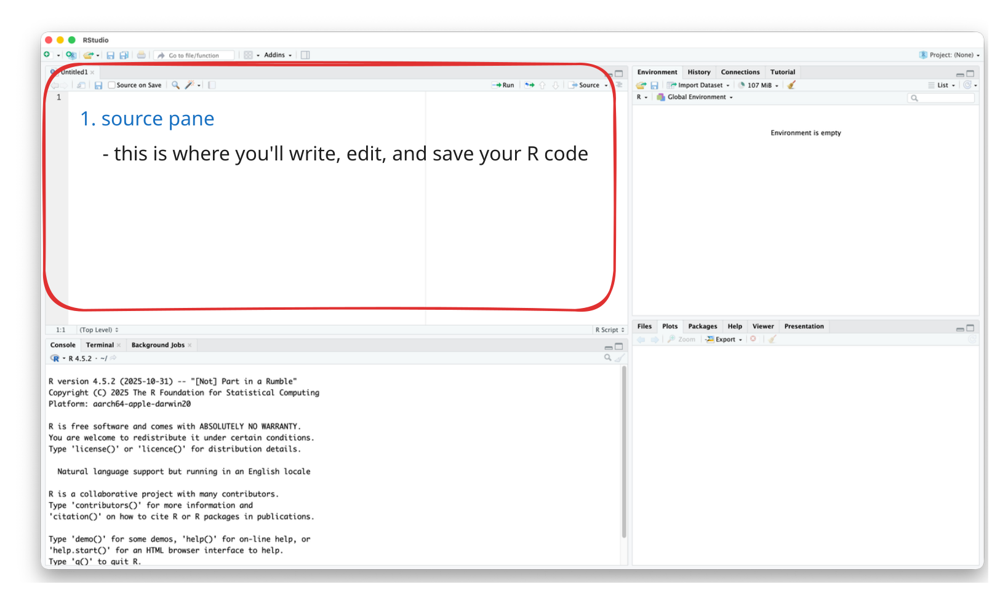
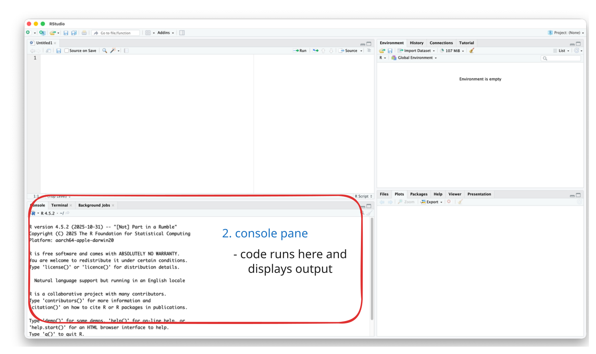
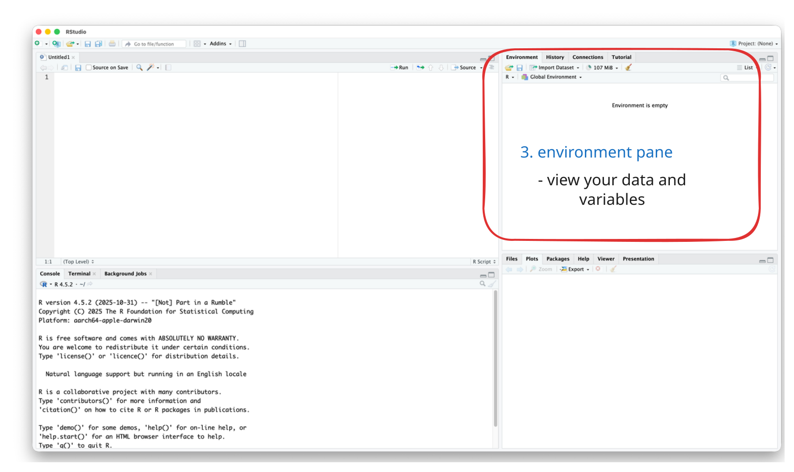
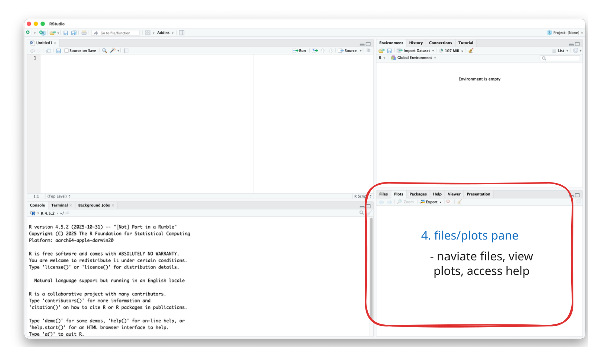

## Today's Agenda 

::: {.incremental}
1. **Part 1**: The Tools (R, RStudio, Quarto)
2. **Part 2**: R Basics (Variables, Types, Structures)
3. **Part 3**: Data Wrangling with dplyr
:::

::: {.fragment .fade-up}
**Goal**: Build the foundation for all future analytics work
:::

# Introduction {background-color="#40666e"}

## Why Learn R for Healthcare/Data Analytics?

- Let's think about the following scenario: 
    - Analyzing readmission rates across 50 hospitals with 3 years of monthly data

<br>

. . .

::: {.columns}
::: {.column .fragment width="50%"}
#### Excel Approach

- Manual copy-paste
- Click through menus
- Repeat when data updates
- Hard to document
- Error-prone
:::

::: {.column .fragment width="50%"}
#### R Approach

- Write code once
- Automated updates
- Fully documented
- Easily shareable
- Reproducible & Scalable
:::
:::

## The R Code 

```{r}
#| echo: true
#| eval: false
#| code-line-numbers: "|2|4-6|7-10"

# Load data from multiple sources
hospital_data <- read_csv("hospital_readmissions.csv")

# Analyze and visualize
hospital_data |>
    group_by(hospital_name, year) |>
    summarize(readmission_rate = mean(readmitted)) |>
    ggplot(aes(x = year, y = readmission_rate, color = hospital_name)) +
    geom_line() +
    labs(title = "30-Day Readmission Trends by Hospital")

# When data updates: just re-run this code!
```

. . .

It's reproducible, scalable, documented, and shareable!

## R's Growing Popularity 

- R Popularity in Data Science

{width=80% fig-align="center"}


## R's Growing Popularity 

- R Popularity in Academic Research

{width=120% fig-align="center"}


. . .

::: {.fragment}
::: {.smaller}
- Learning R = Access to cutting-edge methods + Strong job market demand + Free forever
- See the full report at [r4stats.com](https://r4stats.com/articles/popularity/)
:::
:::

## Learning Objectives

By the end of this session, you will be able to:

::: {.incremental}
1. **Understand** what R, RStudio, and Quarto are and how they work together
2. **Understand** fundamental R concepts: variables, data types, and data structures
3. **Apply** basic data wrangling techniques using the tidyverse
4. **Create** a reproducible analysis document using Quarto
:::


# Part 1: The Tools {background-color="#40666e"}

## What is R?

::: {.columns}
::: {.column width="40%"}
{width=60%}
:::

::: {.column width="60%"}
**R is a programming language** designed for statistical computing and data analysis

<br>

::: {.fragment}
**Think of it like this**:

- Excel is a **tool** (spreadsheet)
- R is a **language** (like English or Spanish)
:::
:::
:::

## Why R? 

::: {.incremental}
1. **Free and Open Source**
   - No licensing costs, ever

2. **Rich Ecosystem of Packages**
   - General: `dplyr`, `ggplot2`, `tidyr`
   - Healthcare: `survival`, `tableone`, `medicaldata`
   - Business: `forecast`, `caret`, `mlr3`

3. **Reproducibility**
   - Essential for research, compliance, collaboration

4. **Industry Adoption**
   - Healthcare organizations, consulting firms, research institutions
:::

## What is RStudio?

::: {.columns}
::: {.column width="40%"}
{width=80%}
:::

::: {.column width="60%"}
**RStudio is an IDE** (Integrated Development Environment)

A user-friendly workspace for working with R
:::
:::

. . .

### The Analogy

[{fig-align="center" width=70%}](https://moderndive.com/v2/getting-started.html){target="_blank"}

## RStudio Interface: Four Panes

{width=70%}

## The Four Panes 1: Source Pane

{width=70%}

## The Four Panes 2: Console Pane

{width=70%}

## The Four Panes 3: Environment Pane

{width=70%}

## The Four Panes 4: Files/Plots Pane

{width=70%}


## What is Quarto?

**Quarto** combines three things in one document:

::: {.incremental}
1. **Code** (R, Python, etc.)
2. **Text** (formatted with Markdown)
3. **Output** (tables, figures, results)
:::

. . .

It renders to, HTML, PDF, Word, Presentations, etc. 

## Why Use Quarto?

::: {.columns}
::: {.column width="50%"}
**Traditional Approach** (Word + Excel):

::: {.incremental}
1. Analyze data in Excel
2. Create charts
3. Copy-paste into Word
4. Update text with numbers
5. When data updates... 😰 **repeat everything!**
:::
:::

::: {.column width="50%"}
::: {.fragment}
**With Quarto**:

1. Update data file
2. Click "Render"
3. ✅ **Done!**

Everything updates automatically!
:::
:::
:::

## Quarto Document Structure {.smaller}

::: {.columns}
::: {.column width="40%"}
### 1. YAML Header {.smaller}

- Controls document settings

```yaml
---
title: "My Analysis"
author: "Your Name"
date: today
format: html
---
```
:::

::: {.column width="20%"}
:::

::: {.column .fragment width="40%"}
### 2. Markdown Text {.smaller}

- Creates formatted narrative

```markdown
## Introduction
This analysis examines
**patient satisfaction**.
```
:::
:::


::: {.fragment style="margin-top: 1em;"}
### 3. Code Chunks {.smaller}

- Executes R code and shows results

````markdown
```{{r}}
mean(patient_data$satisfaction_score)
```
````
:::


## Code Chunk Options {.smaller}

- Control how code chunks behave with `#|` options:

```r
#| echo: false     # Don't show code, only output
#| eval: true      # Run this code (default)
#| warning: false  # Hide warnings
#| message: false  # Hide messages
#| fig-width: 8    # Control plot width
```

. . .

<br><br>

**Common use cases**:

| Option | Use Case |
|--------|----------|
| `echo: false` | Reports for non-technical audience |
| `eval: false` | Show code examples without running |
| `include: false` | Run code but hide everything (setup) |

## Inline R Code

Insert R results directly into your text:

**Syntax**: Use `` ` r code ` ``

. . .

<br>
**Example**:

```{r}
#| echo: true
patient_age <- c(44, 32, 56, 43, 67, 78, 13, 25, 47)
```

::: {.incremental}
- Write: "The average patient age is `` ` r mean(patient_age) ` ``"

- Rendered: "The average patient age is `r round(mean(patient_age), 1)` years."
:::

. . .

💡 When data updates, all numbers update automatically!

## Understanding R Packages

**Packages** = Collections of functions (like apps for your phone)
<br> 

. . .

::: {.columns}
::: {.column width="50%"}
**Your Phone**

- Built-in apps (calculator)
- Download from App Store
- Open app to use
:::

::: {.column width="50%"}
**R**

- Base functions
- `install.packages("name")`
- `library(name)`
:::
:::

. . .

**Key difference**:

- Install **ONCE**: `install.packages("tidyverse")`
- Load **EACH SESSION**: `library(tidyverse)`

## The Tidyverse

**Collection of 8 packages** designed to work together:

::: {.columns}
::: {.column width="50%"}
- **readr**: Read data files
- **dplyr**: Manipulate data ⭐
- **ggplot2**: Visualizations
- **tidyr**: Reshape data
:::

::: {.column width="50%"}
- **tibble**: Enhanced data frames
- **stringr**: Work with text
- **forcats**: Work with factors
- **purrr**: Functional programming
:::
:::

. . .

Load all 8 with one command: `library(tidyverse)`

## Loading Data {.smaller}

**CSV** (Comma-Separated Values) is the most common format

```r
# First, load the tidyverse
library(tidyverse)

# Then read your data
example_data <- read_csv("example_data.csv")

# View it
head(example_data)    # First 6 rows
View(example_data)    # Spreadsheet view
glimpse(example_data) # Compact structure
```

. . .

::: {.callout-warning}
## File Not Found?
Check your working directory: `getwd()` and `list.files()`
:::

## 👉 Try It Yourself! 

**Create your learning document:**

1. File → New File → Quarto Document
2. Title: "Week 2 - My R Learning Notes"
3. Author: Your name
4. Format: HTML
5. Save as `Week02_mynotes.qmd`
6. Click "Render" to test

**Let's keep this document open** and add code as we go!

## Getting Help in R {.smaller}

You **will** get stuck. That's normal! Here's how to find help:

::: {.columns}
::: {.column width="50%"}
**Built-in Help**

```r
?mean          # Help on a function
??regression   # Search for a topic
example(mean)  # Run example code
```
:::

::: {.column width="50%"}
**Help Page Structure**

- **Description**: What it does
- **Arguments**: Available options
- **Examples**: Copy and try!
:::
:::

. . .

<br>

**External Resources**: Google the error message, Stack Overflow, office hours, etc.

# Part 2: R Basics {background-color="#40666e"}

## R as a Calculator {.smaller}

- You can do basic arithmatic calculations
    - `+` for addition
    - `-` for subtraction
    - `*` for multiplication
    - `/` for division
    - `^` for exponentiation

```{r}
#| echo: true
#| eval: false
# Basic operations
5 + 3 # Addition
10 - 4 # Subtraction
6 * 7 # Multiplication
20 / 4 # Division
2^3 # Exponentiation (power)
```

## Comments: Your Code's Documentation

- The `#` symbol creates a **comment** 
    - R ignores it, humans (and LLMs) read it

. . .

::: {.columns}
::: {.column width="50%"}
**❌ Bad** (no context):
```r
x <- 150
y <- 4.5
z <- x * y
```
:::

::: {.column width="50%"}
**✅ Good** (explains what and why):
```r
x <- 150 # patient count
y <- 4.5 # average length of stay (LOS)
z <- x * y # to get the total patient days
```
:::
:::

. . .

**Tip**: 

- But a much better way is to use informative variable names 
    - e.g.,) Instead of `x`, use `patient_count`
- Comment the **"why" and "what,"** not the "how"


## Creating Variables

- Use the assignment operator `<-` to store values:

::: {.columns}
::: {.column width="50%"}
**Store values**
```r
patient_count <- 150
average_los <- 4.5
```
:::

::: {.column width="50%"}
**View values**
```r
patient_count
average_los
```
:::
:::

. . .

**Use in calculations**
```r
total_patient_days <- patient_count * average_los
total_patient_days
```

## Variable Naming Rules

- Use descriptive names and avoid abstract names like `x`, `y`, `z`
- Use underscores instead of spaces
- Avoid using space, special characters, or starting with a number
- **Case sensitive**: `patient_count` is different from `Patient_count`
<br><br>

::: {.columns}
::: {.column width="50%"}
**✅ Good names**:
```r
patient_count
average_los
readmission_rate
```
:::

::: {.column width="50%"}
**❌ Avoid**:
```r
patient count  # spaces
patient-count  # dashes
2patients      # starts with number
```
:::
:::


## Data Types: Overview

R treats different types of data differently

::: {.incremental}
1. **Numeric** - Numbers (42, 3.14, 100)
2. **Character** - Text ("Hospital", "P-123")
3. **Logical** - TRUE or FALSE
4. **Factor** - Categories (departments, severity)
:::

## 1. Numeric (1/2)

- Numbers you can do math with
- **Use for**: Age, costs, lab values, any quantitative measure

```{r}
#| echo: true
# Whole numbers or decimals
num_beds <- 200
occupancy_rate <- 0.85
num_beds_occupancy <- num_beds * occupancy_rate
num_beds_occupancy
```

## 1. Numeric (2/2)

- You can check the type using the `class()` function

```{r}
#| echo: true
# Check the type
class(num_beds)
```


## 2. Character (Text) - 1/2

- Text data, **always in quotes**:

```{r}
#| echo: true
hospital_name <- "City General Hospital"
patient_id <- "P-2024-00123"

class(hospital_name)
```


## 2. Character (Text) - 2/2

- Numbers can be characters, but you can't do math with character data!
- You first need to covert its type

```{r}
#| echo: true
# Numbers can be characters!
age_text <- "45"
class(age_text) # "character" not "numeric"!

# Must convert first:
as.numeric(age_text) + 5
```

## 3.1. Logical (TRUE/FALSE)

- Only two values: `TRUE` or `FALSE` (all caps, no quotes)
- Use for Yes/No questions, filtering data, conditions, etc.

```{r}
#| echo: true
is_emergency <- TRUE
has_insurance <- FALSE

class(is_emergency)
```


## 3.2. Comparison Operators 

- Evaluate conditions and return TRUE or FALSE:

```{r}
#| echo: true
#| eval: false
age <- 65
glucose <- 140

# Comparisons
glucose > 126 # Greater than: TRUE
age < 18 # Less than: FALSE
age >= 65 # Greater than or equal: TRUE
age == 65 # Equal to: TRUE
age != 50 # Not equal to: TRUE
```

## ⚠️ Common Mistake: = vs ==

::: {.columns}
::: {.column width="50%"}
**Assignment** (`<-` or `=`):
```r
age <- 65    # Store value
age = 65     # Same thing
```
:::

::: {.column width="50%"}
**Comparison** (`==`):
```r
age == 65    # Test equality
# Returns TRUE or FALSE
```
:::
:::

. . .

<br>
 
 - Use `<-` for assignment to avoid confusion,  instead of using `=`

## 3.3. Logical Operators 

- We can combine multiple conditions using logical operators:
   - `&` (AND): All conditions must be TRUE
   - `|` (OR): At least one condition must be TRUE
   - `!` (NOT): Reverses TRUE/FALSE

```{r}
#| echo: true
#| eval: false
patient_age <- 72
systolic_bp <- 145
has_diabetes <- TRUE

# AND (&): Both must be TRUE
patient_age > 65 & systolic_bp > 140 # TRUE

# OR (|): At least one must be TRUE
patient_age < 18 | patient_age >= 65 # TRUE

# NOT (!): Reverses TRUE/FALSE
!has_diabetes # FALSE
```


## 3.4. Combining Conditions

- Use parentheses `()` for complex conditions:
    - Conditions inside parentheses are evaluated first

```{r}
#| echo: true
#| eval: false

patient_age <- 72
systolic_bp <- 145
has_diabetes <- TRUE

# High risk = (age > 65 OR diabetes) AND high BP
high_risk <- (patient_age > 65 | has_diabetes) & (systolic_bp > 140)
high_risk

# Pediatric or geriatric patient
special_population <- (patient_age < 18) | (patient_age >= 65)
special_population
```

## 4.1. Factor (Categories)

- For categorical data with predefined levels or groups:
    - Required for many statistical analyses
    - Control order in graphs
    - More memory-efficient
- **Use for**: Department, insurance type, severity levels, etc.

```{r}
#| echo: true
#| eval: false

# Character version
departments_char <- c("ER", "ICU", "Surgery", "ER", "ICU")

# Factor version
departments_factor <- factor(c("ER", "ICU", "Surgery", "ER", "ICU"))
departments_factor

# See unique categories
levels(departments_factor)
```


## 4.2. Ordered Factors 

- For categories with natural order:

```{r}
#| echo: true
#| eval: true

# Severity has a natural order
severity <- factor(
    c("Mild", "Moderate", "Severe", "Mild"),
    levels = c("Mild", "Moderate", "Severe"),
    ordered = TRUE
)
severity
```


## Quick Checkpoint ✓

Before moving on, can you answer:

::: {.incremental}
1. What type is `42`? [→ **numeric**]{.fragment}
2. What type is `"42"`? [→ **character**]{.fragment}
3. What type is `TRUE`? [→ **logical**]{.fragment}
4. How do you test if age equals 65? [→ **`age == 65`**]{.fragment}
5. How do you combine values into a vector? [→ **`c()`**]{.fragment}
:::

. . .

**If any are unclear, let me know!**

## 👉 Try It Yourself! 

Open `Week02_practice.qmd` and complete:

- **Task 1.1**: Creating variables with different data types
- **Task 1.2**: Working with vectors

## Data Structures: Vectors (1/2)

- A **vector** is a sequence of elements of the **same type**
- If mixed, R will convert to the most general type

```{r}
#| echo: true
# Create with c() - "combine" function
ages <- c(45, 67, 32, 58, 71)
ages

mixed_vector_example <- c("John", 23, "Bob", 4, "Tom")
mixed_vector_example
```

## Data Structures: Vectors (2/2)

- You can access specific elements using `[]` with indexing starting at 1
- You can also access a range of elements using `:`

```{r}
#| echo: true
#| eval: false
ages <- c(45, 67, 32, 58, 71)

# Access elements
ages[1] # First element
ages[3] # Third element
ages[1:3] # Elements 1 through 3
```


## Vector Operations

- Operations apply to each element
- You can use functions like `mean()`, `sum()`, `min()`, `max()`

```{r}
#| echo: true
#| eval: false
ages <- c(45, 67, 32, 58, 71)

# Operations apply to each element
ages + 1

# Calculate statistics
mean(ages)
sum(ages)
min(ages)
max(ages)
```

## Data Frames: Two-Dimensional Data 

A **table** where:

- Each column is a vector (variable)
- Each row is an observation
- Columns can have different types

**This is how most healthcare data is organized!**

```{r}
#| echo: true
patients <- data.frame(
    patient_id = c(101, 102, 103, 104, 105),
    age = c(45, 67, 32, 58, 71),
    gender = c("F", "M", "F", "M", "F"),
    department = c("ER", "ICU", "Surgery", "ER", "Pediatrics"),
    los = c(2, 7, 3, 1, 4),
    readmitted = c(FALSE, TRUE, FALSE, FALSE, TRUE)
)
```

## Viewing Data Frames

- Use `View()` to open a data frame in a spreadsheet-like view
- Use `str()` to see the structure of a data frame

```{r}
#| echo: true
#| eval: false
# View the data
View(patients)

# Check structure
str(patients)
```

## Accessing Data Frames

::: {.smaller}
- Use `$column_name`, `[,column_number]`, or `[,"column_name"]` to access a column
- Use `[row_number,]` to access an entire row
- Use `[row_number, column_number]` or `[row_number, "column_name"]` to access a specific cell
:::

```{r}
#| echo: true
#| eval: false
# Get a column
patients$age

# Get a row
patients[1, ]

# Get specific cell
patients[2, "gender"]
```

# Part 3: Data Wrangling {background-color="#40666e"}

## Why Tidyverse? 

- Compare these two approaches (Traditional R vs. Tidyverse):
    - Trying to get the average LOS for patients over 50


::: {.columns}
::: {.column width="50%"}
**Traditional R** (hard to read):
```r
round(mean(
  subset(patients,
    age > 50)$los
  ), 2)
```
:::

::: {.column width="50%"}
**Tidyverse** (reads like English):
```r
patients |>
  filter(age > 50) |>
  summarize(
    mean_los =
      round(mean(los), 2)
  )
```
:::
:::

. . .

Tidyverse is much clearer! ✨

## The Pipe Operator: |> or %>%

- Passes output from one function to the next
- Read it as **"and then"**

::: {.columns}
::: {.column width="50%"}
**Without pipe**:
```r
round(mean(c(1, 2, 3, 4, 5)), 2)
```
:::

::: {.column width="50%"}
**With pipe**:
```r
c(1, 2, 3, 4, 5) |>
  mean() |>
  round(2)
```
:::
:::

. . .

<br><br>
**Keyboard shortcut**: Cmd/Ctrl + Shift + M

## Sample Dataset 

- Let's load a data using the code below: 
- Install Tydiverse if you haven't before: `install.packages("tidyverse")`

```{r}
#| echo: true
library(tidyverse)

healthcare_data <- read_csv("https://raw.githubusercontent.com/mba642-spring-26/mba642-spring-26.github.io/refs/heads/main/datasets/week02_healthcare_data.csv")
```

## Six Core dplyr Functions

::: {.incremental}
1. **`select()`** - Choose columns
2. **`filter()`** - Choose rows
3. **`mutate()`** - Create or modify columns
4. **`arrange()`** - Sort rows
5. **`summarize()`** - Calculate statistics
6. **`group_by()`** - Group-level operations 
:::

## 1. select() - Choose Columns (1/2)

- Select specific columns using `select()`

```{r}
#| echo: true
#| output-location: fragment
# Select specific columns
healthcare_data |>
    select(patient_id, age, department, total_charges) |>
    head(5)
```

## 1. select() - Choose Columns (2/3)

- You can also select a range of columns using `:`

```{r}
#| echo: true
#| output-location: fragment
# Select a range of columns
healthcare_data |>
    select(patient_id:department) |>
    head(5)
```

## 1. select() - Choose Columns (3/3)

- You can remove columns using the minus sign `-`
- There are many other functions to select columns (e.g., starts_with(), contains(), etc.)

```{r}
#| echo: true
#| output-location: fragment
# Remove columns with minus sign
healthcare_data |>
    select(-readmitted_30day) |>
    head(5)
```

## 2. filter() - Choose Rows (1/3)

- Choose rows using `filter()`
- For focusing on specific patients or subsets of patients

```{r}
#| echo: true
#| output-location: fragment
# Single condition
healthcare_data |>
    filter(age >= 65) |>
    head(5)
```

## 2. filter() - Choose Rows (2/3)

- We can also use multiple conditions for subsetting
- AND (both must be true) - use comma or `&`
- OR (at least one must be true) - use `|`

```{r}
#| echo: true
#| output-location: fragment
healthcare_data |>
    filter(department == "Cardiology", los > 5) |>
    head(5)
```


## 2. filter() - Choose Rows (3/3)

- Use `%in%` to match multiple values at once
    - It checks if a value is in a set: `column %in% c("value1", "value2")`
    - Easier than writing `column == "value1" | column == "value2"`

```{r}
#| echo: true
#| output-location: fragment
healthcare_data |>
    filter(department %in% c("Emergency", "Cardiology")) |>
    head(5)
```

## 👉 Try It Yourself! 

Open `Week02_practice.qmd` and complete:

- **Task 3.1**: Select specific columns
- **Task 3.2**: Filter rows based on conditions

## 3.1. mutate() - Create Columns

- Create new columns using `mutate()`
- Common operations include calculations, transformations, and creating new variables

```{r}
#| echo: true
#| output-location: fragment
# Calculate cost per day
healthcare_data |>
    mutate(cost_per_day = total_charges / los) |>
    select(patient_id, total_charges, los, cost_per_day) |>
    head(5)
```

## 3.2. mutate() with case_when() {.smaller}

- Create categories based on conditions:
    - `~` is used to assign values
    - `TRUE ~ "everything else"` is used to assign values to all remaining cases

```{r}
#| echo: true
#| output-location: fragment
# Create age groups
healthcare_data |>
    mutate(
        age_group = case_when(
            age < 18 ~ "Pediatric",
            age < 65 ~ "Adult",
            TRUE ~ "Senior" # TRUE = "everything else"
        )
    ) |>
    select(patient_id, age, age_group) |>
    head(5)
```

## 4. arrange() - Sort Rows

- Sort rows using `arrange()`
- Common operations include sorting by a single column or multiple columns

```{r}
#| echo: true
#| output-location: fragment
# Sort by age (ascending - default)
healthcare_data |>
    arrange(age) |>
    select(patient_id, age, department) |>
    head(5)
```

## arrange() - Descending & Multiple 

- Sort rows in descending order using `desc()`
- Sort by multiple columns using `arrange()`

```{r}
#| echo: true
#| output-location: fragment
# Sort by multiple columns
healthcare_data |>
    arrange(department, desc(los)) |>
    select(patient_id, department, los) |>
    head(5)
```

## 👉 Try It Yourself! 

Open `Week02_practice.qmd` and complete:

- **Task 3.3**: Create new columns with `mutate()`
- **Task 3.4**: Sort data with `arrange()`

## Quick Checkpoint ✓ 

Verify you understand:

::: {.incremental}
1. Which function picks columns? [→ **`select()`**]{.fragment}
2. Which picks rows based on conditions? [→ **`filter()`**]{.fragment}
3. Which creates new columns? [→ **`mutate()`**]{.fragment}
4. What does `|>` do? [→ **Passes output to next function**]{.fragment}
5. How do you sort descending? [→ **`arrange(desc(variable))`**]{.fragment}
:::

. . .

**If confused, let me know!

## 5. summarize() - Calculate Statistics

- Calculate statistics using `summarize()`
- Common operations include calculating means, proportions, and other statistics

```{r}
#| echo: true
#| output-location: fragment
# Single statistic
healthcare_data |>
    summarize(mean_age = mean(age))
```

## summarize() - Multiple Statistics 

- We can calculate multiple statistics as well

```{r}
#| echo: true
#| output-location: fragment
healthcare_data |>
    summarize(
        total_patients = n(), # n() counts rows
        mean_age = mean(age),
        mean_charges = mean(total_charges),
        readmit_rate = mean(readmitted_30day) # proportion of TRUE
    )
```


## 6. group_by() 

- We can calculate statistics **for each group separately**:
    - With `group_by()` and `summarize()` we can get separate statistics per group

```{r}
#| echo: true
#| output-location: fragment
healthcare_data |>
    group_by(department) |>
    summarize(
        patient_count = n(),
        mean_age = mean(age),
        mean_charges = mean(total_charges),
        readmit_rate = mean(readmitted_30day)
    ) |>
    arrange(desc(mean_charges))
```


## Combining Operations {.smaller}

- We can combine multiple operations to create complex pipelines

```{r}
#| echo: true
#| output-location: fragment
# Complex analysis pipeline
healthcare_data |>
    filter(age >= 50) |> # Older patients
    mutate(high_cost = total_charges > 25000) |> # Flag expensive
    group_by(department, high_cost) |> # Group by both
    summarize(
        count = n(),
        avg_los = round(mean(los), 1),
        .groups = "drop" # Remove grouping after
    ) |>
    arrange(department, desc(high_cost))
```

. . .

`.groups = "drop"` makes output a regular data frame


## 👉 Try It Yourself! 

Open `Week02_practice.qmd` and complete:

- **Task 3.6**: Group by and summarize


## Handling Missing Values (`NA`) {.smaller}

- Real healthcare data often has missing values:
- **Key functions**: `is.na()` to detect, `na.rm = TRUE` to ignore, `drop_na()` to remove rows

```{r}
#| echo: true
#| output-location: fragment
# NA = "Not Available"
patient_vitals <- tibble(
    patient_id = 1:5,
    blood_pressure = c(120, 135, NA, 142, NA)
)

# Problem: mean() returns NA if any values are missing
mean(patient_vitals$blood_pressure)

# Solution: na.rm = TRUE removes NAs from calculation
mean(patient_vitals$blood_pressure, na.rm = TRUE)
```


# Summary {background-color="#40666e"}

## What You've Learned Today {.smaller}

::: {.columns}
::: {.column .fragment width="50%"}
**1. The Tools**

- R: Language for statistics
- RStudio: User-friendly workspace
- Quarto: Reproducible documents
:::

::: {.column .fragment width="50%"}
**2. R Basics**

- Data types: numeric, character, logical, factor
- Structures: vectors, data frames
- Variables & operations
:::

::: {.fragment}
**3. Data Wrangling using tidyverse**

- `select()`: Choose columns
- `filter()`: Choose rows
- `mutate()`: Create columns
- `arrange()`: Sort data
- `summarize()`: Calculate stats
- `group_by()`: Group operations 
- Pipe `|>`: Chain operations
:::
:::

## Resources {.smaller}

**Official Documentation**:

- [R for Data Science](https://r4ds.hadley.nz/) - Free online book for beginners
- [RStudio Cheatsheets](https://posit.co/resources/cheatsheets/) - Quick references
- [Quarto Guide](https://quarto.org/docs/guide/) - Official documentation

**Getting Help**:

- `?function_name` - Get help on a function
- Google the error message - someone has had your problem!
- Office hours or email me if you're still stuck

**Next Week**: We will talk about basic statistical concepts and exploratory data analysis in R

## Questions? {background-color="#40666e"}

- Feel free to ask me anything you're curious about!

- Class Reflection Assignment is due by this Sunday at 11:59 PM