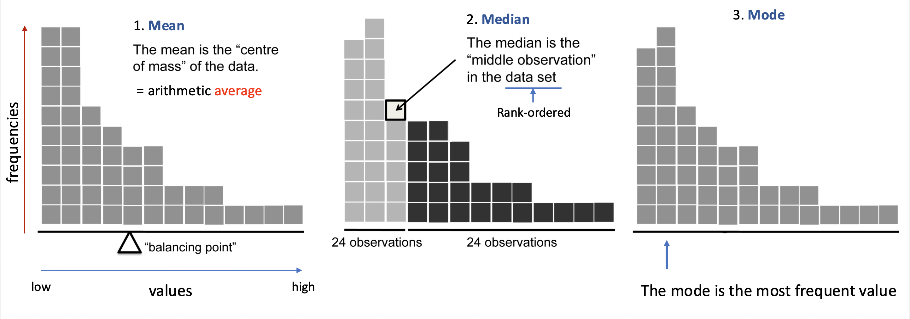
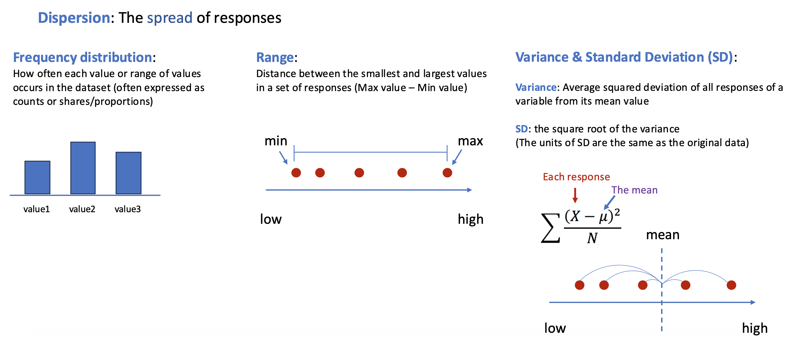
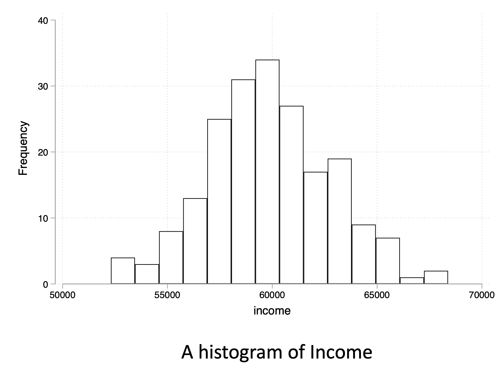
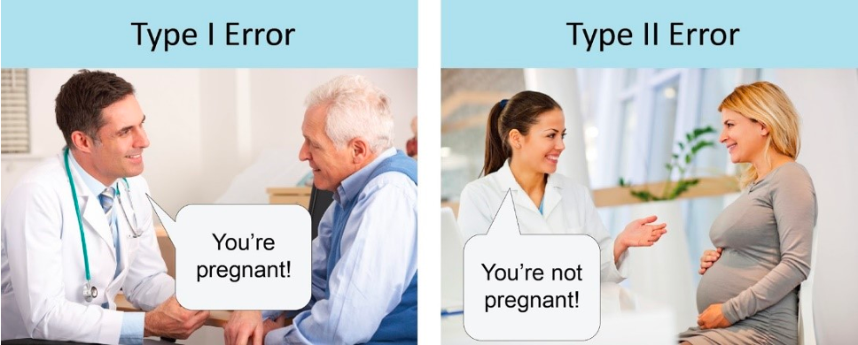

```{r setup}
#| include: false
library(tidyverse)
library(knitr)
library(kableExtra)

# Set seed for reproducibility
set.seed(2026)

# Create healthcare datasets for the course
# Patient satisfaction data
n_patient1 <- 1000
patient_satisfaction <- tibble(
  patient_id = 1:n_patient1,
  hospital = sample(c("General Hospital", "University Medical", "Community Health"), n_patient1, replace = TRUE),
  department = sample(c("Emergency", "Surgery", "Internal Medicine", "Pediatrics"), n_patient1, replace = TRUE),
  age = round(rnorm(n_patient1, mean = 55, sd = 18)),
  gender = sample(c("Male", "Female"), n_patient1, replace = TRUE),
  insurance_type = sample(c("Private", "Medicare", "Medicaid", "Uninsured"), n_patient1,
                          prob = c(0.4, 0.35, 0.15, 0.1), replace = TRUE),
  wait_time_minutes = round(rgamma(n_patient1, shape = 2, rate = 0.05)),
  satisfaction_score = round(pmin(7, pmax(1, rnorm(n_patient1, mean = 5.2, sd = 1.3)))),
  would_recommend = sample(1:7, n_patient1, replace = TRUE,
                           prob = c(0.05, 0.05, 0.1, 0.15, 0.25, 0.25, 0.15)),
  length_of_stay = round(rgamma(n_patient1, shape = 1.5, rate = 0.3), 1),
  total_charges = round(rlnorm(n_patient1, meanlog = 9, sdlog = 1))
)

# Readmission data
readmission_data <- tibble(
  patient_id = 1:500,
  age_group = sample(c("18-44", "45-64", "65-74", "75+"), 500,
                     prob = c(0.15, 0.30, 0.30, 0.25), replace = TRUE),
  diagnosis = sample(c("Heart Failure", "Pneumonia", "COPD", "AMI", "Hip Replacement"),
                     500, replace = TRUE),
  readmitted_30day = sample(c("Yes", "No"), 500, prob = c(0.15, 0.85), replace = TRUE),
  pain_score = sample(0:10, 500, replace = TRUE),
  comorbidity_count = rpois(500, lambda = 2)
)

# Additional data for distribution shape examples
bp_data <- tibble(
  patient_id = 1:800,
  systolic_bp = round(rnorm(800, mean = 120, sd = 12))
)

high_satisfaction <- tibble(
  patient_id = 1:250,
  satisfaction_rating = round(100 - rgamma(250, shape = 3, rate = 0.2))
)

ed_wait_times <- tibble(
  patient_id = 1:500,
  shift = sample(c("Day", "Night"), 500, replace = TRUE, prob = c(0.5, 0.5)),
  wait_minutes = ifelse(shift == "Day",
                       rnorm(500, mean = 22, sd = 5),
                       rnorm(500, mean = 55, sd = 6))
) %>%
  mutate(wait_minutes = round(pmax(5, wait_minutes)))
```

## Today's Agenda

::: {.incremental}
1. **Part 1**: Central Tendency & Dispersion
2. **Part 2**: Scales of Measurement
3. **Part 3**: Distribution Shapes
4. **Part 4**: Introduction to Statistical Inference
:::

::: {.fragment .fade-up}
<br>
**Goal**: Build the statistical foundation for data-driven healthcare decisions
:::

# Why Statistics Matter {background-color="#40666e"}

## Opening Scenario

**Let's think about this:**  

> *Imagine your hospital just collected satisfaction data from 500 patients across multiple departments. Each patient rated their experience on a 7-point scale (1 = very dissatisfied, 7 = very satisfied).*

. . .

- **Your task** is to present these results to the board, but how?

. . .


You analyzed the data and presented the following: 

::: {style="font-size: 0.75em;"}
- "Our average patient satisfaction score is **5.2 out of 7**."
- [A board member asks: *"Is that good? Should we celebrate or be concerned?"*]{.fragment}
:::

. . .


You dig deeper and find: 

::: {style="font-size: 0.75em;"}
- The Emergency Department scored **4.8** while Internal Medicine scored **5.1**. 
- [Another board member asks: *"So Internal Medicine is performing better than the Emergency Department?"*]{.fragment}
:::

. . .

## The Questions We Need to Answer

. . .

::: {.columns}
::: {.column width="50%"}
**Understanding the Numbers**

- Is summarizing 1-7 satisfaction ratings with an "average" even appropriate?
- What does "5.2 out of 7" really tell us?
- How spread out are individual scores?
:::

::: {.column width="50%"}
::: {.fragment}
**Making Comparisons**

- Is a 0.3-point difference (4.8 vs. 5.1) meaningful?
- Could it just be random chance?
- How confident can we be in our conclusions?
:::
:::
:::

. . .

<br>
**Today, we'll cover the concepts you need to answer these questions!**


## Why Statistical Concepts Matter

As a healthcare manager, you make decisions daily that affect:

::: {.incremental}
- **Patient outcomes**: Quality of care, safety, satisfaction
- **Operational efficiency**: Staffing, resource allocation, workflow
- **Financial performance**: Cost management, budget planning
- **Strategic planning**: Service line development, capacity planning
:::

## Learning Objectives

By the end of this session, you will be able to:

::: {.incremental}
1. Understand **measures** of central tendency and dispersion
2. Identify the four **scales of measurement** and select appropriate statistics
3. Recognize how **distribution shapes** affect statistical choices
4. Understand confidence intervals and **hypothesis testing** basics
:::

# Part 1: Central Tendency & Dispersion {background-color="#40666e"}

## The Challenge of Summarizing Data

- Describing patient satisfaction by reading each score individually:
  - "Patient 1 scored 2, Patient 2 scored 4, Patient 3 scored 6..."

. . .

With 1,000 patients, this provides **too much detail** to identify patterns!

. . .

<br>
A solution might be summarizing data with two key types of measures:

1. **Central tendency** — Where is the "center"?
2. **Dispersion** — How spread out is the data?

## The Three Central Tendency Measures

::: {style="display: flex; justify-content: center; align-items: center; height: 70vh;"}

:::


## Example: Length of Stay (11 Patients)

Let's assume that we have 11 patients with the following LOS data:

> **Patient LOS data**: 2, 2, 2, 3, 3, 4, 5, 5, 6, 8, 15 days

```{r}
#| echo: false
los_example <- c(2, 2, 2, 3, 3, 4, 5, 5, 6, 8, 15)
mean_los <- mean(los_example)
median_los <- median(los_example)
```

. . .

**Calculations**:

::: {.columns}
::: {.column width="45%"}
::: {.incremental style="font-size: 0.8em;"}
- **Mean**: 
  - (2+2+2+3+3+4+5+5+6+8+15) / 11 
  - = 55 / 11 = **`r round(mean_los, 2)` days**
- **Median**: 6th value = **`r median_los` days**
- **Mode**: **2 days** (most frequent)
:::
:::

::: {.column width="55%"}
::: {.fragment}
```{r}
#| echo: false
#| fig-height: 3
#| fig-width: 5
los_df <- tibble(LOS = los_example)

ggplot(los_df, aes(x = LOS)) +
  geom_dotplot(binwidth = 1, fill = "steelblue", color = "white", dotsize = 0.8) +
  geom_vline(xintercept = mean_los, color = "#E41A1C", linewidth = 1.2) +
  geom_vline(xintercept = median_los, color = "#377EB8", linewidth = 1.2, linetype = "dashed") +
  annotate("text", x = mean_los + 0.5, y = 0.95, label = paste("Mean =", round(mean_los, 2)),
           color = "#E41A1C", hjust = 0, size = 3) +
  annotate("text", x = median_los - 0.5, y = 0.85, label = paste("Median =", median_los),
           color = "#377EB8", hjust = 1, size = 3) +
  scale_x_continuous(breaks = seq(0, 16, 2)) +
  labs(x = "Length of Stay (Days)", y = "") +
  theme_minimal() +
  theme(axis.text.y = element_blank())
```
:::
:::
:::


## Why Dispersion Matters

Knowing the center isn't enough. We also need to know **how much variability** exists.

. . .

<br>
**Example**: Two hospitals both have **mean wait time = 45 minutes**

::: {.columns}
::: {.column width="50%"}
**Hospital A**: 40-50 minutes

- Low variability
- **Predictable**
:::

::: {.column width="50%"}
**Hospital B**: 10-120 minutes

- High variability
- **Unpredictable**
:::
:::

. . .

<br>
Which would provide a better patient experience? Which is easier to staff?

## Measures of Dispersion

::: {style="display: flex; justify-content: center; align-items: center; height: 50vh; width: 100%;"}

:::

<br>

::: {.callout-note .fragment style="font-size: 0.75em;"}
## Note on Variance Calculation
For sample data, **$n-1$** is used instead of $n$ to get an unbiased estimate. R's `sd()` function uses $n-1$.
:::


## Calculating Dispersion: Frequency & Range

Now let's take a look at how we can calculate the dispersion measures using the same data points used for the central tendency measures.

> **Patient LOS data**: 2, 2, 2, 3, 3, 4, 5, 5, 6, 8, 15 days (Mean = `r round(mean_los, 2)`)

. . . 

**1. Frequency Distribution**

. . .

```{r}
#| echo: false
tibble(Days = los_example) %>%
  count(Days, name = "Freq") %>%
  mutate(Prop = scales::percent(Freq/sum(Freq), accuracy = 1)) %>%
  kable() %>%
  kable_styling(font_size = 16)
```

. . .

**2. Range**

::: {.incremental style="font-size: 0.8em;"}
- Max = 15, Min = 2
- Range = Max - Min = 15 - 2 = 13 days
:::


## Calculating Dispersion: Variance & SD

**3. Variance & Standard Deviation**

. . .

```{r}
#| echo: false
deviations <- los_example - mean_los
squared_dev <- deviations^2
variance_los <- sum(squared_dev) / (length(los_example))
sd_los <- sqrt(variance_los)

calculation_table <- tibble(
  `LOS` = as.character(los_example),
  `Mean` = rep(5, 11),
  `Deviation` = round(deviations, 2),
  `Squared Dev.` = round(squared_dev, 2)
) %>%
  add_row(LOS = "Sum", Mean = NA, Deviation = sum(round(deviations, 2)), `Squared Dev.` = sum(round(squared_dev, 2)))

kable(calculation_table) %>%
  kable_styling(bootstrap_options = c("striped", "hover"), font_size = 16) %>%
  row_spec(12, bold = TRUE, background = "#f2f2f2")
```

. . .

::: {.incremental}
- **Variance** = Sum of Squared Dev / (n) = 146 / 11 = **`r round(variance_los, 2)` days²**
- **Standard Deviation** = $\sqrt{\text{Variance}}$ = **`r round(sd_los, 2)` days**
:::


# Part 2: Scales of Measurement {background-color="#40666e"}

## Why Scales Matter

**What are "Scales of Measurement"?**

- It refers to **how variables are defined and categorized**. The scale determines the amount of information a variable contains.

. . .

<br>
**Why do they matter?**

- Not all statistics work with all types of data!

::: {.incremental style="font-size: 0.85em;"}
- **e.g.,)**: Measuring patient satisfaction

  - **7-point scale** (1 = very dissatisfied, 7 = very satisfied)
  - **Three categories** (Low, Medium, High)
  - **Yes/No question** (Satisfied or not)

- Same concept, different data types → **different statistics required!**
:::

. . .


## The Four Measurement Scales

```{r}
#| echo: false
#| fig-height: 4
#| fig-width: 8
scales_data <- tibble(
  Scale = factor(c("Nominal", "Ordinal", "Interval", "Ratio"),
                 levels = c("Nominal", "Ordinal", "Interval", "Ratio")),
  Information = c(1, 2, 3, 4),
  Label = c("Categories\nonly", "Categories +\nOrder", "Categories +\nOrder +\nEqual intervals",
            "Categories +\nOrder +\nEqual intervals +\nAbsolute zero")
)

ggplot(scales_data, aes(x = Scale, y = Information, fill = Scale)) +
  geom_col(width = 0.7) +
  geom_text(aes(label = Label), vjust = -0.3, size = 3) +
  scale_fill_manual(values = c("#E8E8E8", "#B8D4E8", "#6BAED6", "#2171B5")) +
  labs(title = "Measurement Scales: From Less to More Information",
       y = "Amount of Information") +
  theme_minimal() +
  theme(legend.position = "none",
        axis.text.y = element_blank()) +
  ylim(0, 5.5)
```

## 1. Nominal Scale

- Categories with NO inherent order of magnitude or degree

**Examples**:

::: {.incremental style="font-size: 0.85em;"}
- *Insurance type*: Private (1), Medicare (2), Medicaid (3)
- *Department*: Emergency (1), Surgery (2), Pediatrics (3)
- *Blood type*: A (1), B (2), AB (3), O (4)
- Even if coded as numbers (1, 2, 3, 4), you **cannot** calculate a meaningful mean!
:::

. . .

**Available Statistics**:

::: {.incremental style="font-size: 0.85em;"}
- **Central tendency**: Mode 
- **Dispersion**: Frequencies, percentages
:::

## 2. Ordinal Scale

- Categories with order of magnitude or degree, but **unequal intervals**

**Examples**:

::: {.incremental style="font-size: 0.85em;"}
- *Pain categories*: None, Mild, Moderate, Severe
- *Cancer staging*: Stage I (localized) → II → III → IV (metastatic)
- *Heart Failure Class*: Class I (mild) → II → III → IV (severe)
- *Age group*: Young → Middle-aged → Elderly
- **Cannot calculate meaningful mean!** (gaps between categories are unknown)
:::

. . . 

**Available Statistics**:

::: {.incremental style="font-size: 0.85em;"}
- **Central tendency**: Mode, Median
- **Dispersion**: Frequencies, percentages, range
:::

## Why We Cannot Average Ordinal Data

Let's think about this case: 100 patients rate post-operative pain

::: {style="font-size: 0.75em;"}
| Pain Level | Code | Patients |
|------------|------|----------|
| None       | 1    | 20       |
| Mild       | 2    | 30       |
| Moderate   | 3    | 35       |
| Severe     | 4    | 15       |
:::

. . .

- If we calculate the mean of the above data, we get:
  - Calculated mean: (20×1 + 30×2 + 35×3 + 15×4) / 100 = **2.45**

. . .

**What does 2.45 mean?** 🤔

::: {.incremental style="font-size: 0.75em;"}
- If None→Mild might be a small jump, while Moderate→Severe might be huge (unbearable pain!)
- **We can't assume equal intervals!**
- "2.45" says "between Mild and Moderate," but actual pain could be closer to Severe!
:::


## 3. Interval Scale

- **Equal intervals** between values, but no true zero

**Examples**:

::: {.incremental style="font-size: 0.85em;"}
- *Temperature (°F, °C)*: 0° doesn't mean "no temperature"
- *Calendar year*: Year 0 is arbitrary
- *Numeric satisfaction scales*: (e.g., 1-7, 1-10)
- **Cannot make ratio statements**: "40°C is NOT twice as hot as 20°C"
:::

. . .

**Available Statistics**:

::: {.incremental style="font-size: 0.85em;"}
- **Central tendency**: Mode, Median, **Mean**
- **Dispersion**: Range, **Variance, Standard Deviation**
:::

## 4. Ratio Scale

- Equal intervals + **true zero** (zero = absence)

**Examples**:

::: {.incremental style="font-size: 0.85em;"}
- *Length of stay*: 0 = no stay
- *Wait time*: 0 = no wait
- *Total charges*: $0 = no charges
- *Physical measures*: Age, weight, blood pressure
:::

. . .

**Available Statistics**:

::: {.incremental style="font-size: 0.85em;"}
- All measures (mean, median, mode, SD, variance)
- **Can make ratio statements**: "LOS of 6 days is twice 3 days"
:::

## Quick Summary: Choosing Statistics

| Scale | Central Tendency | Dispersion | Healthcare Examples |
|-------|-----------------|------------|---------------------|
| **Nominal** | Mode | Freq, % | Diagnosis, Insurance |
| **Ordinal** | Mode, Median | Freq, %, Range | Pain category, Stage |
| **Interval** | Mode, Median, Mean | All + Var, SD | Satisfaction (1-7) |
| **Ratio** | All | All | LOS, Wait time, Cost |

## 👉 Quick Checkpoint ✓

::: {.incremental}
1. What scale is "Blood Type (A, B, AB, O)"? [→ **Nominal**]{.fragment}
2. What scale is "Pain level (Mild, Moderate, Severe)"? [→ **Ordinal**]{.fragment}
3. What scale is "Length of Stay in days"? [→ **Ratio**]{.fragment}
4. Can you calculate mean for ordinal data? [→ **No!**]{.fragment}
5. Why not? [→ **Unequal intervals between categories**]{.fragment}
:::

# Part 3: Distribution Shapes {background-color="#40666e"}

## Why Distribution Shape Matters

**Distribution**: The pattern of how data values are spread across their possible range.

::: {style="display: flex; justify-content: center; align-items: center;"}
{width="40%" fig-align="center"}
:::

::: {.incremental style="font-size: 0.8em;"}
- The shape affects which central tendency measure best represents the "typical" value (especially for interval and ratio data).

- If a hospital administrator asks "What's our typical patient length of stay?"

- The answer depends on the distribution!
:::


## Data Distributions

::: {style="display: flex; flex-direction: column; justify-content: center; align-items: center; width: 100%;"}
[{width="45%" fig-align="center"}](https://medium.com/@ciortanmadalina/overview-of-data-distributions-87d95a5cbf0a)
:::

## Four Common Distribution Shapes

::: {.incremental}
1. **Normal (Symmetric)**
2. **Right or positive Skewed**
3. **Left or negative Skewed**
4. **Bimodal**
:::


## 1. Normal Distribution

**Characteristics**: Bell-shaped, symmetric, Mean ≈ Median

**Example**: Blood Pressure

```{r}
#| echo: false
#| fig-height: 3.5
#| fig-width: 6
mean_bp <- mean(bp_data$systolic_bp)
sd_bp <- sd(bp_data$systolic_bp)

ggplot(bp_data, aes(x = systolic_bp)) +
  geom_histogram(binwidth = 2, fill = "#6BAED6", color = "white") +
  geom_vline(xintercept = mean_bp, color = "#E41A1C", linewidth = 1.2) +
  annotate("text", x = mean_bp + 5, y = 80,
           label = paste0("Mean ≈ Median = ", round(mean_bp, 1), " mmHg"),
           color = "#E41A1C", hjust = 0, fontface = "bold") +
  labs(title = "Normal Distribution: Systolic Blood Pressure",
       x = "Systolic Blood Pressure (mmHg)", y = "Count") +
  theme_minimal()
```

. . . 

- **Use Mean** as central tendency. 
  - It accurately represents the balance point in symmetric data, and is widely known and used

## The 68-95-99.7 Rule

For normally distributed data:

- **68%** of values fall within **±1 SD** of the mean
- **95%** of values fall within **±2 SD** of the mean
- **99.7%** of values fall within **±3 SD** of the mean

```{r}
#| echo: false
#| fig-height: 3.5
#| fig-width: 8
x_norm <- seq(mean_bp - 4*sd_bp, mean_bp + 4*sd_bp, length = 1000)
y_norm <- dnorm(x_norm, mean = mean_bp, sd = sd_bp)
normal_curve <- tibble(x = x_norm, y = y_norm * 300)

ggplot(normal_curve, aes(x = x, y = y)) +
  geom_area(data = filter(normal_curve, x >= mean_bp - 3*sd_bp & x <= mean_bp + 3*sd_bp),
            alpha = 0.2, fill = "#FED976") +
  geom_area(data = filter(normal_curve, x >= mean_bp - 2*sd_bp & x <= mean_bp + 2*sd_bp),
            alpha = 0.3, fill = "#FEB24C") +
  geom_area(data = filter(normal_curve, x >= mean_bp - sd_bp & x <= mean_bp + sd_bp),
            alpha = 0.4, fill = "#F03B20") +
  geom_line(linewidth = 1.2) +
  annotate("text", x = mean_bp, y = max(normal_curve$y) * 0.5, label = "68%", fontface = "bold", size = 5) +
  annotate("text", x = mean_bp + 1.5*sd_bp, y = max(normal_curve$y) * 0.2, label = "95%", fontface = "bold", size = 4) +
  scale_x_continuous(breaks = c(mean_bp - 2*sd_bp, mean_bp - sd_bp, mean_bp,
                                mean_bp + sd_bp, mean_bp + 2*sd_bp),
                     labels = c("-2σ", "-1σ", "μ", "+1σ", "+2σ")) +
  labs(title = "The Empirical Rule (68-95-99.7)", x = "", y = "") +
  theme_minimal() +
  theme(axis.text.y = element_blank())
```

## 2. Right-Skewed Distribution

**Characteristics**: Tail to the right, Mean > Median

**Example**: Length of Stay

```{r}
#| echo: false
#| fig-height: 3.5
#| fig-width: 6
mean_los_dist <- mean(patient_satisfaction$length_of_stay)
median_los_dist <- median(patient_satisfaction$length_of_stay)

ggplot(patient_satisfaction, aes(x = length_of_stay)) +
  geom_histogram(binwidth = 1, fill = "#6BAED6", color = "white") +
  geom_vline(xintercept = mean_los_dist, color = "blue", linewidth = 1.2) +
  geom_vline(xintercept = median_los_dist, color = "#4DAF4A", linewidth = 1.2, linetype = "dashed") +
  annotate("text", x = mean_los_dist + 1, y = 40, label = paste("Mean =", round(mean_los_dist, 1)),
           color = "blue", hjust = 0, fontface = "bold") +
  annotate("text", x = median_los_dist - 1, y = 35, label = paste("Median =", median_los_dist),
           color = "#4DAF4A", hjust = 1, fontface = "bold") +
  labs(title = "Length of Stay: Right-Skewed",
       x = "Length of Stay (Days)", y = "Count") +
  theme_minimal()
```

. . . 

- **Median** would be more meaningful — not pulled by outliers

## 3. Left-Skewed Distribution

**Characteristics**: Tail to the left, Mean < Median

**Example**: Patient Satisfaction (0-100 scale)

```{r}
#| echo: false
#| fig-height: 3.5
#| fig-width: 6
mean_sat_ls <- mean(high_satisfaction$satisfaction_rating)
median_sat_ls <- median(high_satisfaction$satisfaction_rating)

ggplot(high_satisfaction, aes(x = satisfaction_rating)) +
  geom_histogram(binwidth = 2, fill = "#6BAED6", color = "white") +
  geom_vline(xintercept = mean_sat_ls, color = "#E41A1C", linewidth = 1.2) +
  geom_vline(xintercept = median_sat_ls, color = "#4DAF4A", linewidth = 1.2, linetype = "dashed") +
  annotate("text", x = mean_sat_ls - 2, y = 25, label = paste("Mean =", round(mean_sat_ls, 1)),
           color = "#E41A1C", hjust = 1, fontface = "bold") +
  annotate("text", x = median_sat_ls + 2, y = 25, label = paste("Median =", round(median_sat_ls, 1)),
           color = "#4DAF4A", hjust = 0, fontface = "bold") +
  labs(title = "Patient Satisfaction: Left-Skewed",
       x = "Satisfaction Rating (0-100)", y = "Count") +
  theme_minimal()
```

. . . 

- **Median** would be more meaningful — not pulled by low outliers

## 4. Bimodal Distribution

**Characteristics**: Two peaks → Two subgroups!

**Example**: ED Wait Times by Shift

```{r}
#| echo: false
#| fig-height: 3.5
#| fig-width: 6
overall_mean <- mean(ed_wait_times$wait_minutes)

ggplot(ed_wait_times, aes(x = wait_minutes)) +
  geom_histogram(binwidth = 3, fill = "#6BAED6", color = "white") +
  geom_vline(xintercept = overall_mean, color = "#E41A1C", linewidth = 1.2) +
  annotate("text", x = overall_mean + 2, y = 58,
           label = paste("Overall Mean =", round(overall_mean, 1), "min"),
           color = "#E41A1C", hjust = 0, fontface = "bold") +
  annotate("text", x = 21, y = 45, label = "Day Shift\nPeak", color = "#377EB8", fontface = "bold") +
  annotate("text", x = 51, y = 45, label = "Night Shift\nPeak", color = "#377EB8", fontface = "bold") +
  labs(title = "ED Wait Times: Bimodal Distribution",
       x = "Wait Time (minutes)", y = "Count") +
  theme_minimal()
```

. . .

::: {.incremental}
- **The overall mean (`r round(overall_mean, 1)` min) or median (`r round(median(ed_wait_times$wait_minutes), 1)` min) represents NEITHER group!**
  - It would be more informative to analyze each subgroup separately (e.g., report Day Shift and Night Shift statistics individually)
:::

## Decision Guide: Choosing Central Tendency

| Distribution Shape | Best Measure | Why |
|--------------------|-------------|-----|
| **Normal** | Mean | Represents balance point well |
| **Right-skewed** | Median | Not pulled by high outliers |
| **Left-skewed** | Median | Not pulled by low outliers |
| **Bimodal** | Analyze separately | Mean/median fall between peaks |


# Practice: Descriptive Statistics in R {background-color="#40666e"}

## Central Tendency in R

**Key Functions**:

::: {style="font-size: 0.8em;"}
- `mean()`: Returns the mean of a data vector
- `median()`: Returns the median of a data vector
- `Mode()`: Returns the mode (requires `DescTools` package)
:::

. . .

```{r}
#| echo: true
#| eval: false

# Create data vector
los_data <- c(2, 2, 2, 3, 3, 4, 5, 5, 6, 8, 15)

# Calculate Mean
mean(los_data)

# Calculate Median
median(los_data)

# Calculate Mode (requires DescTools package)
library(DescTools)
Mode(los_data)
```

## Dispersion in R

**Key Functions**:

::: {style="font-size: 0.8em;"}
- `table()`: Calculates frequencies (counts)
- `prop.table()`: Calculates proportions
- `range()`: Returns the min and max values
- `var()`: Calculates variance (uses n-1)
- `sd()`: Calculates standard deviation (uses n-1)
:::

. . .

```{r}
#| echo: true
#| eval: false

# Frequencies and Proportions
table(los_data)
prop.table(table(los_data))

# Range (min and max)
range(los_data)
diff(range(los_data))  # Single number

# Variance and Standard Deviation
var(los_data)
sd(los_data)
```

## Quick Reference Summary

::: {style="font-size: 0.8em;"}
| Measure | R Function | Example | Note |
|---------|------------|---------|------|
| **Mean** | `mean(x)` | `mean(los_data)` | |
| **Median** | `median(x)` | `median(los_data)` | |
| **Mode** | `Mode(x)` | `Mode(los_data)` | Requires `DescTools` |
| **Frequencies** | `table(x)` | `table(los_data)` | `prop.table(table(x))` returns proportions |
| **Range** | `range(x)` | `range(los_data)` | `diff(range(x))` returns single number |
| **Variance** | `var(x)` | `var(los_data)` | Uses n-1 |
| **SD** | `sd(x)` | `sd(los_data)` | Uses n-1 |
:::


# Part 4: Statistical Inference {background-color="#40666e"}

## From Description to Inference

So far we talked about **descriptive statistics** (summarizing data we have)

Now we will talk about **inferential statistics** (drawing conclusions about populations)

. . .

<br>
Let's think about this healthcare research example:

- *Is there a difference in patient **satisfaction** between departments?*
  - **Sample**: 200 patients we surveyed
    - Department A = 85 vs. Department B = 80
  - **Population**: All patients who visit our hospital

. . .

- Is the satisfaction difference between departments **real** or just **random chance**?


## Let's think about coin tossing

- If we toss a fair coin **10 times**, how many heads would we expect?

```{r}
#| echo: false
#| fig-height: 3.5
#| fig-width: 7
#| fig-align: center

set.seed(2026)
# Simulate 10,000 experiments, each with 10 coin tosses
n_experiments <- 10000
n_tosses <- 10

# Count number of heads in each experiment
heads_count <- rbinom(n_experiments, n_tosses, prob = 0.5)

# Create histogram
ggplot(tibble(heads = heads_count), aes(x = heads)) +
  geom_histogram(binwidth = 1, fill = "#6BAED6", color = "white", center = 0) +
  geom_vline(xintercept = 5, color = "#E41A1C", linewidth = 1.2, linetype = "dashed") +
  annotate("text", x = 5.3, y = max(table(heads_count)) * 0.9, 
           label = "Expected = 5", color = "#E41A1C", hjust = 0, fontface = "bold") +
  scale_x_continuous(breaks = 0:10) +
  labs(title = "10,000 Simulations: Number of Heads in 10 Coin Tosses",
       x = "Number of Heads", y = "Frequency") +
  theme_minimal()
```

::: {.incremental style="font-size: 0.75em;"}
- Most results cluster around **5 heads** (expected value)
- Getting **0** (`r sum(heads_count == 0)`) or **10 heads** (`r sum(heads_count == 10)`) is rare, but possible!
- This is the essence of **random chance**
:::

## The Logic of Hypothesis Testing

::: {.incremental}
1. **Assume** there's NO difference (Null Hypothesis, H₀)
2. **Calculate** how likely our observed data would be under this assumption
3. **If very unlikely** (p < 0.05) → Reject H₀ → Conclude there IS a difference
:::

. . .

<br>
**Think of it like a criminal trial**:

::: {.incremental style="font-size: 0.80em;"}
- H₀: Defendant is innocent
- H₁: Defendant is guilty
- Evidence: Our data
- Standard of proof: p < 0.05 (like "beyond reasonable doubt")
- If evidence strongly contradicts innocence → Reject H₀
:::

## Key Terminology: H₀ vs H₁

::: {.columns}
::: {.fragment .column width="50%"}
**Null Hypothesis (H₀)**

The "no effect" or "no difference" assumption

::: {style="font-size: 0.8em;"}
- H₀: Hospital A satisfaction = Hospital B satisfaction
- H₀: New process has no effect on readmissions
:::
:::

::: {.fragment .column width="50%"}
**Alternative Hypothesis (Hₐ or H₁)**

What we're trying to find evidence for

::: {style="font-size: 0.8em;"}
- H₁: Hospital A satisfaction ≠ Hospital B satisfaction
- H₁: New process reduces readmissions
:::
:::
:::

## What is a p-value?

A p-value is a probability of observing data as extreme as what we observed, **if H₀ were true**

. . .

<br>

::: {.columns}
::: {.fragment .column width="50%"}
**Small p-value (< 0.05)**

- Data would be surprising if H₀ were true
- Evidence against H₀
- "Statistically significant"
:::

::: {.fragment .column width="50%"}
**Large p-value (≥ 0.05)**

- Data wouldn't be surprising if H₀ were true
- Not enough evidence against H₀
- "Not statistically significant"
:::
:::

## Visualizing the Null Hypothesis

```{r}
#| echo: false
#| fig-height: 3.5
#| fig-width: 8

# Create smooth normal distribution curve for null hypothesis
x_null <- seq(-0.6, 0.6, length = 1000)
y_null <- dnorm(x_null, mean = 0, sd = 0.15)
null_curve <- tibble(x = x_null, y = y_null)
critical_value <- 0.3

ggplot(null_curve, aes(x = x, y = y)) +
  geom_area(data = filter(null_curve, x <= -critical_value), fill = "#E41A1C", alpha = 0.3) +
  geom_area(data = filter(null_curve, x >= critical_value), fill = "#E41A1C", alpha = 0.3) +
  geom_line(linewidth = 1.5, color = "#2171B5") +
  geom_vline(xintercept = 0, linetype = "dashed", color = "#2171B5", linewidth = 1) +
  geom_vline(xintercept = c(-critical_value, critical_value), color = "#E41A1C", linewidth = 1, linetype = "dashed") +
  annotate("text", x = -0.45, y = max(null_curve$y) * 0.6, label = expression(bold("Reject H"[0])), color = "#E41A1C", size = 4) +
  annotate("text", x = -0.45, y = max(null_curve$y) * 0.45, label = "(p < 0.05)", color = "#E41A1C", size = 3.5) +
  annotate("text", x = 0.45, y = max(null_curve$y) * 0.6, label = expression(bold("Reject H"[0])), color = "#E41A1C", size = 4) +
  annotate("text", x = 0.45, y = max(null_curve$y) * 0.45, label = "(p < 0.05)", color = "#E41A1C", size = 3.5) +
  annotate("text", x = 0, y = max(null_curve$y) * 0.35, label = expression("Do NOT reject H"[0]), color = "#2171B5", size = 3.5) +
  labs(x = "Difference Between Groups", y = "") +
  theme_minimal() +
  theme(axis.text.y = element_blank(), axis.ticks.y = element_blank())
```

::: {style="font-size: 0.8em;"}
- **Blue curve**: Expected distribution if H₀ is true (no real difference; Null model)
- **Red tails**: Observed difference falls here → Reject H₀ (p < 0.05)
:::

## Common p-value Misconceptions

::: {.incremental}
1. **"P-value is probability H₀ is true"** ❌
   - P-value assumes H₀ is true. It doesn't tell us probability it's true

2. **"p ≥ 0.05 means no difference"** ❌
   - Just means insufficient evidence (absence of evidence ≠ evidence of absence)

3. **"p < 0.05 means clinically or practicallyimportant"** ❌
   - Statistically significant ≠ Practically meaningful
:::

## Confidence Intervals

Hypothesis testing gives a **Yes/No** answer. Confidence intervals tell us **how big** the effect might be.

. . .

<br>
**What is a CI?** 

- A range of plausible values for a population parameter

. . .

**Example**: Mean wait time = 45 min, 95% CI = [42, 48] min

. . .

- If we repeated this sampling many times, about 95% of those intervals would contain the true population mean <a href="https://www.youtube.com/watch?v=0tKWtW1J41Y" target="_blank">[see here]</a>

. . .

**Key insight**:

- Larger sample **and** lower variability → **Narrower** CI (more precise)
- Smaller sample **or** higher variability → **Wider** CI (less precise)

## Calculating a Confidence Interval

**Formula for 95% CI:**

$$\text{CI} = \bar{x} \pm 2 \times \frac{s}{\sqrt{n}}$$

. . .

::: {style="font-size: 0.75em;"}
Where: 

- $\bar{x}$ = sample mean
- $s$ = standard deviation
- $n$ = sample size
- $\frac{s}{\sqrt{n}}$ = **Standard Error (SE)**: how much the sample mean varies
:::

. . .

**Example**: 100 patients, mean wait = 45 min, SD = 15 min

$$45 \pm 2 \times \frac{15}{\sqrt{100}} = 45 \pm 3 = [42, 48] \text{ min}$$

## Using CIs for Comparisons

**Non-overlapping CIs:**

- **Hospital A** satisfaction = 5.5 [CI: 5.2, 5.8]
- **Hospital B** satisfaction = 4.8 [CI: 4.5, 5.1]

. . .

- **CIs don't overlap** → Strong evidence of a significant difference!

. . .

<br>
**Overlapping CIs:**

- **Hospital C** satisfaction = 5.2 [CI: 4.8, 5.6]
- **Hospital D** satisfaction = 4.9 [CI: 4.5, 5.3]

. . .

- **CIs overlap** → We can't tell just by looking! Need a formal test.


## Type I and Type II Errors

::: {.columns}
::: {.fragment .column width="50%"}
### Type I (False Positive)

- **Reject H₀ when it's actually true**
- e.g.,) Adopting ineffective treatment
- Probability = α (usually 0.05)
:::

::: {.fragment .column width="50%"}
### Type II (False Negative)

- **Fail to reject H₀ when it's false**ee
- e.g.,) Missing an effective treatment
- Probability = β
:::
:::


## Type I and Type II Errors


[](https://unbiasedresearch.blogspot.com/)

::: {style="font-size: 0.5em;"}
Source: [https://unbiasedresearch.blogspot.com](https://unbiasedresearch.blogspot.com/)
:::

## The 0.05 Threshold

**Why p < 0.05?**

. . .

::: {.fragment style="font-size: 0.85em;"}
- Popularized by **Ronald Fisher** in the 1920s
- It's a **convention**, not a mathematical truth
- Represents 5% chance of Type I error (1 in 20)
:::

. . .

**When to use different thresholds**:

::: {style="font-size: 0.85em;"}
- **Stricter (0.01, 0.001)**: High-stakes decisions (drug approval)
- **Looser (0.10)**: Exploratory research, practical considerations
:::

. . .

<br>
**For this course**: We use 0.05 as the standard threshold

# Summary {background-color="#40666e"}

## Key Takeaways

::: {.fragment}
**1. Central Tendency & Dispersion**

::: {style="font-size: 0.75em;"}
- Mean, Median, Mode for center
- Range, Variance, SD for spread
- Both are important to understand the data
:::
:::

<br>

::: {.fragment}
**2. Measurement Scales**

::: {style="font-size: 0.75em;"}
- The choice of descriptive statistics depends on the measurement scale
  - Nominal → Mode, Frequencies, Proportions
  - Ordinal → + Median, Range
  - Interval/Ratio → + Mean, SD, Variance
:::
:::

## Key Takeaways

::: {.fragment}
**3. Distribution Shape**

::: {style="font-size: 0.75em;"}
- The choice of descriptive statistics depends on the distribution shape (for interval and ratio scale data)
  - Normal → Use mean
  - Skewed → Use median
  - Bimodal → Analyze separately
:::
:::

<br>

::: {.fragment}
**4. Statistical Inference**

::: {style="font-size: 0.75em;"}
- P-value: Probability of seeing the observed data (or more extreme) assuming H₀ is true
- CI: Range of plausible population values (larger n + lower variability = narrower)
- 0.05 threshold (Type I error rate) is convention, not law
- Statistical significance ≠ Clinical or practical significance
:::
:::

## Resources

**Further Reading**:

- [Seeing Theory: Frequentist Inference](https://seeing-theory.brown.edu/frequentist-inference/index.html) - Interactive visualizations
- [StatQuest: P-values Explained](https://www.youtube.com/watch?v=5Z9OIYA8He8) - Video explanation

**Next Week**: Exploratory Data Analysis and Data Visualization in R

## Questions? {background-color="#40666e"}

- Feel free to ask me anything you're curious about!

- Class Reflection Assignment is due by this Sunday at 11:59 PM
