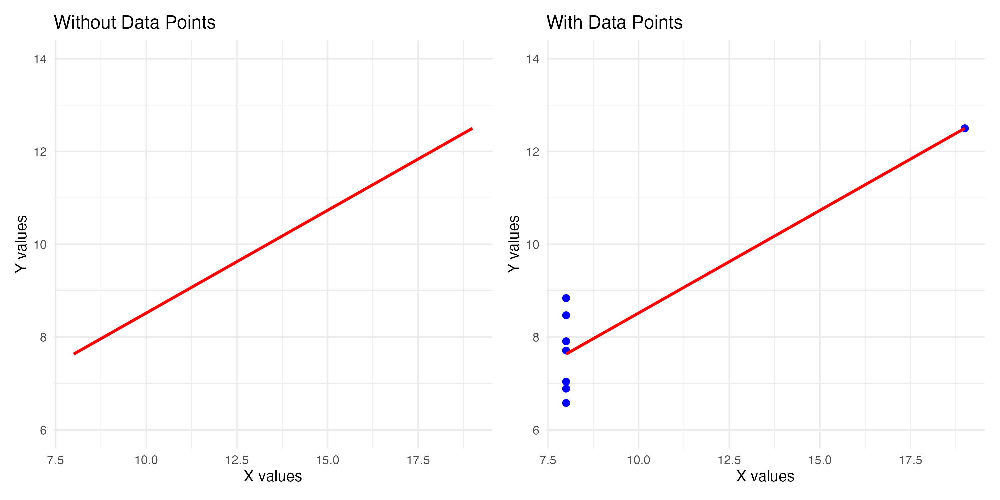
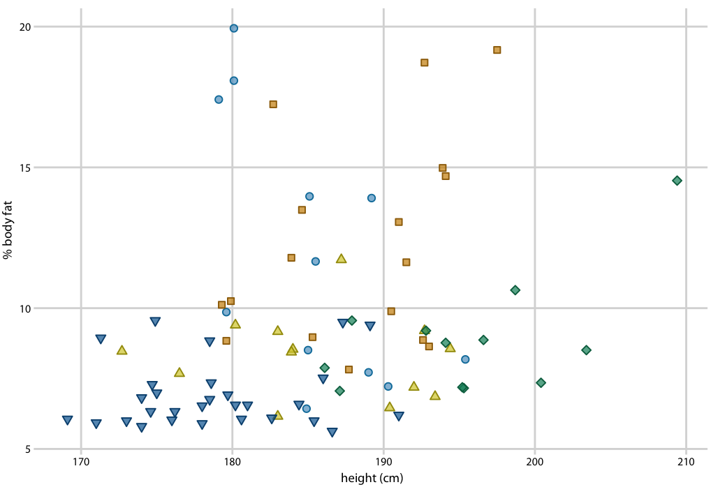

```{r setup}
#| include: false
library(tidyverse)
library(patchwork)
library(dplyr)

set.seed(2026)

# Demo data for overview section
demo_ages <- data.frame(age = c(rnorm(80, 55, 12), rnorm(20, 35, 8)))
demo_depts <- data.frame(dept = factor(c("Cardiology", "Surgery", "Emergency", "Orthopedics"),
                                        levels = c("Emergency", "Surgery", "Cardiology", "Orthopedics")),
                         patients = c(85, 72, 95, 68))
demo_sat <- data.frame(
  dept = rep(c("Cardiology", "Surgery", "Emergency", "Orthopedics"), each = 30),
  satisfaction = c(rnorm(30, 7.8, 1), rnorm(30, 7.2, 1.2), rnorm(30, 6.5, 1.5), rnorm(30, 7.5, 0.9))
)
demo_scatter <- data.frame(wait = runif(100, 15, 90), satisfaction = 9 - 0.03 * runif(100, 15, 90) + rnorm(100, 0, 0.8))
demo_time <- data.frame(
  month = factor(month.abb, levels = month.abb),
  volume = c(180, 165, 195, 210, 225, 240, 235, 220, 205, 215, 190, 175)
)

# Intro demo data
demo_data <- data.frame(
  Department = factor(c("Cardiology", "Emergency", "Orthopedics", "Surgery"),
                      levels = c("Cardiology", "Emergency", "Orthopedics", "Surgery")),
  Satisfaction = c(7.2, 6.8, 7.9, 7.4),
  WaitTime = c(45, 67, 38, 52)
)

# Main demonstration dataset
patient_data <- read.csv("https://raw.githubusercontent.com/mba642-spring-26/mba642-spring-26.github.io/refs/heads/main/datasets/week04_demonstration_data.csv")

# Practice dataset
ed_data <- read.csv("https://raw.githubusercontent.com/mba642-spring-26/mba642-spring-26.github.io/refs/heads/main/datasets/week04_practice_data.csv")
ed_data$month <- factor(ed_data$month, 
                        levels = c("January", "February", "March", "April", 
                                   "May", "June", "July", "August", 
                                   "September", "October", "November", "December"))

# Monthly data for line chart
monthly_data <- data.frame(
  month = factor(month.abb, levels = month.abb),
  patient_volume = c(180, 165, 195, 210, 225, 240, 235, 220, 205, 215, 190, 175)
)
```

# Introduction {background-color="#40666e"}

## Why Visualization Matters

**Compare these two formats:**

::: {.columns}
::: {.column width="50%"}
**Table View**

| Department | Avg Sat | Wait |
|------------|---------|------|
| Cardiology | 7.2 | 45 |
| Emergency | 6.8 | 67 |
| Orthopedics| 7.9 | 38 |
| Surgery | 7.4 | 52 |
:::

::: {.column width="50%"}
**Visualization**
```{r}
#| echo: false
#| fig-width: 6
ggplot(demo_data, aes(x = Department, y = Satisfaction)) +
  geom_col(aes(fill = Satisfaction), alpha = 0.8) +
  geom_text(aes(label = Satisfaction), vjust = -0.5) +
  scale_fill_gradient(low = "#ff9999", high = "#66b266") +
  theme_minimal() + ylim(0, 9) + theme(legend.position = "none")
```
:::
:::

## Why Visualization Matters

**Which format helped you identify the problem department faster?**

. . .

- Most likely, the visualization! You probably spotted the shortest bar in less than a second.

. . .

- Both formats convey identical information, but visualization leverages our brain's **pre-attentive visual processing** to make comparisons nearly instantaneous.

. . .

- We can easily process information from visualizations and maintain the key information. 

## Today's Learning Goals

Data visualization helps you:

::: {.incremental}
- **Speed up understanding** by revealing patterns instantly
- **Bridge expertise gaps** so anyone can grasp the message
- **Drive action** by making it obvious *where* attention is needed
:::

## What Makes a Good Visualization?

**1. Truthful**: Accurate representation without distortion

- ✅ Appropriate scales
- ❌ Truncated axes that distort relationships [(See examples)](https://mbounthavong.com/blog/tag/Truncated+Axis){target="_blank"}


::: {layout-ncol=2}
{width="100%"}

{width="100%"}
:::

## What Makes a Good Visualization?

**2. Functional**: Serves a clear purpose

- ✅ Right chart type for the data and question
- ❌ Pie chart with 15 slices [(See examples)](https://venngage.com/blog/misleading-graphs/){target="_blank"}

::: {layout-ncol=2}
{width="100%"}

{width="65%"}
:::

## What Makes a Good Visualization?

**3. Insightful**: Reveals hidden patterns

- ✅ Shows patterns, relationships, or anomalies
- ❌ Just displaying raw totals



## What Makes a Good Visualization?

**4. Clear**: Easy to understand at a glance

- ✅ Descriptive titles and labels
- ❌ Color overload, missing legends

::: {layout-ncol=2}
{width="90%"}


:::

## Topics for Today

1. **Overview**: Choosing the right visualization
2. **The Grammar of Graphics** (`ggplot2`)
3. **Essential Plot Types**: Details & Code
4. **Practice**: Applying skills to ED data

# Overview: Choosing the Right Chart {background-color="#40666e"}

## 1. Histogram

- *Distribution of one continuous variable*

- **Use when:**
  - Understanding the shape (skew, outliers) of a single measure.
  - *e.g.,) "What is the typical patient wait time?"*

```{r}
#| echo: false
#| fig-height: 3.5
ggplot(demo_ages, aes(x = age)) +
  geom_histogram(binwidth = 5, fill = "steelblue", color = "white") +
  labs(title = "Distribution of Patient Ages", y = "Count") + theme_minimal()
```


## 2. Bar Chart

- *Compare counts or values across categories*

- **Use when:**
  - Comparing size or frequency between groups.
  - *e.g.,) "Which department has the most patients?"*

```{r}
#| echo: false
#| fig-height: 3.5
ggplot(demo_depts, aes(x = reorder(dept, patients), y = patients)) +
  geom_col(fill = "darkgreen", alpha = 0.8) + coord_flip() +
  labs(title = "Patient Volume by Department", x = "", y = "") + theme_minimal()
```


## 3. Box Plot

- *Compare distributions across groups*

- **Use when:**
  - Comparing median and spread across groups.
  - *e.g.,) "Do satisfaction scores differ by department?"*

```{r}
#| echo: false
#| fig-height: 3.5
ggplot(demo_sat, aes(x = dept, y = satisfaction, fill = dept)) +
  geom_boxplot(show.legend = FALSE) +
  labs(title = "Satisfaction by Department", x = "") + theme_minimal()
```


## 4. Scatterplot

- *Relationship between two continuous variables*

- **Use when:**
  - Checking if X is related to Y.
  - *e.g.,) "Does longer wait time relate to lower satisfaction?"*

```{r}
#| echo: false
#| fig-height: 3.5
ggplot(demo_scatter, aes(x = wait, y = satisfaction)) +
  geom_point(color = "darkblue", alpha = 0.5) +
  labs(title = "Wait Time vs. Satisfaction") + theme_minimal()
```

## 5. Line Chart

- *Trends over time*

- **Use when:**
  - Tracking changes or seasonality.
  - *e.g.,) "How has patient volume changed this year?"*

```{r}
#| echo: false
#| fig-height: 3.5
ggplot(demo_time, aes(x = month, y = volume, group = 1)) +
  geom_line(color = "steelblue", linewidth = 1) + geom_point() +
  labs(title = "Monthly Patient Volume") +
  theme_minimal() + theme(axis.text.x = element_text(angle = 45, hjust = 1))
```


## 6. Faceted Plot

- *Compare patterns across groups*

- **Use when:**
  - Comparing the *same* plot across different subgroups.
  - *e.g.,) "Does satisfaction distribution differ by department?"*

```{r}
#| echo: false
#| fig-height: 3.5
ggplot(demo_sat, aes(x = satisfaction)) +
  geom_histogram(binwidth = 0.5, fill = "purple", color = "white") +
  facet_wrap(~ dept, ncol = 2) + theme_minimal()
```

## Quick Reference Table

| Your Question | Use This |
|---------------|----------|
| "What's the distribution of a single variable?" | **Histogram** |
| "How many cases in each category?" | **Bar Chart** |
| "How do groups compare?" | **Box Plot** / **Faceted** |
| "Is there a relationship between two variables?" | **Scatterplot** |
| "How does it change over time?" | **Line Chart** |


# The Grammar of Graphics {background-color="#40666e"}

## Understanding `ggplot2`

**Concept**: Build plots layer by layer.

. . . 

<br>
**3 Essential Layers:**

::: {.incremental}
1. **Data**: Your dataframe
2. **Aesthetics (`aes`)**: Mapping variables to visuals (x, y, color, size)
3. **Geometrics (`geom`)**: The shape (bar, point, line)
:::

## Basic Template

```r
ggplot(data = <DATA>, mapping = aes(<MAPPINGS>)) +
  <GEOM_FUNCTION>()
```

. . .

**Example with ToothGrowth data:**

```{r}
#| fig-height: 3
ggplot(data = ToothGrowth, mapping = aes(x = supp, y = len)) +
  geom_boxplot()
```

## Adding Layers

Start simple, then refine by adding layers with `+`:

```{r}
#| fig-height: 3.5
ggplot(data = ToothGrowth, mapping = aes(x = supp, y = len)) +
  geom_boxplot(fill = "steelblue", alpha = 0.7) +
  labs(title = "Tooth Length by Supplement Type",
       x = "Supplement", y = "Tooth Length") +
  theme_minimal()
```

## Common Geometries

| Type | Geom | Use Case |
|------|------|----------|
| **1 Continuous** | `geom_histogram()` | Distribution |
| **1 Categorical** | `geom_bar()` | Counts |
| **2 Continuous** | `geom_point()` | Relationship |
| **Continuous + Time** | `geom_line()` | Trend |
| **Continuous + Cat** | `geom_boxplot()` | Comparison |

## Other Useful Components

- **Labels**: `labs(title, x, y, color, caption)`
- **Scales**: `scale_x_continuous()`, `scale_color_brewer()`
- **Facets**: `facet_wrap(~ variable)`, `facet_grid(row ~ col)`
- **Themes**: `theme_minimal()`, `theme_classic()`, `theme_bw()`

# Dataset for Today {background-color="#40666e"}

## Loading the Data

**Patient Satisfaction Survey**

```{r}
#| eval: false
# Demonstration data
patient_data <- read.csv("https://raw.githubusercontent.com/mba642-spring-26/mba642-spring-26.github.io/refs/heads/main/datasets/week04_demonstration_data.csv")

# Practice data (ED visits)
ed_data <- read.csv("https://raw.githubusercontent.com/mba642-spring-26/mba642-spring-26.github.io/refs/heads/main/datasets/week04_practice_data.csv")
ed_data$month <- factor(ed_data$month, levels = c("January", "February", "March", "April", "May", "June", "July", "August", "September", "October", "November", "December"))
```

## Dataset Preview

```{r}
head(patient_data, 5)
```

## Dataset Variables

| Variable | Description | Type |
|----------|-------------|------|
| `patient_id` | Unique patient identifier | Numeric |
| `age` | Patient age in years | Continuous |
| `department` | Hospital department | Categorical |
| `satisfaction_score` | Overall satisfaction (1-10) | Continuous |
| `wait_time_minutes` | Wait time before seeing provider | Continuous |
| `length_of_stay_days` | Hospital length of stay | Discrete |

# Visualizing Single Variables {background-color="#40666e"}

## 1. Histogram: Purpose

**Purpose**: Reveal the **distribution pattern** of continuous data

- Where values cluster
- Symmetric or skewed
- Potential outliers

**When to use**: Examining distribution of age, wait times, length of stay, or any continuous measure.

## Demonstration: Basic Histogram

**Question**: *What is the typical age of our patients?*

```{r}
#| fig-height: 3.5
ggplot(data = patient_data, mapping = aes(x = age)) +
  geom_histogram()
```

## Demonstration: Improved Histogram

Adding styling and labels:

```{r}
#| fig-height: 3.5
ggplot(patient_data, aes(x = age)) +
  geom_histogram(binwidth = 5, fill = "steelblue", color = "white") +
  labs(title = "Distribution of Patient Ages",
       x = "Age (years)", y = "Number of Patients") +
  theme_minimal()
```

## Components Used

- `geom_histogram()`: Creates histogram by dividing continuous variable into bins
- `binwidth = 5`: Controls bin size (each bar = 5-year age range)
- `fill` and `color`: Control bar appearance (interior and border)
- `labs()`: Adds title and axis labels
- `theme_minimal()`: Applies clean appearance

## Why Binwidth Matters

::: {.callout-important}
The same data can tell different stories:

- **Too narrow** (binwidth = 1): Noisy, jagged patterns
- **Too wide** (binwidth = 20): Hides important features
- **Just right**: Reveals true distribution pattern
:::

## Interpreting Histograms

**What story does the shape tell?**

::: {.incremental}
1. **Shape**: Symmetric, right-skewed, or left-skewed?
2. **Center**: Where do most values cluster?
3. **Spread**: Are values tight or widely variable?
4. **Outliers**: Any isolated bars far from the group?
5. **Modality**: One peak (unimodal) or multiple peaks?
:::

## Practice: Histogram

Create a histogram showing the distribution of **wait times** (`wait_time_minutes`) in the ED data.

```{r}
#| eval: false
# Fill in the blanks (replace ___ with appropriate values)
ggplot(data = ed_data, mapping = aes(x = ___)) +
  geom_histogram(binwidth = ___, fill = "steelblue", color = "white") +
  labs(
    title = "Distribution of ED Patient Wait Times",
    x = "___",
    y = "___"
  ) +
  theme_minimal()
```

**Question**: What is the approximate center of the distribution? Is it symmetric or skewed?


## 2. Bar Chart: Purpose

**Purpose**: Compare frequencies or counts across categories

- Which groups are larger/smaller
- Also useful for comparing average values across measures

**When to use**: Patient counts by department, admission type, insurance status, or any categorical grouping.

## Demonstration: Bar Chart

**Question**: *How many patients in each department?*

```{r}
#| fig-height: 3.5
ggplot(patient_data, aes(x = department)) +
  geom_bar(fill = "darkgreen", width = 0.5, alpha = 0.7) +
  labs(title = "Patient Volume by Department",
       x = "Department", y = "Number of Patients") +
  theme_minimal()
```

## Components Used

- `geom_bar()`: Automatically counts observations in each category
- `alpha = 0.7`: Controls transparency (0 = transparent, 1 = opaque)
- `width = 0.5`: Controls bar width
- `labs()`: Adds clear labels and title

## Practice: Bar Chart

Create a bar chart showing the number of ED visits by **month** (`month`).

```{r}
#| eval: false
# Fill in the blanks
ggplot(data = ed_data, mapping = aes(x = ___)) +
  geom_bar(fill = "darkgreen", alpha = 0.7) +
  labs(
    title = "Monthly ED Patient Volume",
    x = "___",
    y = "Number of Visits"
  ) +
  theme_minimal() +
  theme(axis.text.x = element_text(angle = 45, hjust = 1))
```

**Question**: Are visits evenly distributed across months, or are there patterns?


## 3. Box Plot: Purpose

**Purpose**: Compact five-number summary of distribution

- Minimum, 25th percentile, median, 75th percentile, maximum
- Ideal for identifying typical range and outliers

**When to use**: Comparing distributions across groups, identifying outliers in metrics.

## Demonstration: Box Plot

**Question**: *What are the typical satisfaction scores?*

```{r}
#| fig-height: 3.5
ggplot(patient_data, aes(x = "", y = satisfaction_score)) +
  geom_boxplot(fill = "coral", width = 0.2, alpha = 0.6) +
  labs(title = "Distribution of Patient Satisfaction Scores",
       x = "", y = "Satisfaction Score (1-10)") +
  theme_minimal()
```

## Interpreting Box Plots

**A 5-Number Summary in one glance:**

::: {.incremental}
- **Box (IQR)**: The middle 50% of data. Taller box = more variability.
- **Line (Median)**: The exact middle value.
- **Whiskers**: The expected range (1.5× IQR).
- **Dots (Outliers)**: Individual cases that are unusually high/low.
:::

## Interpreting Box Plots (continued)

**Quick Guide**

1. **Median position within box**: If not centered, distribution is skewed
2. **Box height (IQR)**: Taller boxes indicate more variability
3. **Whisker lengths**: Asymmetric whiskers suggest skewness
4. **Outliers**: Many outliers may indicate data quality issues


## Practice: Box Plot

Create a box plot showing the distribution of **wait times** (`wait_time_minutes`) in the ED.

```{r}
#| eval: false
# Fill in the blanks
ggplot(data = ed_data, mapping = aes(x = "", y = ___)) +
  geom_boxplot(fill = "lightblue") +
  labs(
    title = "Distribution of ED Wait Times",
    x = "",
    y = "Wait Time (minutes)"
  ) +
  theme_minimal()
```

**Question**: What is the approximate median wait time? Are there any outliers?


# Visualizing Relationships {background-color="#40666e"}

## Why Relationships Matter

So far, we talked about how to visualize single variables (distributions, counts)

<br>
Now, let's talk about **relationships** between variables

- Does one variable affect another?
- Do they move together or in opposite directions?

## 4. Scatterplot: Purpose

**Purpose**: Reveal relationships between two *continuous* variables

- Positive correlation (move together)
- Negative correlation (opposite directions)
- No clear pattern

**When to use**: Examining whether wait time relates to satisfaction, age relates to length of stay, etc.

## Demonstration: Basic Scatterplot

**Question**: *Does wait time affect satisfaction?*

```{r}
#| fig-height: 3.5
ggplot(patient_data, aes(x = wait_time_minutes, y = satisfaction_score)) +
  geom_point(alpha = 0.5, color = "darkblue") +
  labs(title = "Relationship Between Wait Time and Satisfaction",
       x = "Wait Time (minutes)", y = "Satisfaction Score (1-10)") +
  theme_minimal()
```

## Demonstration: Adding Trend Line

```{r}
#| fig-height: 3.5
ggplot(patient_data, aes(x = wait_time_minutes, y = satisfaction_score)) +
  geom_point(alpha = 0.5, color = "darkblue") +
  geom_smooth(method = "lm", se = TRUE, color = "red") +
  labs(title = "Wait Time and Satisfaction with Linear Trend",
       x = "Wait Time (minutes)", y = "Satisfaction Score (1-10)") +
  theme_minimal()
```

## Components Used

- `geom_point()`: Plots individual data points
- `geom_smooth(method = "lm")`: Adds linear regression trend line
- `se = TRUE`: Displays confidence interval (shaded area)
- `alpha = 0.5`: Makes points semi-transparent for overlap visibility

## Interpreting Scatterplots

**Describing the relationship:**

::: {.incremental}
1. **Direction**: Positive (upward /) or Negative (downward \)?
2. **Strength**: Strong (points tight around line) or Weak (scattered)?
3. **Form**: Linear (straight) or Non-linear (curved)?
4. **Outliers**: Any points far from the general pattern?
:::

## Practice: Scatterplot

Create a scatterplot showing the relationship between **ED census** (number of patients, `ed_census`) and **wait times** (`wait_time_minutes`). Add a trend line.

```{r}
#| eval: false
# Fill in the blanks
ggplot(data = ed_data, mapping = aes(x = ___, y = ___)) +
  geom_point(alpha = 0.5, color = "darkblue") +
  geom_smooth(method = "lm", se = TRUE, color = "red") +
  labs(
    title = "Relationship Between ED Census and Wait Times",
    x = "___",
    y = "___"
  ) +
  theme_minimal()
```

**Question**: Is there a positive or negative relationship? What does this mean for ED operations?


## 5. Line Chart: Purpose

**Purpose**: Reveal **trends over time**

- How a metric rises, falls, or cycles
- Essential for tracking performance and seasonal patterns

**When to use**: Monthly readmission rates, weekly patient volumes, daily ED wait times.

## Line Chart Data

Creating monthly patient volume data:

```{r}
monthly_data <- data.frame(
  month = factor(month.abb, levels = month.abb),
  patient_volume = c(180, 165, 195, 210, 225, 240, 
                     235, 220, 205, 215, 190, 175)
)
head(monthly_data)
```

## Demonstration: Line Chart

**Question**: *How does the patientvolume change over time?*

```{r}
#| fig-height: 3.5
ggplot(monthly_data, aes(x = month, y = patient_volume, group = 1)) +
  geom_line(color = "steelblue", linewidth = 1) +
  geom_point(color = "steelblue", size = 2) +
  labs(title = "Monthly Patient Volume",
       x = "Month", y = "Number of Patients") +
  theme_minimal()
```

## Components Used

- `geom_line()`: Connects points in order
- `geom_point()`: Adds dots at each data point
- `group = 1`: Tells ggplot to connect all points as one line (needed when x-axis is categorical, any numbers are fine)
- `linewidth`: Controls line thickness

## Interpreting Line Charts

**What to look for:**

::: {.incremental}
1. **Overall trend**: Increasing, decreasing, or stable?
2. **Patterns**: Seasonal cycles or regular fluctuations?
3. **Anomalies**: Any sudden spikes or drops?
:::

## Practice: Line Chart

Create a line chart showing monthly average wait times using the ED data.

```{r}
#| eval: false
# First, summarize monthly data
monthly_summary <- ed_data %>%
  group_by(month) %>%
  summarize(avg_wait = mean(wait_time_minutes))

# Then create the line chart
ggplot(data = monthly_summary, mapping = aes(x = ___, y = ___, group = 1)) +
  geom_line(color = "steelblue", linewidth = 1) +
  geom_point(color = "steelblue", size = 2) +
  labs(
    title = "Monthly Average ED Wait Times",
    x = "___",
    y = "___"
  ) +
  theme_minimal() +
  theme(axis.text.x = element_text(angle = 45, hjust = 1))
```

**Question**: Do you see any seasonal patterns in wait times?

# Grouped Comparisons {background-color="#40666e"}

## Why Group Comparisons?

Compare distributions or relationships **across categories**:

- Do certain departments have higher satisfaction?
- Does the relationship between wait time and satisfaction differ by department?

## Grouped Box Plot: Concept

**Purpose**: Compare distributions across groups side-by-side

- Reveal whether different groups have similar or different patterns
- Identify which groups need attention

## Demonstration: Grouped Box Plot

**Question**: *Do satisfaction scores differ by department?*

```{r}
#| fig-height: 3.5
ggplot(patient_data, aes(x = department, y = satisfaction_score, 
                          fill = department)) +
  geom_boxplot(alpha = 0.7, width = 0.3) +
  labs(title = "Patient Satisfaction by Department",
       x = "Department", y = "Satisfaction Score (1-10)") +
  theme_minimal() +
  theme(legend.position = "none")
```

## Practice: Grouped Box Plot

Create grouped box plots to compare **wait times** (`wait_time_minutes`) across different **shifts** (`shift`: Day, Evening, Night).

```{r}
#| eval: false
# Fill in the blanks
ggplot(data = ed_data, mapping = aes(x = ___, y = ___, fill = ___)) +
  geom_boxplot(alpha = 0.7) +
  labs(
    title = "ED Wait Times by Shift",
    x = "Shift",
    y = "Wait Time (minutes)"
  ) +
  theme_minimal() +
  theme(legend.position = "none")
```

**Question**: Which shift tends to have the highest median wait time?


## Bar Chart of Means: Concept

**Purpose**: Compare **average values** across groups

- Shows the mean of a continuous variable by category
- Good for presentations when comparing group averages

## Demonstration: Bar Chart of Means

**Question**: *What is the average satisfaction by department?*

```{r}
#| fig-height: 3.5
ggplot(patient_data, aes(x = department, y = satisfaction_score, 
                          fill = department)) +
  geom_bar(stat = "summary", fun = "mean", alpha = 0.8) +
  labs(title = "Average Patient Satisfaction by Department",
       x = "Department", y = "Average Satisfaction Score (1-10)") +
  ylim(0, 10) +
  theme_minimal() +
  theme(legend.position = "none")
```

## Components Used

- `geom_bar(stat = "summary", fun = "mean")`: Calculates and plots the mean for each group
- `ylim()`: Sets y-axis limits (important for proper context)

**Bar chart of means** vs **Box plot**:

- Bar chart: Shows average clearly, good for presentations
- Box plot: Shows full distribution, better for exploration

## Practice: Bar Chart of Means

Create a bar chart showing the **average wait time** (`wait_time_minutes`) for each **acuity level** (`acuity_level`).

```{r}
#| eval: false
# Fill in the blanks
ggplot(data = ed_data, mapping = aes(x = factor(___), y = ___, 
                                      fill = factor(___))) +
  geom_bar(stat = "summary", fun = "___", alpha = 0.8) +
  labs(
    title = "Average ED Wait Times by Acuity",
    x = "Acuity Level",
    y = "Average Wait Time (minutes)"
  ) +
  theme_minimal() +
  theme(legend.position = "none")
```

**Question**: Does the average wait time increase or decrease as acuity level goes up (1 to 5)?

  - *Note: Acuity 1 is most critical (should be fastest), Acuity 5 is least critical.*


## Grouped Scatterplot: Concept

**Purpose**: See if relationships differ across subgroups

- Add color or shape by group
- Separate trend lines for each group

## Demonstration: Grouped Scatterplot

**Question**: *Does the wait-satisfaction relationship differ by department?*

```{r}
#| fig-height: 3.5
ggplot(patient_data, aes(x = wait_time_minutes, y = satisfaction_score,
                          color = department)) +
  geom_point(alpha = 0.6, size = 2) +
  geom_smooth(method = "lm", se = FALSE) +
  labs(title = "Wait Time and Satisfaction by Department",
       x = "Wait Time (minutes)", y = "Satisfaction Score (1-10)",
       color = "Department") +
  theme_minimal()
```

## Interpreting Grouped Slopes

::: {.incremental}
- **Orthopedics**: Negative relationship (satisfaction ↓ as wait ↑)
- **Surgery & Cardiology**: Nearly flat (wait time has little impact)
- **Emergency**: Slight positive trend (possible triage effect?)
:::

. . .

This suggests different departments may need different improvement strategies.

## Practice: Grouped Scatterplot

Create a scatterplot showing the relationship between **wait time** (`wait_time_minutes`) and **length of stay** (`length_of_stay_hours`), with points **colored by shift** (`shift`). Add trend lines without confidence intervals.

```{r}
#| eval: false
# Fill in the blanks
ggplot(data = ed_data, mapping = aes(x = ___, y = ___, color = ___)) +
  geom_point(alpha = 0.5) +
  geom_smooth(method = "lm", se = FALSE) +
  labs(
    title = "Wait Time vs. Length of Stay by Shift",
    x = "Wait Time (minutes)",
    y = "Length of Stay (hours)",
    color = "Shift"
  ) +
  theme_minimal()
```

**Question**: Do the lines have similar slopes, or does the relationship change by shift?


## Faceting: Small Multiples

**Purpose**: Create separate panels for each group

- Easier to see within-group patterns
- Cleaner than overlapping colors when many groups

## Demonstration: Faceted Plot

```{r}
#| fig-height: 4
ggplot(patient_data, aes(x = wait_time_minutes, y = satisfaction_score)) +
  geom_point(alpha = 0.5, color = "steelblue") +
  geom_smooth(method = "lm", se = TRUE, color = "darkred") +
  facet_wrap(~ department, nrow = 2) +
  labs(title = "Wait Time vs. Satisfaction Across Departments",
       x = "Wait Time (minutes)", y = "Satisfaction Score (1-10)") +
  theme_minimal()
```

## Components Used

- `facet_wrap(~ variable)`: Creates separate panels for each value
- `nrow = 2`: Arranges panels in 2 rows
- The `~` symbol means "by" or "split by" (formula notation)

**When to use faceting**: When groups are too crowded on a single plot, or when you want to emphasize within-group patterns.

## Practice: Faceted Plot

Create a faceted scatterplot showing the relationship between **wait time** (`wait_time_minutes`) and **length of stay** (`length_of_stay_hours`), with separate panels for each **shift** (`shift`).

```{r}
#| eval: false
# Fill in the blanks
ggplot(data = ed_data, mapping = aes(x = ___, y = ___)) +
  geom_point(alpha = 0.5, color = "steelblue") +
  geom_smooth(method = "lm", se = TRUE, color = "darkred") +
  facet_wrap(~ ___) +
  labs(
    title = "Wait Time vs. Length of Stay Across Shifts",
    x = "___",
    y = "___"
  ) +
  theme_minimal()
```

**Question**: Compare this to the previous colored scatterplot. Which approach makes it easier to see within-shift patterns?


# Summary {background-color="#40666e"}

## Quick Reference: Matching Chart to Question

| Your Question | Use This |
|---------------|----------|
| "What's the distribution?" | **Histogram** |
| "How many in each category?" | **Bar Chart** |
| "How do groups compare?" | **Box Plot** / **Faceted** |
| "Is there a relationship?" | **Scatterplot** |
| "How does it change over time?" | **Line Chart** |

## Key Takeaways

::: {.incremental}
1. **Visualization matters**: Reveals patterns instantly
2. **Grammar of graphics**: Data + Aesthetics + Geometry
3. **Choose the right chart** for your question
4. **Start simple, then refine**: Add layers iteratively
5. **Practice is key**: The more you create, the better you get
:::

## Assignments

1. **Reflection**: Please share your thoughts on the lecture (3 interesting and 3 confusing things)
2. **Assignment**: Complete `week04_visualization_assignment.qmd`
  - **Points**: 10 points
  - **Due**: Feb 8, 2026
  - **Submit**: via Canvas

# References {background-color="#40666e"}

## Key References

- Healy, K. (2018). *Data Visualization: A Practical Introduction*. Princeton University Press.
- Wickham, H., Navarro, D., & Pedersen, T. L. (2023). *ggplot2: Elegant Graphics for Data Analysis*. [https://ggplot2-book.org/](https://ggplot2-book.org/)
- Wilke, C. O. (2019). *Fundamentals of Data Visualization*. [https://clauswilke.com/dataviz/](https://clauswilke.com/dataviz/)

## Online Resources

- R Graphics Cookbook: [https://r-graphics.org/](https://r-graphics.org/)
- ggplot2 documentation: [https://ggplot2.tidyverse.org/](https://ggplot2.tidyverse.org/)
- Data-to-Viz (chart selection): [https://www.data-to-viz.com/](https://www.data-to-viz.com/)
