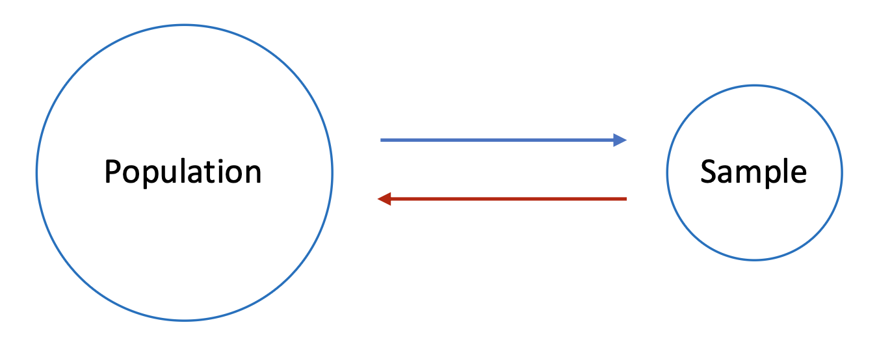

```{r setup}
#| include: false
library(ggplot2)
library(dplyr)
library(parameters)
library(gridExtra)
set.seed(2026)
```

# Introduction {background-color="#40666e"}

## Why *t*-tests Matter

**Let's think about this scenario:**

> *A hospital administrator notices their emergency department's average waiting time (from randomly selected 30 patients) is **52 minutes**, while the regional standard is **45 minutes**.*

. . .

<br>
A **key question** we need to understand is: 
  
- *Is this 7-minute difference a real problem, or just random variation?*

. . .

<br>
This is exactly what *t*-tests help us answer!

## Why *t*-tests Matter

*t*-tests determine whether observed differences are **statistically significant**.

::: {.incremental}
- They examine whether differences in our sample likely reflect **true differences** in the population
- Or whether they could have occurred simply **by chance**
::: 

. . . 

::: {.incremental}
<br>
This distinction is critical: 

- Acting on noise wastes resources
- Ignoring real problems harms outcomes
:::


## Today's Learning Goals

By the end of this lecture, you will be able to:

::: {.incremental}
1. **Identify** which *t*-test to use for different scenarios
2. **Conduct** *t*-tests in R using the `t.test()` function
3. **Visualize** mean comparison relationships using `ggplot2`
4. **Interpret** *t*-test results and make data-driven conclusions
:::

## *t*-tests in Healthcare Management

Real-world applications where *t*-tests drive decisions:

::: {.incremental}
- **Quality Improvement**: Is our patient satisfaction score meeting the target?
- **Operational Efficiency**: Does electronic intake reduce processing time vs. paper?
- **Clinical Outcomes**: Did the new pain management protocol improve patient outcomes?
- **Resource Planning**: Is our average length of stay different from the national benchmark?
:::

## Overview: Three Types of T-Tests

| Test Type | Purpose | Example |
|-----------|---------|---------|
| **One-sample** | Compare sample mean to a benchmark | ED wait time vs. 45-min standard |
| **Independent-samples** | Compare means from two separate groups | Digital vs. paper intake systems |
| **Paired-samples** | Compare two related measurements | Before vs. after an intervention |


# Datasets for Today {background-color="#40666e"}

## Loading the Data

First, let's load the required packages:

```{r}
#| label: load-packages

# Load required packages
library(ggplot2)
library(dplyr)
library(parameters)

# Set seed for reproducibility
set.seed(2026)
```

We'll use two datasets throughout this lecture:

```{r}
#| label: load-data

# Demonstration dataset
hospital_ops <- read.csv("https://raw.githubusercontent.com/mba642-spring-26/mba642-spring-26.github.io/refs/heads/main/datasets/week05_demo_data.csv")

# Practice dataset
patient_outcomes <- read.csv("https://raw.githubusercontent.com/mba642-spring-26/mba642-spring-26.github.io/refs/heads/main/datasets/week05_practice_data.csv")
```

## Demonstration Data: `hospital_ops`

| Variable | Description |
|----------|-------------|
| `patient_id` | Unique patient identifier |
| `ed_wait_time` | ED waiting time (minutes) |
| `intake_hospital` | Hospital system (A=Digital, B=Paper) |
| `intake_time` | Patient intake processing time (minutes) |
| `pain_before`, `pain_after` | Pain scores (0-10 scale) |

## Practice Data: `patient_outcomes`

| Variable | Description |
|----------|-------------|
| `patient_id` | Unique patient identifier |
| `satisfaction` | Patient satisfaction (1-10 scale) |
| `protocol_group` | Clinical protocol (New = Enhanced Recovery, Standard = Standard Care) |
| `length_of_stay` | Hospital stay (days) |
| `bp_before`, `bp_after` | Systolic blood pressure (mmHg) |

# 1. One-Sample *t*-test {background-color="#40666e"}

## What is a One-Sample *t*-test?

A **one-sample *t*-test** compares a sample mean to a known or hypothesized population mean or value.

. . .

<br>
**Key Question**: *Is our sample mean significantly different from a benchmark?*

. . .

<br>
**Key Components**:

- **One group** of observations (your sample data)
- **One comparison value** (a known or hypothesized population mean, benchmark, standard, or target)

## When to Use It

The one-sample t-test is appropriate when comparing against a fixed reference:

::: {.incremental}
- Performance vs. **industry benchmarks** (e.g., length of stay vs. national average)
- Outcomes vs. **target levels** (e.g., satisfaction scores vs. target of 8.0)
- Metrics vs. **regulatory requirements** (e.g., readmission rates vs. CMS standards)
:::

## One-Sample *t*-test Scenario: <br> Emergency Department Waiting Times

- Imagine you are an administrator at a hospital where the regional average emergency department waiting time is **45 minutes**.

. . .


- Recently, you've received complaints that patients are waiting too long. To investigate, you randomly sample 30 patients and record their waiting times.

. . .

- **The key question**: 
  - Is this difference statistically significant, or could it simply be due to natural variation in the data?


## A Quick Review of Null Hypothesis Testing

{width="300px"}

. . .

Two competing explanations for the difference:

::: {.incremental}
- **Explanation 1** (H~1~): The hospital's mean waiting time is longer than 45 minutes
- **Explanation 2** (H₀): The hospital's mean waiting time is 45 minutes (but coincidentally, the sample mean is higher than 45 minutes)
:::

## Hypotheses

For our ED waiting times scenario:

- **Null Hypothesis (H₀)**: μ = 45 (The hospital's mean waiting time equals the 45-minute regional standard)
- **Alternative Hypothesis (H₁)**: μ ≠ 45 (The hospital's mean waiting time differs from the standard)

. . .

The *t*-test will help us decide whether to reject H₀ based on our sample data.

## The Formula

The t-statistic is calculated as:

$$t = \frac{\bar{X} - \mu_0}{s / \sqrt{n}}$$

. . .

Where:

- $\bar{X}$: sample mean (e.g., 52 minutes in our scenario)
- $\mu_0$: hypothesized/known mean (e.g., 45-minute benchmark)
- $s$: sample standard deviation (measures the spread of your data)
- $n$: sample size (e.g., 30 patients in our scenario)

## Understanding the Formula

**Numerator** ($\bar{X} - \mu_0$):

- The difference between observed and expected under the null hypothesis

. . .

**Denominator** ($s / \sqrt{n}$):

- The **standard error of the mean**
- Tells us expected variability in sample means

. . .

**Interpretation**:

- t ≈ 0 → sample mean close to benchmark
- |t| large → sample mean far from benchmark

## Demonstration: <br> Extract the Data and Calculation

```{r}
#| label: one-sample-data
# Extract ED waiting times from our dataset
waiting_times <- hospital_ops$ed_wait_time # getting wait time data
mu_0 <- 45  # benchmark (regional average)
n <- length(waiting_times) # sample size
x_bar <- mean(waiting_times) # sample mean
s <- sd(waiting_times) # sample standard deviation
se <- s / sqrt(n) # standard error of the mean
t_stat <- (x_bar - mu_0) / se # t-statistic
```


. . .

Our t-statistic (`r round(t_stat, 2)`) tells us how many standard errors our sample mean is from the benchmark.

## Visualizing the Data

```{r}
#| label: one-sample-histogram
#| fig-width: 8
#| fig-height: 4
#| code-fold: true

ggplot(hospital_ops, aes(x = ed_wait_time)) +
  geom_histogram(binwidth = 1, fill = "steelblue", color = "white", alpha = 0.8) +
  geom_vline(xintercept = mu_0, color = "red", linetype = "dashed", linewidth = 1) +
  geom_vline(xintercept = x_bar, color = "darkgreen", linewidth = 1) +
  annotate("text", x = mu_0 - 0.5, y = 7, label = "Benchmark\n(45 min)", 
           color = "red", hjust = 1, size = 3) +
  annotate("text", x = x_bar + 0.5, y = 7, label = paste0("Sample Mean\n(", round(x_bar, 1), " min)"), 
           color = "darkgreen", hjust = 0, size = 3) +
  labs(title = "Distribution of ED Waiting Times",
       subtitle = "Comparing sample mean (green) to benchmark (red dashed)",
       x = "Waiting Time (minutes)", y = "Number of Patients") +
  theme_minimal()
```

## Visualizing the Null Distribution

```{r}
#| label: one-sample-viz
#| echo: false
#| fig-width: 9
#| fig-height: 4.5

df <- n - 1
x_range <- seq(-6, 6, length.out = 1000)
y_values <- dt(x_range, df)
crit_val <- qt(0.975, df)

ggplot(data.frame(x = x_range, y = y_values), aes(x, y)) +
  geom_line(linewidth = 1) +
  geom_area(data = subset(data.frame(x = x_range, y = y_values), x <= -crit_val),
            aes(x, y), fill = "gray70", alpha = 0.7) +
  geom_area(data = subset(data.frame(x = x_range, y = y_values), x >= crit_val),
            aes(x, y), fill = "gray70", alpha = 0.5) +
  geom_area(data = subset(data.frame(x = x_range, y = y_values), x <= -t_stat),
            aes(x, y), fill = "red", alpha = 0.7) +
  geom_area(data = subset(data.frame(x = x_range, y = y_values), x >= t_stat),
            aes(x, y), fill = "red", alpha = 0.5) +
  geom_vline(xintercept = c(-crit_val, crit_val), linetype = "dashed") +
  geom_vline(xintercept = t_stat, color = "red", linewidth = 1.5) +
  annotate("text", x = t_stat + 0.5, y = 0.15, label = paste("t =", round(t_stat, 2)),
           color = "red", hjust = 0, fontface = "bold") +
  annotate("text", x = crit_val, y = 0.02, label = paste("Critical =", round(crit_val, 2)),
           hjust = -0.1, size = 3) +
  labs(title = "One-Sample T-Test: Null Distribution",
       subtitle = "Gray = rejection regions (α = 0.05), Red = our t-statistic",
       x = "t-value", y = "Density") +
  theme_minimal() +
  theme(plot.title = element_text(face = "bold"))
```

## Interpreting the Visualization

::: {.incremental}
- **Gray shaded areas**: Rejection regions (α = 0.05)
- **Red vertical line**: Our calculated t-statistic
- **Result**: Our t falls in the rejection region!
- **Meaning**: This result would be unlikely if the true mean were 45 minutes (i.e., the null is true)
:::

## Demonstration: Using t.test() in R

- We can run one-sample t-test using the `t.test()` function in R.
  - one group's mean vs a known or hypothesized mean

```{r}
#| label: one-sample-ttest
# Perform one-sample t-test
result <- t.test(hospital_ops$ed_wait_time, mu = 45)
parameters(result)
```

## Components of the Output

- ***t*-statistic** (`r round(result$statistic, 2)`): Distance from benchmark in SE units
- **df** (`r result$parameter`): Degrees of freedom (n - 1)
- ***p*-value** (`r format(result$p.value, scientific = FALSE, digits = 2, nsmall = 2)`): Probability of seeing this or more extreme result if null is true
- **95% CI** [`r round(result$conf.int[1], 2)`, `r round(result$conf.int[2], 2)`]: Range for the true mean

## Interpreting the Results

**Key findings**:

::: {.incremental}
- The *p*-value is less than 0.05, so we **reject the null hypothesis** — the observed difference is unlikely due to chance alone
- The 45-minute benchmark is NOT within the 95% confidence interval, which further confirms that the true mean is significantly different from 45
- **Conclusion**: The evidence strongly suggests that the hospital's average ED waiting time is significantly higher than the 45-minute regional standard
  - Need to investigate causes and potential interventions for the longer wait times.

:::

. . .


## Practice: One-Sample *t*-test

A clinic wants to test if their average patient satisfaction score differs from the national average of **8.0** (out of 10). Use the `patient_outcomes` dataset.

```{r}
#| eval: false
# Fill in the blanks (replace ___ with appropriate values)
satisfaction_scores <- patient_outcomes$___

# Perform the t-test
result_satisfaction <- t.test(___, mu = ___)
parameters(result_satisfaction)
```

<br>
**Question**: Is the average satisfaction significantly different from the target?

# 2. Independent-Samples *t*-test {background-color="#40666e"}

## What is an Independent-Samples *t*-test?

An **independent-samples *t*-test** compares means from two different, unrelated groups.

. . .

<br>
**Key Question**: *Are these two group means significantly different from each other?*

. . .

<br>
**Key Requirements**:

- **Two independent groups** (observations unrelated; grouping variable)
- **Continuous outcome variable**


## When to Use It

The independent-samples t-test is appropriate when comparing **two separate, independent groups**:

::: {.incremental}
- **Comparing treatments**: New drug vs. standard treatment
- **Comparing facilities**: One hospital vs. another (Hospital A vs. Hospital B)
- **Intervention studies**: Intervention group vs. control group
- **Demographic comparisons**: Urban vs. rural outcomes
:::

## Independent-Samples t-test Scenario: <br> Comparing Intake Systems

**Situation**: Your health system is considering digital intake systems.

- **Hospital A**: *Digital* tablet-based intake
- **Hospital B**: Traditional *paper* forms

. . .

<br>
**Question**: Does the digital system result in faster processing times?

. . .

<br>
You collect processing time data from 15 randomly selected patients at each hospital to determine whether the difference represents a real efficiency gain.

## Hypotheses

For our intake systems comparison:

- **Null Hypothesis (H₀)**: μ₁ = μ₂ (Mean processing time is the same for both systems)
- **Alternative Hypothesis (H₁)**: μ₁ ≠ μ₂ (Mean processing times differ between systems)

. . .

The *t*-test will help us decide whether the observed difference is statistically significant.

## The Formula

$$t = \frac{\bar{X}_1 - \bar{X}_2}{s_p\sqrt{\frac{1}{n_1} + \frac{1}{n_2}}}$$

. . .

**Pooled standard deviation**:

$$s_p = \sqrt{\frac{(n_1-1)s_1^2 + (n_2-1)s_2^2}{n_1 + n_2 - 2}}$$

## Understanding the Formula

**Numerator** ($\bar{X}_1 - \bar{X}_2$):

- The difference between the two sample means

. . .

**Denominator**:

- Standard error of the difference between means
- Combines variability from both groups

. . .

**Pooled SD** ($s_p$):

- Weighted average of both groups' SDs
- Assumes equal population variances

## Demonstration: Extract the Data

First, let's get each hospital's intake time data. 

```{r}
#| label: independent-data
# Extract data from our dataset
hospital_A <- hospital_ops$intake_time[hospital_ops$intake_hospital == "A_Digital"]
hospital_B <- hospital_ops$intake_time[hospital_ops$intake_hospital == "B_Paper"]
```

Let's check descriptive statistics for each hospital.

```{r}
#| label: independent-data-summary
#| eval: false

# Hospital A: Digital 
mean(hospital_A) # average intake time in minutes
sd(hospital_A)   # standard deviation of intake time in minutes
length(hospital_A) # number of patients

# Hospital B: Paper
mean(hospital_B) # average intake time in minutes
sd(hospital_B)   # standard deviation of intake time in minutes
length(hospital_B) # number of patients
```


## Visualizing Group Differences

```{r}
#| label: independent-viz
#| fig-width: 9
#| fig-height: 4.5
#| code-fold: true

# Create grouped data for visualization
intake_viz <- hospital_ops %>%
  mutate(hospital_label = ifelse(intake_hospital == "A_Digital", 
                                  "A: Digital System", "B: Paper Forms"))

# Box plot with individual points
ggplot(intake_viz, aes(x = hospital_label, y = intake_time, fill = hospital_label)) +
  geom_boxplot(alpha = 0.7, width = 0.4) +
  geom_jitter(width = 0.1, alpha = 0.5, size = 2) +
  labs(title = "Patient Intake Processing Times by System",
       subtitle = "Comparing digital (A) vs. paper (B) intake systems",
       x = "Hospital System", y = "Processing Time (minutes)") +
  theme_minimal() +
  theme(legend.position = "none",
        plot.title = element_text(face = "bold"))
```

## Visualizing the Null Distribution

```{r}
#| label: independent-null
#| echo: false
#| fig-width: 9
#| fig-height: 4.5

n1 <- length(hospital_A)
n2 <- length(hospital_B)
df_ind <- n1 + n2 - 2
t_stat_ind <- (mean(hospital_A) - mean(hospital_B)) /
              sqrt(((n1-1)*sd(hospital_A)^2 + (n2-1)*sd(hospital_B)^2) / df_ind * (1/n1 + 1/n2))

x_range <- seq(-6, 6, length.out = 1000)
y_values <- dt(x_range, df_ind)
crit_val <- qt(0.975, df_ind)

ggplot(data.frame(x = x_range, y = y_values), aes(x, y)) +
  geom_line(linewidth = 1) +
  geom_area(data = subset(data.frame(x = x_range, y = y_values), x <= -crit_val),
            aes(x, y), fill = "gray70", alpha = 0.5) +
  geom_area(data = subset(data.frame(x = x_range, y = y_values), x >= crit_val),
            aes(x, y), fill = "gray70", alpha = 0.7) +
  geom_area(data = subset(data.frame(x = x_range, y = y_values), x <= -abs(t_stat_ind)),
            aes(x, y), fill = "red", alpha = 0.5) +
  geom_area(data = subset(data.frame(x = x_range, y = y_values), x >= abs(t_stat_ind)),
            aes(x, y), fill = "red", alpha = 0.5) +
  geom_vline(xintercept = c(-crit_val, crit_val), linetype = "dashed") +
  geom_vline(xintercept = t_stat_ind, color = "red", linewidth = 1.5) +
  annotate("text", x = t_stat_ind - 0.3, y = 0.15, label = paste("t =", round(t_stat_ind, 2)),
           color = "red", hjust = 1, fontface = "bold") +
  annotate("text", x = -crit_val, y = 0.02, label = paste("Critical =", round(-crit_val, 2)),
           hjust = 1.1, size = 3) +
  labs(title = "Independent-Samples T-Test: Null Distribution",
       subtitle = "Our t-statistic falls in the rejection region (red area), indicating significance",
       x = "t-value", y = "Density") +
  theme_minimal() +
  theme(plot.title = element_text(face = "bold"))
```

## Demonstration: Using t.test() in R

Same as one-sample t-test, we can use t.test() function in R.

```{r}
#| label: independent-ttest
# Perform independent samples t-test
# var.equal = TRUE uses pooled variance (Student's t-test)
result_ind <- t.test(hospital_A, hospital_B, var.equal = TRUE)
# alternatively: t.test(intake_time ~ intake_hospital, data = hospital_ops, var.equal = TRUE)
parameters(result_ind)
```

## Components of the Output

- ***t*-statistic** (`r round(result_ind$statistic, 2)`): Distance between the two group means in SE units
- **df** (`r result_ind$parameter`): Degrees of freedom (n₁ + n₂ - 2)
- ***p*-value** (`r format(result_ind$p.value, scientific = FALSE, digits = 2, nsmall = 2)`): Probability of seeing this or more extreme result if null is true
- **95% CI** [`r round(result_ind$conf.int[1], 2)`, `r round(result_ind$conf.int[2], 2)`]: Range for the true difference in means

## Interpreting the Results

**Key findings**:

::: {.incremental}
- The *p*-value is less than 0.05, so we **reject the null hypothesis** — the observed difference between the two groups is unlikely due to chance alone
- Zero is NOT within the 95% confidence interval, which further confirms that the true difference in means is significantly different from zero
- **Conclusion**: The digital intake system (Hospital A) has **significantly shorter** processing times than the paper system (Hospital B)
  - This supports investing in digital intake systems across the health system.
:::

## Practice: Independent-Samples *t*-test

A hospital wants to compare the length of stay (in days) between patients receiving a new **Enhanced Recovery Protocol (ERP)** versus **Standard Care**. Use the `patient_outcomes` dataset and test this hypothesis.

```{r}
#| eval: false
# Fill in the blanks
new_protocol <- patient_outcomes$length_of_stay[patient_outcomes$protocol_group == "___"]
standard_care <- patient_outcomes$length_of_stay[patient_outcomes$protocol_group == "___"]

# Perform the t-test
result_los <- t.test(___, ___, var.equal = ___)
# alternatively:result_los <- t.test(___ ~ ___, data = ___, var.equal = ___)
parameters(result_los)
```

<br>
**Question**: Is the difference in length of stay statistically significant?

# 3. Paired-Samples *t*-test {background-color="#40666e"}

## What is a Paired-Samples *t*-test?

A **paired-samples *t*-test** compares two related measurements on the same subjects.

. . .

<br> **Key Question**: *Is there a significant change within the same individuals?*

. . .

<br> **Key Characteristic**:

- Data comes in **pairs** (each subject/patient has two linked measurements)

## Why Use Paired Data?

**Key Advantage**: Each person serves as their own control!

- Eliminates variability between individuals
- Increases statistical power to detect true effects
- More efficient use of data


## When to Use It

The paired-samples *t*-test is appropriate for related measurements:

::: {.incremental}
- **Before-and-after studies**: Pre-treatment vs. post-treatment
- **Matched pairs**: Twins, matched controls
- **Within-subject comparisons**: Two conditions on the same patient
:::

## Paired-Samples *t*-test Scenario: <br> Pain Management Protocol

**Situation**: A hospital implemented a new **non-pharmacological pain management protocol** (integrating guided imagery and music therapy).

. . .

<br> To evaluate effectiveness, they measure pain scores (0-10 scale) for 30 patients **before** and **after** the protocol.

. . .

<br> **Question**: Did the protocol significantly reduce pain?

## Hypotheses

For our pain management protocol evaluation:

- **Null Hypothesis (H₀)**: μ_D = 0 (The mean difference in pain scores is zero — no change)
- **Alternative Hypothesis (H₁)**: μ_D ≠ 0 (The mean difference is not zero — pain scores changed)

. . .

The *t*-test will help us determine whether the protocol had a significant effect.

## The Formula

The paired *t*-test analyzes **differences** between paired observations:

$$t = \frac{\bar{D}}{s_D / \sqrt{n}}$$

. . .

Where:

- $\bar{D}$: mean of the differences
- $s_D$: standard deviation of the differences
- $n$: number of pairs


## Paired-Samples *t*-test Demonstration

Let's first get the pain scores from our dataset.

```{r}
#| label: paired-data
# Extract pain scores from our dataset
before <- hospital_ops$pain_before
after <- hospital_ops$pain_after
differences <- before - after
```

Let's check descriptive statistics of the pain scores. 
```{r}
#| label: paired-stats
#| eval: false

# Before Treatment 
mean(before)
sd(before)

# After Treatment
mean(after)
sd(after)

# Before - After
mean(differences)
sd(differences)
```

## Visualizing Paired Data

```{r}
#| label: paired-viz
#| code-fold: true
#| fig-width: 7
#| fig-height: 4.5

pain_data <- data.frame(
  patient = rep(1:30, 2),
  time = factor(rep(c("Before", "After"), each = 30),
                levels = c("Before", "After")),
  score = c(before, after)
)

ggplot(pain_data, aes(x = time, y = score, group = patient)) +
  geom_line(alpha = 0.3, color = "gray30") +
  geom_point(aes(color = time), size = 2, alpha = 0.7) +
  stat_summary(aes(group = 1), fun = mean, geom = "line",
               linewidth = 2, color = "red") +
  stat_summary(aes(group = 1), fun = mean, geom = "point",
               size = 4, color = "red") +
  labs(title = "Individual Patient Pain Scores",
       subtitle = "Red line shows mean change",
       x = "", y = "Pain Score (0-10)") +
  theme_minimal() +
  theme(legend.position = "none",
        plot.title = element_text(face = "bold"))
```

## Interpreting the Paired Plot

::: {.incremental}
- **Gray lines**: Individual patient changes (some improved, some didn't)
- **Red line**: Overall mean change
- **Downward slope**: Average pain decreased after treatment
:::

## Visualizing the Null Distribution

```{r}
#| label: paired-null
#| echo: false
#| fig-width: 9
#| fig-height: 4.5

n_paired <- length(differences)
df_paired <- n_paired - 1
t_stat_paired <- mean(differences) / (sd(differences) / sqrt(n_paired))

x_range <- seq(-6, 6, length.out = 1000)
y_values <- dt(x_range, df_paired)
crit_val <- qt(0.975, df_paired)

ggplot(data.frame(x = x_range, y = y_values), aes(x, y)) +
  geom_line(linewidth = 1) +
  geom_area(data = subset(data.frame(x = x_range, y = y_values), x <= -crit_val),
            aes(x, y), fill = "gray70", alpha = 0.5) +
  geom_area(data = subset(data.frame(x = x_range, y = y_values), x >= crit_val),
            aes(x, y), fill = "gray70", alpha = 0.5) +
  geom_area(data = subset(data.frame(x = x_range, y = y_values), x <= -abs(t_stat_paired)),
            aes(x, y), fill = "red", alpha = 0.5) +
  geom_area(data = subset(data.frame(x = x_range, y = y_values), x >= abs(t_stat_paired)),
            aes(x, y), fill = "red", alpha = 0.5) +
  geom_vline(xintercept = c(-crit_val, crit_val), linetype = "dashed") +
  geom_vline(xintercept = t_stat_paired, color = "red", linewidth = 1.5) +
  annotate("text", x = t_stat_paired + 0.5, y = 0.15, label = paste("t =", round(t_stat_paired, 2)),
           color = "red", hjust = 0, fontface = "bold") +
  annotate("text", x = crit_val, y = 0.02, label = paste("Critical =", round(crit_val, 2)),
           hjust = -0.1, size = 3) +
  labs(title = "Paired-Samples T-Test: Null Distribution",
       subtitle = "Our t-statistic falls in the rejection region (red area), indicating significance",
       x = "t-value", y = "Density") +
  theme_minimal() +
  theme(plot.title = element_text(face = "bold"))
```

## Demonstration: Using t.test() in R

Same as other t-tests, we can use `t.test()` function with `paired = TRUE` option.

```{r}
#| label: paired-ttest
# Perform paired samples t-test
result_paired <- t.test(before, after, paired = TRUE)
parameters(result_paired)
```

## Components of the Output

- ***t*-statistic** (`r round(result_paired$statistic, 2)`): Distance of the mean difference from zero in SE units
- **df** (`r result_paired$parameter`): Degrees of freedom (n - 1)
- ***p*-value** (`r format(result_paired$p.value, scientific = FALSE, digits = 2, nsmall = 2)`): Probability of seeing this or more extreme result if null is true
- **95% CI** [`r round(result_paired$conf.int[1], 2)`, `r round(result_paired$conf.int[2], 2)`]: Range for the true mean difference

## Interpreting the Results

**Key findings**:

::: {.incremental}
- The *p*-value is less than 0.05, so we **reject the null hypothesis** — the observed change in pain scores is unlikely due to chance alone
- Zero is NOT within the 95% confidence interval, which further confirms that the true mean difference is significantly different from zero
- **Conclusion**: The non-pharmacological pain management protocol **significantly reduced** pain scores
  - This supports expanding the protocol to other departments or patient populations.
:::

## Practice: Paired-Samples *t*-test

A health clinic wants to evaluate the effectiveness of a **lifestyle intervention program** (12-week program with dietary modification and exercise coaching) on reducing blood pressure. Use the `patient_outcomes` dataset and test the hypothesis that the intervention program reduces blood pressure.

```{r}
#| eval: false
# Fill in the blanks
bp_before <- patient_outcomes$___
bp_after <- patient_outcomes$___

# Perform the t-test
result_bp <- t.test(___, ___, paired = ___)
parameters(result_bp)
```

<br> **Question**: Is the change in blood pressure statistically significant?

# Choosing the Right *t*-test {background-color="#40666e"}

## Decision Flowchart

Use this guide to select the appropriate t-test:

::: {.smaller}
| Question | If Yes... | R Function |
|----------|-----------|------------|
| Comparing to a benchmark? | **One-sample** | `t.test(x, mu = value)` |
| Two separate groups? | **Independent-samples** | `t.test(x, y, var.equal = TRUE)` |
| Same subjects, twice? | **Paired-samples** | `t.test(x, y, paired = TRUE)` |
::: 

::: {.incremental}
- **"Is our average wait time different from the 45-minute standard?"** → One-sample

- **"Do patients at Hospital A have shorter stays than Hospital B?"** → Independent-samples

- **"Did patient satisfaction improve after our intervention?"** → Paired-samples
:::

# Summary {background-color="#40666e"}

## Key Takeaways

::: {.incremental}
1. **One-sample t-tests**: Evaluate if you meet standards or benchmarks
2. **Independent-samples t-tests**: Compare different treatments, departments, or facilities
3. **Paired-samples t-tests**: Evaluate effectiveness of interventions
4. **All t-tests**: Use `t.test()` in R with appropriate arguments
:::


## Assignments

1. **Reflection**: Share your thoughts on the lecture
   - 3 interesting things
   - 3 confusing things

2. **Practice**: Complete `week05_practice.qmd`
   - Apply each t-test type to new scenarios
   - **Due**: Check Canvas for deadline

# References {background-color="#40666e"}

## Statistical Methods

- Statistical Analysis for Health Data Science with SAS and R: Chapter 3
- Field, A. (2018). *Discovering Statistics Using IBM SPSS Statistics* (5th ed.). SAGE Publications.
- [Navarro, D. (2019). *Learning Statistics with R: Chapter 13*.](https://learningstatisticswithr.com/lsr-0.6.pdf){target="_blank"}

## Healthcare Applications

- Horwitz, L. I., Green, J., & Bradley, E. H. (2010). US emergency department performance on wait time and length of visit. Annals of emergency medicine, 55(2), 133-141.
- Middel, B. (2008). The impact of electronic health records on time efficiency of physicians and nurses: a systematic review1. Nederlands Tijdschrift voor Evidence Based Practice, 6(1), 14-16.
- Patil, A., Srinivasarangan, M., Ravindra, P., & Mundada, H. (2017). Studying protocol-based pain management in the emergency department. Journal of emergencies, trauma, and shock, 10(4), 180-188.
