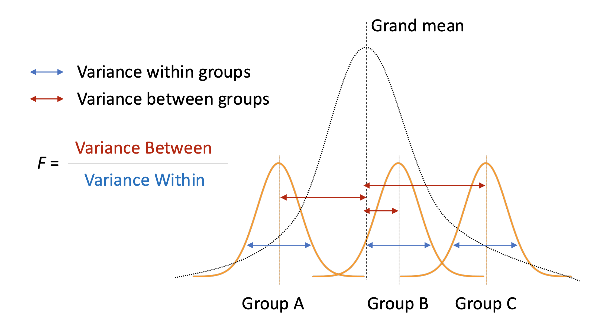

```{r setup}
#| include: false
library(ggplot2)
library(dplyr)
library(emmeans)
set.seed(2026)
```

# Introduction {background-color="#40666e"}

## Why ANOVA Matters

**Let's think about these scenarios:**

> *A hospital administrator wants to compare patient satisfaction across **four departments** (e.g., emergency, cardiology, orthopedics, oncology). The means range from 7.5 to 8.3—are these differences real or just random variation?*

. . .

<br>
A **key question** we need to understand is:

- *Can we compare all four departments simultaneously while controlling for false positives?*

. . .

<br>
This is exactly what **ANOVA** helps us answer!

## Why ANOVA Matters

While *t*-tests compare **two** groups, ANOVA extends this to **three or more** groups.

::: {.incremental}
- ANOVA determines whether differences across multiple groups are **statistically significant**
- It does this in a **single test**, avoiding the problems of running multiple *t*-tests
:::

. . .

::: {.incremental}
<br>
Why not just run multiple *t*-tests?

- Because the **familywise error rate** inflates rapidly!
- **Familywise error rate**: The probability of making **at least one Type I error** (false positive) across all comparisons in a set of tests.
:::

## The Multiple Comparisons Problem

```{r}
#| label: error-rate-demo
#| echo: false
#| fig-width: 8
#| fig-height: 4

comparisons <- 1:15
error_rates <- 1 - (1 - 0.05)^comparisons

error_df <- data.frame(
  comparisons = comparisons,
  error_rate = error_rates * 100
)

groups <- c(3, 4, 5, 6)
comps <- choose(groups, 2)
rates <- (1 - (1 - 0.05)^comps) * 100

ggplot(error_df, aes(x = comparisons, y = error_rate)) +
  geom_line(linewidth = 1.2, color = "#2E86AB") +
  geom_point(size = 3, color = "#2E86AB") +
  geom_hline(yintercept = 5, linetype = "dashed", color = "red") +
  annotate("text", x = 12, y = 8, label = "Desired α = 5%", color = "red") +
  annotate("point", x = comps, y = rates, size = 4, color = "#A23B72") +
  annotate("text", x = 3, y = 20, label = "3 groups\n(3 tests)", size = 3) +
  annotate("text", x = 6, y = 35, label = "4 groups\n(6 tests)", size = 3) +
  annotate("text", x = 10, y = 48, label = "5 groups\n(10 tests)", size = 3) +
  scale_x_continuous(breaks = 1:15) +
  scale_y_continuous(breaks = seq(0, 60, 10), limits = c(0, 60)) +
  labs(title = "The Multiple Comparisons Problem",
       subtitle = "Familywise error rate increases rapidly with number of t-tests",
       x = "Number of Pairwise Comparisons",
       y = "Probability of at Least One Type I Error (%)") +
  theme_minimal() +
  theme(plot.title = element_text(face = "bold"))
```

## The Multiple Comparisons Problem

The familywise error rate for $c$ independent comparisons at significance level $\alpha$:

$$\alpha_{family} = 1 - (1 - \alpha)^c$$

. . .

<br>
**Example**: With 4 groups, you need $\binom{4}{2} = 6$ pairwise t-tests:

$$\alpha_{family} = 1 - (1 - 0.05)^6 = 1 - (0.95)^6 = 0.265 = 26.5\%$$

. . .

<br>
That's a **26.5% chance** of at least one false positive, which is far from the 5% we intended!

. . .

<br>
**ANOVA solves this** by testing all groups simultaneously in a **single test**, maintaining the Type I error rate at α = 0.05.


## ANOVA in Healthcare Management

Real-world applications where ANOVA drives decisions:

::: {.incremental}
- **Quality Improvement**: Comparing satisfaction across multiple departments
- **Treatment Evaluation**: Comparing outcomes across 3+ treatment protocols
- **Longitudinal Tracking**: Monitoring patient outcomes at multiple time points
- **Resource Allocation**: Comparing cost efficiency across facility types
:::


## Today's Learning Goals

By the end of this lecture, you will be able to:

::: {.incremental}
1. **Identify** when to use one-way vs. repeated-measures ANOVA
2. **Conduct** ANOVA in R using `aov()` and interpret ANOVA tables
3. **Perform** post-hoc tests using `emmeans` to identify which groups differ
4. **Visualize** group comparisons using `ggplot2`
:::


## Overview: Two Types of ANOVA

| ANOVA Type | Purpose | Example |
|-----------|---------|---------|
| **One-Way** | Compare means across 3+ independent groups | Satisfaction across 4 departments |
| **Repeated-Measures** | Compare means across 3+ related measurements | HbA1c at baseline, 3, 6, 12 months |


# 1. One-Way ANOVA {background-color="#40666e"}

## What is One-Way ANOVA?

A **one-way ANOVA** tests whether there are significant differences among the means of **three or more independent groups**.

. . .

<br>
**Key Question**: *Do these group means differ significantly, or could the differences be due to chance?*

. . .

<br>
**Key Components**:

- **One independent variable (IV)** (factor) with 3+ levels
- **Independent groups**: Each observation belongs to only one group
- **Continuous dependent variable (DV)**: The outcome measure

## How ANOVA Works

ANOVA analyzes **variance** to make inferences about **means** by partitioning total variability:

::: {.incremental}
1. **Between-group variance**: Differences among group means
2. **Within-group variance**: Differences among individuals within groups
:::

. . .

<br>
If the between-group variance is **much larger** than the within-group variance → group means are likely different!

## When to Use It

One-way ANOVA is appropriate when comparing means **across 3+ distinct, unrelated groups**:

::: {.incremental}
- Comparing *patient outcomes* across different **treatment protocols**
- Evaluating *staff performance* across multiple **departments**
- Comparing *operational metrics* across several **facilities**
- Assessing *cost efficiency* across different **care models**
:::

## One-Way ANOVA Scenario: <br> Patient Satisfaction Across Departments

- A hospital administrator wants to evaluate patient satisfaction across **four departments**: Emergency, Cardiology, Orthopedics, and Oncology.

. . .

- Each department has implemented different patient experience initiatives.

. . .

- **The key question**:
  - Do satisfaction levels differ significantly across departments?

## The Formula

The F-statistic is calculated as:

$$F = \frac{\text{Between-group variance}}{\text{Within-group variance}} = \frac{MS_{between}}{MS_{within}}$$

. . .

Where:

- $MS_{between} = \frac{\sum_{j=1}^{k} n_j(\bar{X}_j - \bar{X}_{grand})^2}{k-1}$
- $MS_{within} = \frac{\sum_{j=1}^{k}\sum_{i=1}^{n_j}(X_{ij} - \bar{X}_j)^2}{N-k}$
- $i$ = each individual, $j$ = each group, $k$ = number of groups, $N$ = total number of individuals


## Understanding the F-Statistic

:::: {.columns}
::: {.column width="60%"}

:::
::: {.column width="40%"}
::: {.fragment}
| Variance| Low | High | 
|:---:|:---:|:---:|
| Between-Group | F ↓ | F ↑ |
| Within-Group | F ↑ | F ↓ |
:::
:::
::::

## Demonstration: <br> Patient Satisfaction Data

- Let's load the data and required packages using the code below:
- We use a new package, `emmeans` today. Let's install it using `install.packages("emmeans")` if you haven't installed it yet.

```{r}
#| label: load-packages-data
#| message: false

# Load required packages
library(ggplot2)
library(dplyr)
library(emmeans)

# Load Patient satisfaction Data
satisfaction_data <- read.csv("https://raw.githubusercontent.com/mba642-spring-26/mba642-spring-26.github.io/refs/heads/main/datasets/week06_satisfaction.csv")
```


## Visualizing Group Differences

:::: {.columns}
::: {.column width="60%"}
```{r}
#| label: oneway-viz1
#| code-fold: true
#| fig-width: 6
#| fig-height: 4.5

p1 <- ggplot(satisfaction_data, aes(x = department, y = score, fill = department)) +
  geom_boxplot(alpha = 0.7, width = 0.4) +
  geom_jitter(width = 0.1, alpha = 0.5, size = 1.5) +
  labs(title = "Patient Satisfaction by Department",
       x = "Department", y = "Satisfaction Score (1-10)") +
  theme_minimal() +
  theme(legend.position = "none",
        plot.title = element_text(face = "bold"))
p1
```
:::
::: {.column width="40%"}
```{r}
#| echo: false
# Summary statistics
summary_stats <- satisfaction_data %>%
  group_by(department) %>%
  summarise(
    n = n(),
    mean = round(mean(score), 2),
    sd = round(sd(score), 2)
  )

knitr::kable(summary_stats,
             col.names = c("Department", "n", "Mean", "SD"),
             caption = "**Summary Statistics by Department**",
             align = "c")
```
:::
::::


## Visualizing the F-Distribution

```{r}
#| label: oneway-fdist
#| echo: false
#| fig-width: 9
#| fig-height: 4.5

anova_result <- aov(score ~ department, data = satisfaction_data)
f_stat <- summary(anova_result)[[1]]$`F value`[1]
df1 <- summary(anova_result)[[1]]$Df[1]
df2 <- summary(anova_result)[[1]]$Df[2]

x_range <- seq(0, max(f_stat + 5, 10), length.out = 1000)
y_values <- df(x_range, df1, df2)
crit_val <- qf(0.95, df1, df2)

ggplot(data.frame(x = x_range, y = y_values), aes(x, y)) +
  geom_line(linewidth = 1) +
  geom_area(data = subset(data.frame(x = x_range, y = y_values), x >= crit_val),
            aes(x, y), fill = "gray50", alpha = 0.5) +
  geom_vline(xintercept = crit_val, linetype = "dashed") +
  geom_vline(xintercept = f_stat, color = "red", linewidth = 1.5) +
  annotate("text", x = f_stat + 1, y = 0.3,
           label = paste("F =", round(f_stat, 2)),
           color = "red", hjust = 0, fontface = "bold") +
  annotate("text", x = crit_val + 0.5, y = 0.05,
           label = paste("Critical =", round(crit_val, 2)),
           hjust = 0, size = 3) +
  labs(title = "One-Way ANOVA: F-Distribution Under the Null Hypothesis",
       subtitle = paste("df1 =", df1, ", df2 =", df2),
       x = "F-value", y = "Density") +
  theme_minimal() +
  theme(plot.title = element_text(face = "bold"))
```

## Hypotheses

-   **Null hypothesis** ($H_0$): All group means are equal ($\mu_1 = \mu_2 = \mu_3 = \mu_4$)
-   **Alternative hypothesis** ($H_A$): At least one group mean is different from the others

. . .

<br>
**Interpretation of the F-distribution graph:**

- The red line indicates the calculated F-statistic, and the shaded gray area is the rejection region
- If the F-statistic falls in the rejection region → reject $H_0$
- The area above the F-statistic is the p-value

## Demonstration: Using aov() in R

- We can run one-way ANOVA using the `aov()` function in R.
  - Syntax: `aov(outcome ~ grouping_variable, data = your_data)`

```{r}
#| label: oneway-test1

# Perform one-way ANOVA
anova_result <- aov(score ~ department, data = satisfaction_data)
summary(anova_result)
```

## Interpreting the ANOVA Table

::: {.incremental}
- **Df**: Between groups ($k - 1 = 3$), Within groups ($N - k = 76$)
- **Sum Sq**: Variance explained by factor (between) vs. unexplained (within)
- **Mean Sq**: Sum of Squares / degrees of freedom
- **F value**: Ratio of between-group to within-group variance
- **Pr(>F)**: p-value—probability of this F if all group means were equal
:::

## Interpreting the Results

**Key findings**:

::: {.incremental}
- The p-value is less than 0.05, so we **reject the null hypothesis**
- There are statistically significant differences in patient satisfaction among the four departments
<br><br> 
- **But which departments differ from each other?**
  - ANOVA tells us differences exist but not **where** they are
  - For this, we need **post-hoc tests**
:::

## Post-Hoc Tests: Tukey's HSD

When ANOVA is significant, we use **Tukey's Honest Significant Difference (HSD)** to identify which specific groups differ.

. . .

<br> 
**Key features:**

::: {.incremental}
- Tests **all pairwise comparisons** (4 groups → 6 comparisons)
- **Controls familywise error rate** at α = 0.05 across ALL comparisons
- If **p.value < 0.05**, those two groups are significantly different
:::

## Demonstration: Tukey's HSD in R

1. First, we get the estimated marginal means (EMMs) for each group, using the `emmeans()` function.

```{r}
#| label: posthoc-tukey1

# Step 1: Calculate estimated marginal means
emm_dept <- emmeans(anova_result, ~ department)
emm_dept
```

## Demonstration: Tukey's HSD in R

2. Then, we perform pairwise comparisons with Tukey adjustment, using `pairs()` function. 

```{r}
#| label: posthoc-tukey2

# Step 2: Pairwise comparisons with Tukey adjustment
tukey_pairs <- pairs(emm_dept, adjust = "tukey")
tukey_pairs
```

## Interpreting Tukey's HSD Output

Each row shows a pairwise comparison:

::: {.incremental}
- **contrast**: Which two groups are being compared
- **estimate**: Difference between group means
- **SE**: Standard error of the difference
- **t.ratio**: Test statistic
- **p.value**: Adjusted p-value (controlling for multiple comparisons)
:::

. . .

**Decision rule**: If **p.value < 0.05**, those groups are significantly different.

## Practice 1: Staff Training Programs

- A hospital compares **three training programs** (Traditional, Simulation, Blended) for nurse medication safety scores (out of 100). These scores assess nurses' competency in safe medication handling, including correct dosage identification, drug interaction awareness, and proper administration procedures.

. . .

- The **Research Question** we have is: Do the three training programs result in different medication safety competency scores?

## Practice 1: Staff Training Programs

1. Load the dataset using the code below.
```{r}
#| label: practice-oneway1-data-slide

# Load Training program Data
training_data <- read.csv("https://raw.githubusercontent.com/mba642-spring-26/mba642-spring-26.github.io/refs/heads/main/datasets/week06_training_data.csv")
```

2. Create a boxplot to visualize the data.

```{r}
#| label: practice-oneway1-viz
#| eval: false

# Fill in the blanks to create a boxplot
ggplot(___, aes(x = ___, y = ___, fill = ___)) +
  geom_boxplot(alpha = 0.7) +
  geom_jitter(width = 0.1, alpha = 0.5) +
  labs(title = "Medication Safety Scores by Training Program",
       x = "Training Program", y = "Safety Score (out of 100)") +
  theme_minimal() +
  theme(legend.position = "none",
        plot.title = element_text(face = "bold"))
```

## Practice 1: Staff Training Programs

3. Run ANOVA and post-hoc tests.

```{r}
#| eval: false
# Fill in the blanks (replace ___ with appropriate values)
# Step 1: Run ANOVA
anova_training <- aov(___ ~ ___, data = training_data)
summary(___)

# Step 2: Post-hoc tests
emm_training <- emmeans(___, ~ ___)
pairs(___, adjust = "tukey")
```

<br>
**Question**: Which training program is most effective?

## Example 2: Comparing Care Coordination Models

Three care coordination models for managing chronic conditions:

- **Model A**: Nurse-led telephone follow-up
- **Model B**: Community health worker home visits
- **Model C**: Integrated care team with digital monitoring

. . .

<br>
**Question**: Do 30-day readmission rates differ across models? (lower is better)

## Example 2: Data and Visualization

Let's load the dataset and create a boxplot to visualize the data.

```{r}
#| label: oneway-example2-slide

# Load 30-day readmission rates (%) by care coordination model
readmission_data <- read.csv("https://raw.githubusercontent.com/mba642-spring-26/mba642-spring-26.github.io/refs/heads/main/datasets/week06_readmission_data.csv")
```

```{r}
#| label: oneway-viz2-slide
#| code-fold: true
#| fig-width: 8
#| fig-height: 4.5

ggplot(readmission_data, aes(x = model, y = rate, fill = model)) +
  geom_boxplot(alpha = 0.7) +
  geom_jitter(width = 0.1, alpha = 0.5) +
  labs(title = "30-Day Readmission Rates by Care Coordination Model",
       x = "Care Model", y = "Readmission Rate (%)") +
  theme_minimal() +
  theme(legend.position = "none",
        plot.title = element_text(face = "bold"))
```

## Example 2: Hypotheses and ANOVA

Let's run one-way ANOVA to test our hypotheses.

**Hypotheses:**

-   $H_0$: All three models have equal mean readmission rates ($\mu_A = \mu_B = \mu_C$)
-   $H_A$: At least one model's mean readmission rate is different from the others

```{r}
#| label: oneway-test2-slide

# Perform ANOVA
anova_readmit <- aov(rate ~ model, data = readmission_data)
summary(anova_readmit)
```

## Example 2: Post-Hoc

- As we found a significant difference in means, let's perform post-hoc tests to identify which models are significantly different.

```{r}
#| label: oneway-posthoc2-slide

# Post-hoc test
emm_readmit <- emmeans(anova_readmit, ~ model)
pairs(emm_readmit, adjust = "tukey")
```

## Example 2: Interpretation

**Key findings from Tukey's HSD:**

::: {.incremental}
- **All three pairwise comparisons** are statistically significant
- Model C (Integrated) has the lowest readmission rates
- Model B (CHW Visits) significantly outperforms Model A (Nurse Phone)
- **Conclusion**: More comprehensive care coordination → lower readmissions
:::

## Practice 2: Hospital Operating Costs

- Compare cost per discharge (\$, the total cost of a patient's entire hospital stay from admission to discharge) across **four hospital types**:

::: {.smaller style="margin-left: 2em;"}
  - **Academic Medical**: Large teaching hospitals; complex care and research
  - **Community**: General hospitals serving local populations
  - **Critical Access**: Small rural hospitals (≤25 beds)
  - **Specialty**: Focused on specific areas (e.g., cardiac, orthopedic)
:::

<br>

- The **Research Question** we have is: Do operating costs per discharge differ significantly across hospital types?

## Practice 2: Hospital Operating Costs

1. Load the dataset using the code below.

```{r}
#| label: practice-oneway2-data-slide

# Load Cost per discharge by hospital type
cost_data <- read.csv("https://raw.githubusercontent.com/mba642-spring-26/mba642-spring-26.github.io/refs/heads/main/datasets/week06_operating_cost.csv")
```

2. Create a boxplot to visualize the data.

```{r}
#| label: practice-oneway2-viz
#| eval: false

# Fill in the blanks to create a boxplot
ggplot(___, aes(x = ___, y = ___, fill = ___)) +
  geom_boxplot(alpha = 0.7) +
  geom_jitter(width = 0.1, alpha = 0.5) +
  labs(title = "Cost per Discharge by Hospital Type",
       x = "Hospital Type", y = "Cost per Discharge ($)") +
  theme_minimal() +
  theme(legend.position = "none",
        plot.title = element_text(face = "bold"))
```

## Practice 2: Hospital Operating Costs

3. Run ANOVA and post-hoc tests.

```{r}
#| eval: false
# Fill in the blanks (replace ___ with appropriate values)
# Step 1: Run ANOVA
anova_cost <- aov(___ ~ ___, data = cost_data)
summary(___)

# Step 2: Post-hoc tests
emm_cost <- emmeans(___, ~ ___)
pairs(___, adjust = "tukey")
```

<br>
**Question**: Which hospital type has the highest and lowest costs?


# 2. Repeated-Measures ANOVA {background-color="#40666e"}

## What is Repeated-Measures ANOVA?

A **repeated-measures ANOVA** tests whether there are significant differences across 3+ related measurements on the **same subjects**.

. . .

<br><br>

**Key Question**: *Is there a significant change across time points, conditions, treatments, or measurements within the same individuals?*

. . .

<br><br>

**Key Characteristic**:

- This is the extension of the **paired t-test** to more than two measurements

## Why Use Repeated Measures?

**Key Advantage**: Each person serves as their own control!

::: {.incremental}
- **Eliminates individual variability** as a source of noise
- **Increases statistical power** to detect true effects
- **More efficient**: need fewer subjects than between-subjects design
:::

## When to Use It

Repeated-measures ANOVA is appropriate for:

::: {.incremental}
- **Longitudinal studies**: Tracking patients at multiple time points
  - e.g., Pain scores at baseline, 1, 3, 6 months
- **Within-subject experiments**: Same subjects under different conditions
  - e.g., Performance under different shift schedules
- **Quality improvement**: Monitoring metrics over multiple periods
  - e.g., Satisfaction before, during, and after initiative
:::

## Repeated-Measures Scenario: <br> Diabetes Management Program

**Situation**: A healthcare organization implements a comprehensive diabetes management program.

. . .

<br>
They measure **HbA1c levels** (%) for 25 patients at **four time points**:

- **Baseline**, **3 Months**, **6 Months**, **12 Months**

. . .

<br>
**Question**: Does HbA1c change significantly over the 12-month program?

## Background: What is HbA1c?

- **HbA1c** measures average blood glucose over 2-3 months (reported as %)

. . .

**Clinical targets**:

| Range | Interpretation |
|-------|---------------|
| < 5.7% | Normal |
| 5.7–6.4% | Prediabetes |
| ≥ 6.5% | Diabetes |
| **< 7.5%** | **Treatment goal** |

. . .

<br>
Each 1% reduction in HbA1c is associated with significant reductions in complications (retinopathy, nephropathy, neuropathy).

## The Formula

Repeated-measures ANOVA partitions variance differently than one-way ANOVA to account for correlation between measurements on the same subject:

$$F = \frac{MS_{time}}{MS_{error}} = \frac{SS_{time}/df_{time}}{SS_{error}/df_{error}}$$

. . .

Where:

- $MS_{time}$: How much do time point means differ from the grand mean? (the effect)
- $MS_{error}$: Random variation after removing **both** subject and time effects (the noise)
- $df_{time} = t - 1$ (number of time points minus 1)
- $df_{error} = (n-1) \times (t-1)$

## How Between-Subject Variance Is Removed

**One-Way ANOVA**: all leftover variance goes into error:

$$SS_{total} = SS_{between} + \underbrace{SS_{error}}_{\text{large (includes subject differences)}}$$

. . .

<br>
**Repeated-Measures ANOVA**: subject variance is separated out:

$$SS_{total} = SS_{time} + SS_{subjects} + \underbrace{SS_{error}}_{\text{smaller!}}$$

. . .

<br>
By removing $SS_{subjects}$, the error term gets **smaller** → F-statistic gets **larger** → more **statistical power**!

## Demonstration: <br> Diabetes Management Data

Let's load the dataset using the code below. 

```{r}
#| label: repeated-example1-slide

# Load HbA1c levels (%) for 25 patients at 4 time points
diabetes_data <- read.csv("https://raw.githubusercontent.com/mba642-spring-26/mba642-spring-26.github.io/refs/heads/main/datasets/week06_diabetes.csv")

# Convert time to factor with correct order, and patient_id to factor
diabetes_data <- diabetes_data %>%
  mutate(
    time = factor(time,
                  levels = c("Baseline", "3 Months", "6 Months", "12 Months")),
    patient_id = factor(patient_id)
  )
```

## Visualizing Repeated Measures Data

```{r}
#| label: repeated-viz1-slide
#| code-fold: true
#| fig-width: 8
#| fig-height: 4.5

ggplot(diabetes_data, aes(x = time, y = hba1c, group = patient_id)) +
  geom_line(alpha = 0.3, color = "gray50") +
  geom_point(alpha = 0.3) +
  stat_summary(aes(group = 1), fun = mean, geom = "line",
               linewidth = 2, color = "red") +
  stat_summary(aes(group = 1), fun = mean, geom = "point",
               size = 4, color = "red") +
  labs(title = "Individual Patient HbA1c Trajectories",
       subtitle = "Red line shows mean across all patients",
       x = "Time Point", y = "HbA1c (%)") +
  theme_minimal() +
  theme(plot.title = element_text(face = "bold"),
        axis.text.x = element_text(angle = 45, hjust = 1))
```

## Interpreting the Spaghetti Plot

::: {.incremental}
- **Gray lines**: Individual patient trajectories
- **Red line**: Overall mean trajectory
- **Downward trend**: Average HbA1c decreasing over time
- **Individual variability**: Some patients improve more than others
:::

## Conducting a Repeated Measures ANOVA

- We specify `Error(patient_id/time)` to account for within-subjects design.

::: {.smaller style="margin-left: 2em;"}
  -   $H_0$: Mean HbA1c is equal across all four time points ($\mu_{baseline} = \mu_{3mo} = \mu_{6mo} = \mu_{12mo}$)
  -   $H_A$: At least one time point's mean HbA1c differs from the others
:::

```{r}
#| label: repeated-test1-slide

# Repeated-measures ANOVA
rm_anova <- aov(hba1c ~ time + Error(patient_id/time), data = diabetes_data)
summary(rm_anova)
```

## Interpreting the Output

::: {.incremental}
- **time row**: Tests whether mean HbA1c differs across time points
- **Df = 3**: Degrees of freedom for time (4 time points - 1)
- **F value**: Ratio of time effect variance to residual variance
- **Pr(>F)**: p-value for the time effect
:::

## Conclusion and Interpretation

```{r}
#| echo: false
time_means <- diabetes_data %>%
  group_by(time) %>%
  summarise(mean_hba1c = round(mean(hba1c), 2), .groups = "drop")
reduction <- time_means$mean_hba1c[1] - time_means$mean_hba1c[4]
```

- With a significant F-test (p < 0.05), we **reject the null hypothesis**. HbA1c levels changed significantly over the 12-month program.

. . .

- Overall, `r reduction` percentage points were improved.
  - Patients started with poorly controlled diabetes (average `r time_means$mean_hba1c[1]`%)
  - By 6 and 12 months, average HbA1c achieved the treatment goal of <7.5%


## Post-Hoc Tests for Repeated Measures

**But which time points differ?** We need pairwise comparisons:

```{r}
#| label: posthoc-repeated1-slide

emm_time <- emmeans(rm_anova, ~ time)
pairs(emm_time, adjust = "tukey")
```

## Practice 3: Pain Management Follow-up

- A pain clinic measures **pain intensity** (0-10 VAS scale) for 20 chronic pain patients at **five time points** during a 6-month treatment program. 
- Pain perceptions measured across five time points: 
  - **Baseline**, **Month 1**, **Month 2**, **Month 4**, **Month 6**

. . .

- The **Research Question** we have is: Does pain intensity decrease significantly over the course of the treatment program?

## Practice 3: Pain Management Follow-up

1. Load the dataset using the code below.

```{r}
#| label: practice-repeated1-data-slide

# Load Pain scores at 5 time points for 20 patients
pain_data <- read.csv("https://raw.githubusercontent.com/mba642-spring-26/mba642-spring-26.github.io/refs/heads/main/datasets/week06_pain_management.csv")

# Convert time to factor with correct order, and patient_id to factor
pain_data <- pain_data %>%
  mutate(
    time = factor(time,
                  levels = c("Baseline", "Month 1", "Month 2", "Month 4", "Month 6")),
    patient_id = factor(patient_id)
  )
```

## Practice 3: Pain Management Follow-up

2. Create a spaghetti plot to visualize the data.

```{r}
#| label: practice-repeated1-viz
#| eval: false

# Fill in the blanks to create a spaghetti plot
ggplot(___, aes(x = ___, y = ___, group = ___)) +
  geom_line(alpha = 0.3, color = "gray50") +
  geom_point(alpha = 0.3) +
  stat_summary(aes(group = 1), fun = mean, geom = "line",
               linewidth = 2, color = "red") +
  stat_summary(aes(group = 1), fun = mean, geom = "point",
               size = 4, color = "red") +
  labs(title = "Pain Intensity Over Treatment Program",
       subtitle = "Red line shows mean across all patients",
       x = "Time Point", y = "Pain Intensity (VAS 0-10)") +
  theme_minimal() +
  theme(axis.text.x = element_text(angle = 45, hjust = 1))
```

## Practice 3: Pain Management Follow-up

3. Run repeated-measures ANOVA and post-hoc tests.

```{r}
#| eval: false
# Fill in the blanks (replace ___ with appropriate values)
# Step 1: Run repeated-measures ANOVA
rm_anova_pain <- aov(___ ~ ___ + Error(___/___), data = pain_data)
summary(___)

# Step 2: Post-hoc tests
emm_pain <- emmeans(___, ~ ___)
pairs(___, adjust = "tukey")
```

<br>
**Question**: Does pain decrease significantly over the treatment program?

## Example 2: <br> Staff Burnout Across Shift Schedules

The **same 20 nurses** measured under three shift schedules:

- **Schedule A**: Traditional 8-hour shifts
- **Schedule B**: 12-hour shifts
- **Schedule C**: Flexible self-scheduling (nurses choose their own shift times and lengths)

. . .

<br>
Each nurse works under each schedule for one month, with washout periods.

## Example 2: Data and Visualization

Let's load the dataset using the code below.

```{r}
#| label: repeated-example2-slide

# Load burnout scores for 20 nurses under 3 shift schedules
burnout_data <- read.csv("https://raw.githubusercontent.com/mba642-spring-26/mba642-spring-26.github.io/refs/heads/main/datasets/week06_burnout.csv")

# Convert schedule to factor with correct order
burnout_data <- burnout_data %>%
  mutate(
    schedule = factor(schedule,
                      levels = c("A: 8-hour", "B: 12-hour", "C: Flexible")),
    nurse_id = factor(nurse_id)
  )
```

## Example 2: Visualization

```{r}
#| label: repeated-viz2-slide
#| code-fold: true
#| fig-width: 8
#| fig-height: 4.5

ggplot(burnout_data, aes(x = schedule, y = burnout, group = nurse_id)) +
  geom_line(alpha = 0.3, color = "gray50") +
  geom_point(alpha = 0.5) +
  stat_summary(aes(group = 1), fun = mean, geom = "line",
               linewidth = 2, color = "red") +
  stat_summary(aes(group = 1), fun = mean, geom = "point",
               size = 4, color = "red") +
  labs(title = "Individual Nurse Burnout Scores",
       x = "Shift Schedule", y = "Burnout Score (MBI)") +
  theme_minimal() +
  theme(plot.title = element_text(face = "bold"))
```

## Example 2: Hypotheses and ANOVA

**Hypotheses:**

::: {.smaller style="margin-left: 2em;"}
-   $H_0$: Mean burnout scores are equal across all three shift schedules ($\mu_A = \mu_B = \mu_C$)
-   $H_A$: At least one shift schedule's mean burnout score differs from the others
:::

```{r}
#| label: repeated-test2-slide

rm_anova_burnout <- aov(burnout ~ schedule + Error(nurse_id/schedule),
                        data = burnout_data)
summary(rm_anova_burnout)
```

## Example 2: Post-Hoc

As we found a significant ANOVA result, we need to conduct post-hoc tests to find which shifts are significantly different.

```{r}
#| label: repeated-posthoc2-slide

emm_schedule <- emmeans(rm_anova_burnout, ~ schedule)
pairs(emm_schedule, adjust = "tukey")
```

## Example 2: Interpretation

**Key findings:**

::: {.incremental}
- Flexible scheduling (C) → **significantly lower** burnout than both A and B
- 12-hour shifts (B) → **significantly higher** burnout than 8-hour shifts (A)

<br>

- Offering flexible self-scheduling could reduce nurse burnout, which is associated with reduced turnover (saving recruitment and training costs), fewer medical errors, and improved patient satisfaction scores
:::

## Practice 4: Employee Engagement Survey

- An HR department surveys nurse engagement **quarterly** over one year (4 time points: Q1, Q2, Q3, Q4).

<br>

- Engagement scores (1-100) capture nurses' emotional commitment, motivation, and connection to their work (e.g., feeling energized, finding purpose in patient care, and being fully focused during shifts).

. . .

<br>

- The **Research Question** we have is: Does nurse engagement change significantly across the four quarters?

## Practice 4: Employee Engagement Survey

1. Load the dataset using the code below.

```{r}
#| label: practice-repeated2-data-slide

# Load Engagement scores (1-100) for 25 nurses over 4 quarters
engagement_data <- read.csv("https://raw.githubusercontent.com/mba642-spring-26/mba642-spring-26.github.io/refs/heads/main/datasets/week06_engagement.csv")

engagement_data <- engagement_data %>%
  mutate(
    quarter = factor(quarter, levels = c("Q1", "Q2", "Q3", "Q4")),
    nurse_id = factor(nurse_id)
  )
```

## Practice 4: Employee Engagement Survey

2. Create a spaghetti plot to visualize the data.

```{r}
#| label: practice-repeated2-viz
#| eval: false

# Fill in the blanks to create a spaghetti plot
ggplot(___, aes(x = ___, y = ___, group = ___)) +
  geom_line(alpha = 0.3, color = "gray50") +
  geom_point(alpha = 0.3) +
  stat_summary(aes(group = 1), fun = mean, geom = "line",
               linewidth = 2, color = "red") +
  stat_summary(aes(group = 1), fun = mean, geom = "point",
               size = 4, color = "red") +
  labs(title = "Nurse Engagement Scores by Quarter",
       subtitle = "Red line shows mean across all nurses",
       x = "Quarter", y = "Engagement Score (1-100)") +
  theme_minimal()
```

## Practice 4: Employee Engagement Survey

3. Run repeated-measures ANOVA and post-hoc tests.

```{r}
#| eval: false
# Fill in the blanks (replace ___ with appropriate values)
# Step 1: Run repeated-measures ANOVA
rm_anova_engage <- aov(___ ~ ___ + Error(___/___), data = engagement_data)
summary(___)

# Step 2: Post-hoc tests
emm_engage <- emmeans(___, ~ ___)
pairs(___, adjust = "tukey")
```

<br>
**Question**: Does engagement change significantly across quarters?


# Choosing the Right Test {background-color="#40666e"}

## Decision Flowchart

::: {.smaller}
| Question | If Yes... | R Function |
|----------|-----------|------------|
| Comparing to a benchmark? | **One-sample *t*-test** | `t.test(x, mu = value)` |
| Two separate groups? | **Independent *t*-test** | `t.test(x, y, var.equal = TRUE)` |
| Same subjects, twice? | **Paired *t*-test** | `t.test(x, y, paired = TRUE)` |
| 3+ independent groups? | **One-way ANOVA** | `aov(y ~ group, data)` |
| Same subjects, 3+ times? | **Repeated-measures ANOVA** | `aov(y ~ time + Error(id/time), data)` |
:::

. . .

After significant ANOVA → **Post-hoc tests**: `emmeans()` + `pairs(adjust = "tukey")`

# Summary {background-color="#40666e"}

## Key Takeaways

::: {.incremental}
1. **One-way ANOVA**: Compare 3+ independent groups in a single test
2. **Repeated-measures ANOVA**: Compare 3+ related measurements on the same subjects
3. **Post-hoc tests** (Tukey's HSD): Identify *which* groups differ after significant ANOVA
4. **All ANOVAs**: Use `aov()` in R; use `emmeans()` + `pairs()` for post-hoc
:::

## Assignments

1. **Reflection**: Please share your thoughts on the lecture
   - 3 interesting things
   - 3 confusing things

2. **No Lab Assignment** this week

# References {background-color="#40666e"}

## Statistical Methods

- Field, A. (2018). *Discovering Statistics Using IBM SPSS Statistics* (5th ed.). SAGE Publications.
- [Navarro, D. (2019). *Learning Statistics with R: Chapter 14*.](https://learningstatisticswithr.com/lsr-0.6.pdf){target="_blank"}
- Maxwell, S. E., & Delaney, H. D. (2004). *Designing Experiments and Analyzing Data* (2nd ed.). Psychology Press.

## Healthcare Applications

- Assessing Patient Satisfaction with Hospital Services. (2025). *Healthcare (Basel)*.
- Effect of Community Health Workers on 30-Day Hospital Readmissions. (2021). *JAMA Network Open*.
- Medication Safety Simulation Training for Anesthesia Professionals. (2025). *Clinical Simulation in Nursing*.
- Improved Glycemic Control With a Digital Health Intervention in Adults With Type 2 Diabetes. (2021). *JMIR Diabetes*.
- Association of 12 h Shifts and Nurses' Job Satisfaction, Burnout and Intention to Leave. (2015). *BMJ Open*.
- Visual Analogue Scale. *Physiopedia*.
