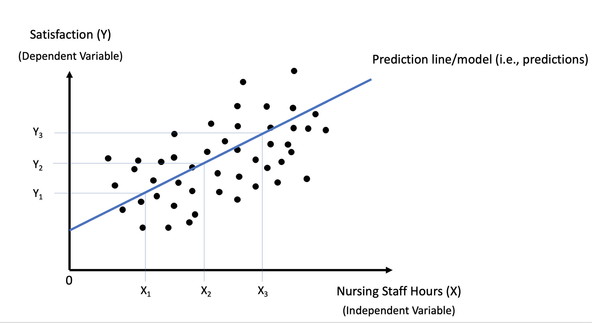
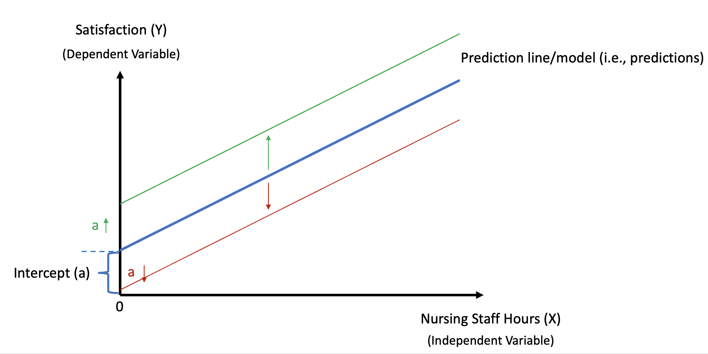
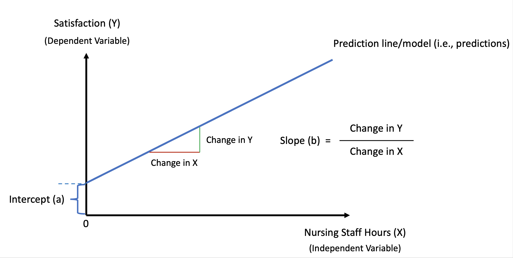
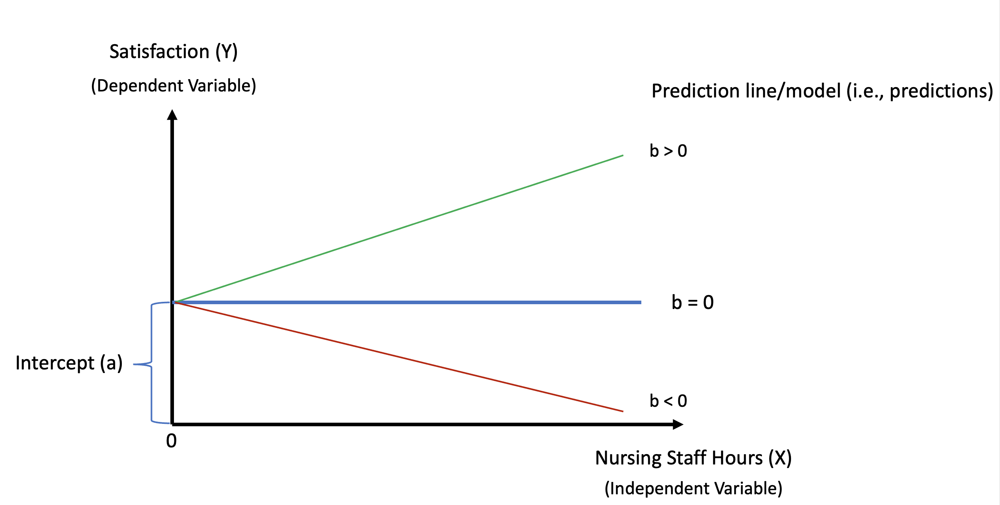
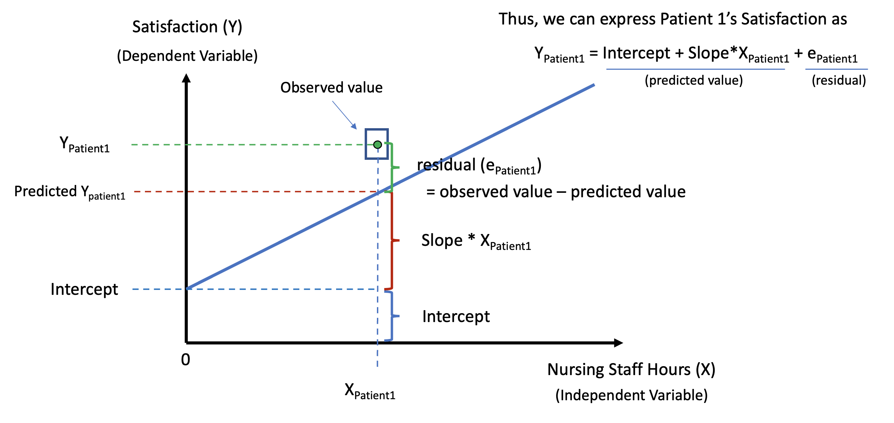
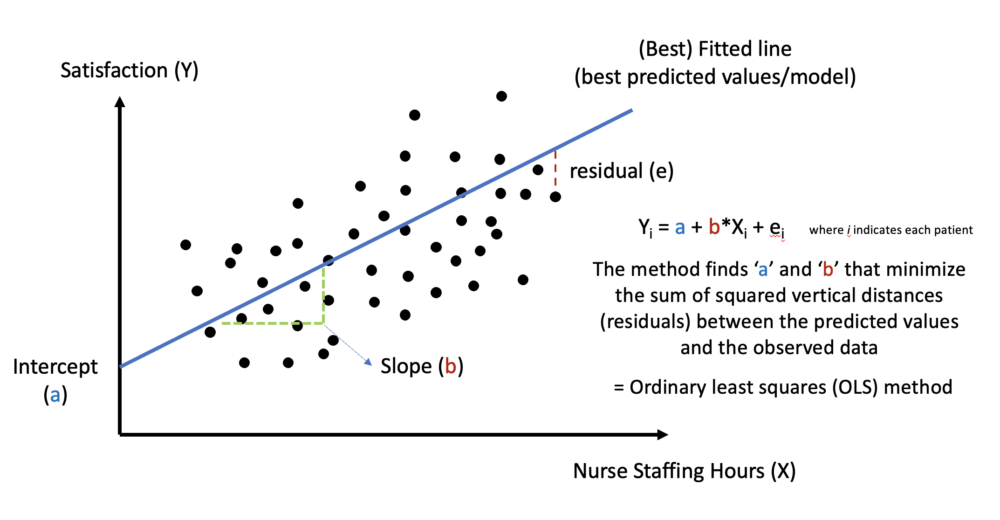
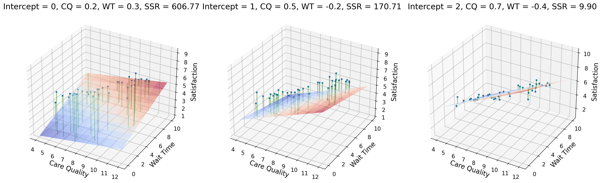
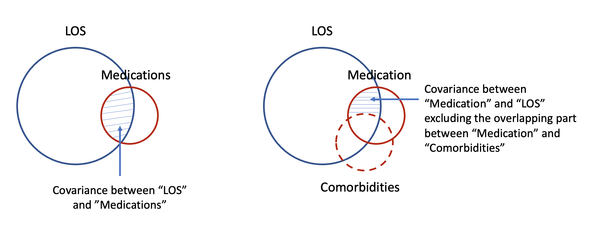

```{r setup}
#| include: false
library(tidyverse)
library(knitr)
library(kableExtra)
library(car)
library(patchwork)
library(sjPlot)

set.seed(2026)
```

## Learning Goals

By the end of this lecture, you will be able to:

::: incremental
1.  **Understand** when linear regression is used and how it works
2.  **Fit** simple and multiple linear regression models in R using `lm()`
3.  **Interpret** regression coefficients (direction, magnitude, significance)
4.  **Make predictions** for new observations using fitted models
5.  **Identify** multicollinearity using VIF and understand how to handle it
:::

## From Correlation to Regression

In Week 8, we used correlation to answer:

-   *"Is there a relationship between nurse staffing hours and patient satisfaction?"*

. . .

<br> **Linear regression extends this** by answering more actionable questions:

::: incremental
-   *How many points does satisfaction change for each additional nursing hour?*
-   *If we increase staffing to 8 hours per patient day, what satisfaction score can we expect?*
-   *Among wait time, staffing, and facility age, which factors significantly explain patient satisfaction?*
:::

## Types of Linear Regression

Linear regression models the linear relationship between independent variables (IV) and a dependent variable (DV):

-   e.g., *Are older patients more likely to have longer lengths of stay (LOS)?*
    -   **Dependent variable (Y)**: The outcome we want to predict or explain (LOS)
    -   **Independent variable(s) (X)**: The predictor(s) we use to explain Y (age)

. . .

The number of independent variables determines the type of regression:

-   **Simple Linear Regression**: One predictor → outcome <br> *(e.g., Patient age → LOS)*
-   **Multiple Linear Regression**: Two or more predictors → outcome <br> *(e.g., Age + Severity + Insurance → LOS)*

# Simple Linear Regression {background-color="#40666e"}

## What Is Simple Linear Regression?

Simple linear regression models the relationship between **one independent variable (X)** and **one dependent variable (Y)** using a straight line (linear model).

. . .

<br>

**When to use it:**

::: incremental
-   Quantify the strength and direction of a linear relationship between two continuous variables
-   Predict an outcome based on a single predictor
-   Test whether a linear relationship is statistically significant
:::

## The Model Equation

$$Y_i = \beta_0 + \beta_1 X_i + \epsilon_i$$

<br>

-   $Y_i$ = **Dependent variable**: the outcome we predict (e.g., satisfaction score)
-   $X_i$ = **Independent variable**: the predictor (e.g., wait time)
-   $\beta_0$ = **Intercept (a or b₀)**: predicted Y when X = 0 (The starting point)
-   $\beta_1$ = **Slope (b or b₁)**: change in Y per one-unit increase in X ("How much does Y change?")
-   $\epsilon_i$ = **Residual**: observed $Y_i$ − predicted $Y_i$ ($\hat{Y}_i$)

## The OLS Method

Linear regression finds the "best" line by minimizing the **residual sum of squares (RSS)**:

$$RSS = \sum_{i=1}^{n} (Y_i - \hat{Y}_i)^2 = \sum_{i=1}^{n} \epsilon_i^2$$

. . .

<br>

Let's take a look at how the OLS method works in simple linear regression.

## The Prediction Line

{fig-align="center"}

## The Intercept

{fig-align="center"}

## The Slope

{fig-align="center"}

## Slope Direction

{fig-align="center"}

## Putting It All Together

{fig-align="center"}

## The OLS Method — Visual Summary

{fig-align="center"}

<a href="https://colab.research.google.com/drive/1nG-NqRsae74jqjgqxeFLATML3tD25q5K?usp=sharing" target="_blank">OLS simulation</a>

## Interpreting the Slope (β₁)

Now that we have the best-fit line, **the slope (β₁)** tells us:

-   **Direction**:
    -   β₁ \> 0: positive relationship
    -   β₁ \< 0: negative relationship
-   **Magnitude**: How much Y changes for each one-unit increase in X
-   **Statistical significance**: Whether the relationship likely exists in the population

## Using the Fitted Model for Predictions

Once OLS estimates $\beta_0$ (intercept) and $\beta_1$ (slope), we can predict outcomes:

$$\hat{Y} = \hat{\beta}_0 + \hat{\beta}_1 X$$

. . .

<br>

The "hat" notation (\^) indicates **estimated** values from our sample data.

. . .

We use the fitted model to:

::: incremental
1.  **Assess model fit**: predictions for observations in our dataset
2.  **Forecast outcomes**: predictions for new observations
3.  **Evaluate "what if" questions**: hypothetical scenarios
:::

## Example Case: <br> ED Wait Time & Patient Satisfaction

**Background**: Research has consistently shown that ED wait times are negatively associated with patient satisfaction. A 2021 study (Abass et al.) found that being informed about waiting time showed a moderately strong positive correlation with patients' overall rating.

. . .

<br>

Let's build a regression model to quantify how much ED wait time impacts patient satisfaction scores, and use it to make predictions.

## Load the Data

Let's load the required packages and dataset using the code:

```{r}
#| label: load-simple-data

library(tidyverse)

ed_data <- read.csv("https://raw.githubusercontent.com/mba642-spring-26/mba642-spring-26.github.io/refs/heads/main/datasets/week11_ed_data.csv")

head(ed_data, 5) 
```

## Exploratory Data Analysis

Before running regression, always visualize your data:

```{r}
#| label: fig-eda-simple
#| code-fold: true
#| fig-width: 9
#| fig-height: 4.5

ggplot(ed_data, aes(x = wait_time_minutes, y = satisfaction_score)) +
  geom_point(alpha = 0.6, size = 2, color = "steelblue") +
  geom_smooth(method = "lm", se = TRUE, color = "darkred", fill = "pink") +
  labs(
    x = "Wait Time (minutes)",
    y = "Patient Satisfaction Score (0-100)",
    title = "ED Wait Time vs. Patient Satisfaction"
  ) +
  theme_minimal()
```

## Fitting the Simple Linear Regression Model

We use the `lm(DV ~ IV, data)` function in R:

```{r}
#| label: fit-simple-model
#| code-fold: true

model_simple <- lm(satisfaction_score ~ wait_time_minutes, data = ed_data)
summary(model_simple)
```

## The Fitted Regression Equation

```{r}
#| echo: false
b0 <- round(coef(model_simple)[1], 2)
b1 <- round(coef(model_simple)[2], 3)
```

Based on the model output, our fitted equation is:

$$\widehat{\text{Satisfaction}} = `r b0` + (`r b1`) \times \text{Wait Time}$$

<br>

OLS found that when β₀ = `r b0` and β₁ = `r b1`, the residual sum of squares (RSS) is minimized (i.e., this is the best-fitting line!)

## Interpreting the Results

```{r}
#| echo: false
intercept <- round(coef(model_simple)[1], 2)
slope <- round(coef(model_simple)[2], 3)
p_value <- summary(model_simple)$coefficients[2, 4]
r_squared <- round(summary(model_simple)$r.squared, 3)
```

**1. The Intercept**: β₀ = `r intercept`

-   When wait time is 0 minutes, predicted satisfaction is `r intercept` points

. . .

**2. The Slope**: β₁ = `r slope`

::: incremental
-   The effect of wait time on satisfaction score
-   **Direction**: Negative (longer waits -\> **lower** satisfaction)
-   **Magnitude**: Each additional minute decreases satisfaction by **`r abs(slope)` points**
-   **Significance**: p = `r ifelse(p_value < 2.2e-16, "< 2.2e-16", format(p_value, scientific = TRUE))` (\< 0.05) → **statistically significant**
:::

. . .

**3. R² = `r r_squared`**

-   Wait time explains **`r r_squared * 100`%** of the variance in satisfaction

## Visualizing R²

```{r}
#| label: fig-rsquared-concept
#| echo: false
#| fig-width: 12
#| fig-height: 6

ed_data_variance <- ed_data %>%
  mutate(
    predicted = predict(model_simple),
    mean_y = mean(satisfaction_score),
    total_dev = satisfaction_score - mean_y,
    explained_dev = predicted - mean_y,
    residual_dev = satisfaction_score - predicted
  )

TSS <- sum(ed_data_variance$total_dev^2)
ESS <- sum(ed_data_variance$explained_dev^2)
RSS <- sum(ed_data_variance$residual_dev^2)
R2 <- ESS / TSS

p1 <- ggplot(ed_data_variance, aes(x = wait_time_minutes, y = satisfaction_score)) +
  geom_hline(yintercept = mean(ed_data_variance$satisfaction_score),
             color = "darkgreen", linewidth = 1.2, linetype = "dashed") +
  geom_segment(aes(xend = wait_time_minutes, yend = mean_y),
               color = "purple", alpha = 0.4, linewidth = 0.6) +
  geom_point(size = 2, color = "black", alpha = 0.6) +
  annotate("text", x = 100, y = mean(ed_data_variance$satisfaction_score) + 3,
           label = "Mean (baseline model)", color = "darkgreen", size = 3, hjust = 1) +
  annotate("text", x = 20, y = 95,
           label = paste0("Total Variance (TSS)\nAll deviations from mean\nTSS = ",
                         round(TSS, 0)),
           color = "purple", size = 3, hjust = 0) +
  labs(x = "Wait Time (minutes)", y = "Patient Satisfaction Score",
       title = "Baseline Model: Using Only the Mean",
       subtitle = "Purple lines show total variance") +
  theme_minimal(base_size = 10)

p2 <- ggplot(ed_data_variance, aes(x = wait_time_minutes, y = satisfaction_score)) +
  geom_hline(yintercept = mean(ed_data_variance$satisfaction_score),
             color = "darkgreen", linewidth = 0.8, linetype = "dotted", alpha = 0.5) +
  geom_smooth(method = "lm", se = FALSE, color = "blue", linewidth = 1.2) +
  geom_segment(aes(xend = wait_time_minutes, yend = predicted),
               color = "red", alpha = 0.5, linewidth = 0.6, linetype = "dashed") +
  geom_point(size = 2, color = "black", alpha = 0.6) +
  annotate("text", x = 100, y = 45,
           label = "Regression line", color = "blue", size = 3, hjust = 1) +
  annotate("text", x = 20, y = 95,
           label = paste0("Residual Variance (RSS)\nUnexplained by model\nRSS = ",
                         round(RSS, 0)),
           color = "red", size = 3, hjust = 0) +
  annotate("text", x = 20, y = 82,
           label = paste0("R² = ", round(R2, 3), " = ", round(R2*100, 1), "%\n",
                         "of variance explained"),
           color = "blue", size = 3, hjust = 0, fontface = "bold") +
  labs(x = "Wait Time (minutes)", y = "Patient Satisfaction Score",
       title = "Regression Model: Using Wait Time",
       subtitle = "Red lines show remaining (unexplained) variance") +
  theme_minimal(base_size = 10)

p1 + p2
```

## Making Predictions: By Hand

```{r}
#| label: manual-prediction-calculation
#| echo: false

intercept_val <- coef(model_simple)[1]
slope_val <- coef(model_simple)[2]
wait_time_example <- 45
predicted_satisfaction_manual <- intercept_val + slope_val * wait_time_example
```

Let's predict satisfaction for a patient with a **45-minute wait**:

**Step 1**: Recall the fitted equation

$$\widehat{\text{Satisfaction}} = `r b0` + (`r b1`) \times \text{Wait Time}$$

. . .

**Step 2**: Plug in the value (X = 45)

$$\widehat{\text{Satisfaction}} = `r b0` + (`r b1`) \times 45$$

. . .

**Step 3**: Calculate

$$\widehat{\text{Satisfaction}} = `r round(predicted_satisfaction_manual, 2)`$$

The predicted satisfaction score for a patient with a 45-minute wait is **`r round(predicted_satisfaction_manual, 2)`** points.

## Making Predictions: In R

R makes this easier with the `predict()` function:

-   Let's assume that we have 5 new patients and their wait times are 15, 30, 45, 60, and 90 minutes, respectively.

```{r}
#| label: simple-new-data-points

new_patients <- data.frame(
  wait_time_minutes = c(15, 30, 45, 60, 90)
)

new_patients$predicted_score <- predict(model_simple, newdata = new_patients)
new_patients
```

## Practice 1: Simple Linear Regression

**Scenario**: You are analyzing the relationship between **nurse staffing levels** and **patient mortality rates** across 100 hospitals.

<br>

The question we want to answer is:

-   *Does having more nurses per patient reduce mortality rates?*
-   *If so, by how much does mortality change for each additional nurse per patient?*

## Practice 1: Load Data

Load the data using the code below:

```{r}
#| label: load-simple-practice-data

simple_practice_data <- read.csv("https://raw.githubusercontent.com/mba642-spring-26/mba642-spring-26.github.io/refs/heads/main/datasets/week11_practice_data1.csv")

head(simple_practice_data, 5)
```

## Practice 1: Tasks (1/2)

**Task 1.1**: Visualize the relationship

```{r}
#| label: task-1-1
#| eval: false

ggplot(data = ___, aes(x = ___, y = ___)) +
  geom_point(alpha = 0.6, color = "steelblue", size = 2) +
  geom_smooth(method = "___", se = TRUE, color = "darkred") +
  labs(title = "Nurse Staffing vs. Mortality Rate",
       x = "Nurses per Patient", y = "Mortality Rate (%)") +
  theme_minimal()
```

. . .

**Task 1.2**: Fit the model and interpret

```{r}
#| label: task-1-2
#| eval: false

model_simple_practice <- lm(___ ~ ___, data = ___)
summary(___)
```

**Questions:** What is the intercept? What is the slope (direction, magnitude, significance)? What is the R²?

## Practice 1: Tasks (2/2)

**Task 1.3**: Make predictions

Assume that we have 5 new hospitals and their nurse staffing levels are 1.0, 1.5, 2.0, 2.5, and 3.0 nurses per patient, respectively. Predict their mortality rates.

```{r}
#| label: task-1-3
#| eval: false

new_hospitals <- data.frame(
  nurses_per_patient = c(1.0, 1.5, 2.0, 2.5, 3.0)
)

new_hospitals$predicted_mortality <- predict(___, newdata = ___)
new_hospitals
```

# Multiple Linear Regression {background-color="#40666e"}

## From Simple to Multiple Regression

Now that we've modeled the relationship between a single predictor and an outcome, a natural question arises:

. . .

-   *What happens when multiple factors influence the outcome simultaneously?*

. . .

<br>

In healthcare, outcomes are rarely driven by a single variable:

::: incremental
-   Patient satisfaction depends on more than just wait time
-   Length of stay depends on more than just age
-   Multiple linear regression addresses this reality
:::

## What Is Multiple Linear Regression?

Multiple linear regression extends simple regression to model the relationship between **multiple independent variables** and **one dependent variable**.

. . .

<br>

**When to use it:**

::: incremental
-   Include multiple predictors to better explain variance in an outcome
-   **Control for confounding variables** when examining specific relationships
-   Make predictions based on multiple characteristics simultaneously
:::

## The Model Equation

$$Y_i = \beta_0 + \beta_1 X_{1i} + \beta_2 X_{2i} + \cdots + \beta_k X_{ki} + \epsilon_i$$

. . .

<br>

**Example**: Predicting patient satisfaction from care quality and wait time:

$$\widehat{\text{Satisfaction}} = \beta_0 + \beta_1 \times \text{Care Quality} + \beta_2 \times \text{Wait Time}$$

-   **β₁** is the effect of care quality on satisfaction (expected to be **positive**)
-   **β₂** is the effect of wait time on satisfaction (expected to be **negative**)

## OLS in Multiple Linear Regression

{fig-align="center"}

<a href="https://colab.research.google.com/drive/1n5ll8aGXbxS3V6Zv0SiqIeM_XQJF9b32?usp=sharing" target="_blank">OLS Simulation</a>

## Example Case: Hospital Length of Stay

**Background**: A 2022 systematic review (Stone et al.) identified age, comorbidities, and severity as the most frequently cited predictors of hospital length of stay across 15 studies.

. . .

<br>

Let's predict hospital LOS based on three key patient characteristics:

::: incremental
1.  **Age**: Patient age in years
2.  **Severity Score**: Illness severity on a 1-10 scale
3.  **Number of Comorbidities**: Count of concurrent chronic conditions
:::

## Load the Data

Let's load the dataset using the code below:

```{r}
#| label: load-multiple-data

hospital_data <- read.csv("https://raw.githubusercontent.com/mba642-spring-26/mba642-spring-26.github.io/refs/heads/main/datasets/week11_hospital_data.csv")

head(hospital_data, 5)
```

## Fitting the Multiple Regression Model

Just like simple regression, we use the `lm()` function:

```{r}
#| label: fit-multiple-model
#| code-fold: true

model_multiple <- lm(length_of_stay ~ age + severity_score + num_comorbidities,
                     data = hospital_data)

summary(model_multiple)
```

## Interpreting the Coefficients

```{r}
#| echo: false
coefs <- coef(model_multiple)
```

In multiple linear regression, each coefficient indicates the effect of the predictor **holding all other variables constant**:

::: incremental
1.  **Intercept (β₀ = `r round(coefs[1], 2)`)**: Predicted LOS when all predictors = 0 (not practically meaningful)
2.  **Age (β₁ = `r round(coefs[2], 3)`)**: Each additional year of age → **`r round(coefs[2], 3)`-day increase** in LOS
3.  **Severity (β₂ = `r round(coefs[3], 3)`)**: Each one-point increase → **`r round(coefs[3], 3)`-day increase** in LOS
4.  **Comorbidities (β₃ = `r round(coefs[4], 3)`)**: Each additional comorbidity → **`r round(coefs[4], 3)`-day increase** in LOS
:::

## Model Fit: R² vs. Adjusted R²

```{r}
#| echo: false
r_squared_multi <- round(summary(model_multiple)$r.squared, 3)
adj_r_squared_multi <- round(summary(model_multiple)$adj.r.squared, 3)
```

From the `summary()` output above:

-   **R² = `r r_squared_multi`**: `r round(r_squared_multi * 100, 1)`% of variance in LOS is explained by the model
-   **Adjusted R² = `r adj_r_squared_multi`**: Adjusted R² penalizes for the number of predictors and is preferred when comparing models with different numbers of variables

. . .

<br>

**Why Adjusted R²?**

-   Regular R² can only increase when you add more predictors, even if they have no real relationship.
-   Adjusted R² penalizes for the number of predictors. It only increases if a new predictor **genuinely improves** the model.

## Predicting LOS: By Hand

```{r}
#| echo: false
b0_multi <- round(coef(model_multiple)[1], 2)
b1_multi <- round(coef(model_multiple)[2], 3)
b2_multi <- round(coef(model_multiple)[3], 3)
b3_multi <- round(coef(model_multiple)[4], 3)
```

```{r}
#| label: manual-multiple-prediction
#| echo: false

pred_los_manual <- coef(model_multiple)[1] + coef(model_multiple)[2] * 75 +
                   coef(model_multiple)[3] * 5 + coef(model_multiple)[4] * 2
```

Let's predict LOS for a new patient with **Age = 75, Severity = 5, Comorbidities = 2**:

<br>

**Step 1**: Recall the fitted equation

$$\widehat{\text{LOS}} = `r b0_multi` + `r b1_multi` \times \text{Age} + `r b2_multi` \times \text{Severity} + `r b3_multi` \times \text{Comorbidities}$$

. . .

**Step 2**: Plug in the values

$$\widehat{\text{LOS}} = `r b0_multi` + `r b1_multi` \times 75 + `r b2_multi` \times 5 + `r b3_multi` \times 2$$

. . .

**Step 3**: Calculate

$$\widehat{\text{LOS}} = `r round(pred_los_manual, 2)` \text{ days}$$

## Predicting LOS: In R

R makes this easier with `predict()` — let's predict for multiple patients at once:

-   **Patient 1**: Age 35, severity 2, no comorbidities
-   **Patient 2**: Age 75, severity 5, 2 comorbidities
-   **Patient 3**: Age 50, severity 8, 3 comorbidities
-   **Patient 4**: Age 80, severity 7, 5 comorbidities

```{r}
#| label: multiple-new-patients
#| eval: false

example_patients <- data.frame(
  age = c(35, 75, 50, 80),
  severity_score = c(2, 5, 8, 7),
  num_comorbidities = c(0, 2, 3, 5)
)

example_patients$predicted_los <- predict(model_multiple, newdata = example_patients)
example_patients
```

## Practice 2: Multiple Linear Regression

We are analyzing **patient satisfaction scores** across hospitals, hypothesizing that satisfaction is influenced by **wait time**, **nurse staffing**, and **facility age**.

<br>

We would like to understand how wait time, nurse staffing, and facility age affect patient satisfaction by building a multiple linear regression model and using it to make predictions.

## Practice 2: Load Data

Load the dataset using the code below:

```{r}
#| label: load-multiple-practice-data

multiple_practice_data <- read.csv("https://raw.githubusercontent.com/mba642-spring-26/mba642-spring-26.github.io/refs/heads/main/datasets/week11_practice_data2.csv")

head(multiple_practice_data, 5)
```

## Practice 2: Tasks (1/2)

**Task 2.1**: Fit the multiple regression model and interpret the results:

```{r}
#| label: task-2-1
#| eval: false

model_multiple_practice <- lm(___ ~ ___ + ___ + ___, data = ___)
summary(___)
```

<br>

**Questions:**

-   What is the coefficient for each predictor?
-   Holding other variables constant, what happens to satisfaction?
-   Is each effect statistically significant?

## Practice 2: Tasks (2/2)

**Task 2.2**: Predict satisfaction for two new hospitals:

-   **Hospital A**: 20 min wait time, 3.5 nurse ratio, 5-year-old facility
-   **Hospital B**: 70 min wait time, 1.8 nurse ratio, 35-year-old facility

```{r}
#| label: task-2-3
#| eval: false

new_hospitals_multi <- data.frame(
  wait_time_min = c(___, ___),
  nurse_ratio = c(___, ___),
  facility_age_years = c(___, ___)
)

new_hospitals_multi$predicted_satisfaction <- predict(___, newdata = ___)
new_hospitals_multi
```

## A Puzzling Case

Can we predict hospital **length of stay (LOS)** from the number of **comorbidities** and **medications** a patient has?

Let's check this. Load the dataset using the code below:

```{r}
#| label: multicollinearity-demo

demo_data <- read.csv("https://raw.githubusercontent.com/mba642-spring-26/mba642-spring-26.github.io/refs/heads/main/datasets/week11_multicollinearity.csv")
head(demo_data, 5)
```

## Let's Fit Three Models

Let's fit three models and compare:

1.  Comorbidities only
2.  Medications only
3.  Both Comorbidities and Medications

```{r}
#| label: multicollinearity-models
#| results: 'hide'

model_1 <- lm(los ~ num_comorbidities, data = demo_data)
model_2 <- lm(los ~ num_medications, data = demo_data)
model_3 <- lm(los ~ num_comorbidities + num_medications, data = demo_data)
```

## Model Comparison

```{r}
#| label: multicollinearity-comparison
#| echo: false
sjPlot::tab_model(
  model_1, model_2, model_3,
  dv.labels = c("Model 1: Comorbidities only", "Model 2: Medications only", "Model 3: Both"),
  pred.labels = c("(Intercept)" = "(Intercept)", "num_comorbidities" = "Comorbidities", "num_medications" = "Medications"),
  show.ci = FALSE,
  title = "Same Predictor, Different Results — Why?"
)
```

Notice anything strange about the **Medications** coefficient across models?

## What Happened?

::: incremental
-   **Model 2** (medications alone): Significant **positive** effect (+`r round(coef(model_2)[2], 2)`)
-   **Model 3** (both together): Medications coefficient **changes direction** (`r round(coef(model_3)[3], 2)`)!
-   The same predictor tells a completely different story depending on what else is in the model
:::

. . .

<br>

**Why?** The two predictors are highly correlated!

## This Is Multicollinearity

**Multicollinearity** occurs when predictors are highly correlated with each other, making it difficult to separate their individual effects.

. . .

{fig-align="center"}

## How to Diagnose: VIF

A commonly used metric is the **Variance Inflation Factor (VIF)**:

$$\text{VIF}_j = \frac{1}{1 - R^2_j}$$

where $R^2_j$ is the R² from regressing predictor $j$ on all other predictors.

**Rule of thumb**: VIF \> 10 indicates problematic multicollinearity.

. . .

We can get VIF using the `vif()` function from the `car` package:

```{r}
#| label: vif-check

library(car)

vif_values <- vif(model_3)
vif_values
```

## How to Handle Multicollinearity

When VIF is high, you have several options:

::: incremental
-   **Keep** the most theoretically important predictor and **remove** the redundant one
-   **Combine** them into a composite measure (e.g., "patient complexity index")
-   **Check** the correlation matrix **before** modeling to catch it early
:::

# Summary {background-color="#40666e"}

## Key Takeaways

::: incremental
-   **Simple regression**: How one factor relates to an outcome
-   **Multiple regression**: How several factors **together** relate to an outcome, each factor's unique contribution **holding others constant**
-   **OLS** finds the line that minimizes the sum of squared residuals
-   **R²** tells you what percentage of variation your model explains; in multiple regression, use **Adjusted R²** which penalizes for adding unhelpful predictors
-   **Interpreting coefficients**: ask three questions: Direction? Magnitude? Significant?
-   **Multicollinearity** can completely mislead you about which predictors matter; check VIF
:::

## Assignments

**Reflection** (Due Sunday, March 29 by 11:59 PM):

Please share your thoughts on today's lecture:

-   3 interesting things you learned
-   3 confusing things you'd like clarified

## References

-   Abass, G., Asery, A., Al Badr, A., AlMaghlouth, A., AlOtaiby, S., & Heena, H. (2021). Patient satisfaction with the emergency department services at an academic teaching hospital. *Journal of Family Medicine and Primary Care*, *10*(4), 1718–1725.

-   Stone, K., Zwiggelaar, R., Jones, P., & Mac Sherene, N. (2022). A systematic review of the prediction of hospital length of stay: Towards a unified framework. *PLOS Digital Health*, *1*(4), e0000017.
